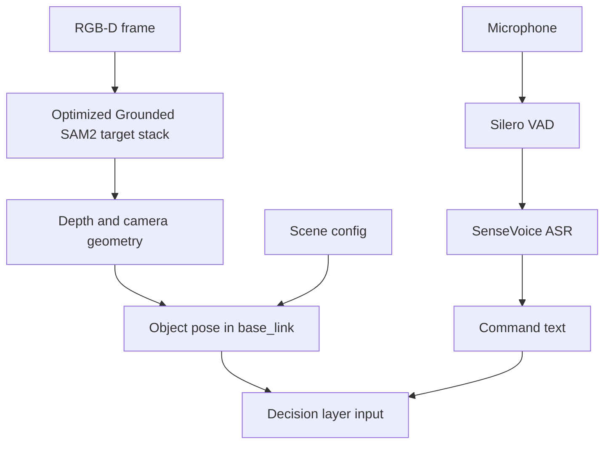
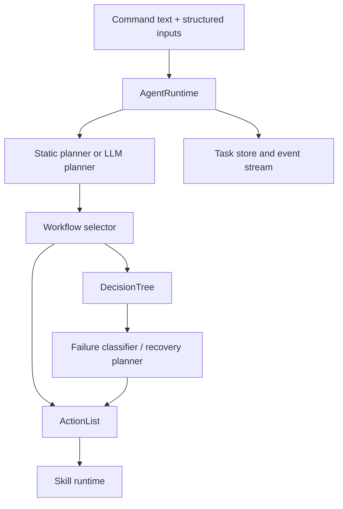
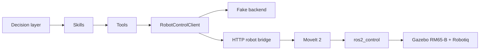

# SensorAgent Technical Architecture

> Scope note: this document is the layered (perception / decision / execution)
> view used for the competition technical report. The single repository
> architecture source is [`docs/architecture.md`](docs/architecture.md); if the
> two disagree, that file wins.

SensorAgent is an embodied-agent orchestration repository for an RM65-B robotic
arm system with local speech input, open-vocabulary perception, task planning,
workflow execution, and ROS 2 simulation integration. The system is organized as
three layers: perception, decision, and execution. Configuration, contracts,
logging, and tests support all three layers.

This document describes the engineering target for the current repository. It
distinguishes implemented code from planned integration points so the design can
be used for development, demos, and later hardware migration without overstating
the current status.

```mermaid
flowchart LR
  user["User / voice / CLI"] --> perception["Perception layer"]
  perception --> decision["Decision layer"]
  decision --> execution["Execution layer"]
  execution --> sim["ROS 2 / MoveIt / Gazebo"]
  execution --> hw["Future hardware runtime"]

  cfg["configs/"] --> perception
  cfg --> decision
  cfg --> execution
  contracts["contracts/"] --> decision
  contracts --> execution
  logs["logs/ traces"] <-- decision
  logs <-- execution
```

## System boundary

SensorAgent owns task understanding, workflow selection, tool and skill
orchestration, local model adapters, and the Agent-facing robot control boundary.
It does not own robot firmware, production safety systems, vendor hardware
drivers, or final physical-cell bringup.

The ROS 2 workspace in `ros2_ws/` is a reproducible development and simulation
stack. It combines RM65-B, Robotiq 2F-85, Gazebo, MoveIt 2, and an HTTP bridge so
the Python Agent process can stay separate from the ROS 2 Humble process.

## Perception layer

The perception layer converts human commands and scene observations into
structured task inputs. It is responsible for speech activity detection, ASR,
open-vocabulary object detection and segmentation, RGB-D pose estimation, and
postcondition verification.



### Speech perception

The local speech path is implemented around the model assets in `models/asr/`.
`audio.listen_vad_transcribe` records a 16 kHz mono command, uses Silero VAD to
trim speech, and sends the selected utterance to SenseVoice ASR through
`sherpa-onnx`.

The repository paths are:

```text
models/asr/vad/silero_vad.onnx
models/asr/sense-voice/model.int8.onnx
models/asr/sense-voice/tokens.txt
```

`configs/audio_local.yaml` selects the local audio backend, `sounddevice_vad`
microphone recorder, VAD thresholds, and SenseVoice model directory. TTS assets
exist under `models/tts/`; the current Agent path generates output files rather
than playing audio automatically.

### Vision perception

The target vision stack uses the team's optimized **Grounded SAM2** pipeline for
open-vocabulary detection, segmentation, and RGB-D object localization. In the
architecture, this stack provides text-prompted object candidates, mask
refinement, mask-aware spatial selection, and a stable object pose for grasp
planning.

The current repository already has the abstraction needed for this path:
`vision.open_vocab_detect` supports open-vocabulary detector backends, optional
mask refinement, RGB-D geometry, workspace filtering, and spatial constraints
such as left, right, nearest, farthest, largest, and smallest. Existing config
hooks include:

```yaml
integrations:
  vision:
    backend: grounding_dino
    grounding_dino_model: IDEA-Research/grounding-dino-tiny
    sam2_model_path: models/vision/sam2_t.pt
    refine_masks: true
```

For deterministic simulation and tests, `vision.config_detect` reads object
poses directly from `scene.objects` in the runtime configuration. This provides a
stable baseline when perception model weights or camera capture are not needed.

In Gazebo, `vision.capture_frame` produces the RGB-D input for the model path.
It runs `scripts/linux/capture_gazebo_rgbd_frame.py` in the ROS 2 Python
interpreter (probed through `SENSORAGENT_ROS_PYTHON`, `ROS_PYTHON`, then
`python3`), subscribes to the industrial camera topics, resolves the camera
transform through TF with a configured fallback, and writes an image, depth,
camera-info, and transform manifest under `logs/vision/`.

Model quality is measured offline instead of by single-image confidence.
`src/sensoragent/evaluation/` and `scripts/vision_eval.py` validate a portable
JSONL dataset manifest, run the same `vision.open_vocab_detect` Tool over the
dataset with one persistent model instance, and write per-sample results,
aggregate metrics, Tool logs, and optional overlays.

### Visual verification

Postcondition checks are split from detection. `vision.verify_object_lifted` and
`vision.verify_object_in_bin` compare observed object state with expected lift or
target-area conditions. These tools return reportable failures such as
`DROPPED_OBJECT` and `WRONG_BIN`, which the decision layer can classify and use
for recovery.

## Decision layer

The decision layer turns user intent and perception output into an executable
task plan. It owns task lifecycle, planner selection, workflow execution,
failure classification, and local recovery decisions.



### Agent runtime and planning

`src/sensoragent/agent/` contains the Agent runtime, planner interface, static
planner, LLM planner, and workflow selector. `AgentRuntime` creates task state,
publishes lifecycle events, dispatches exactly one target per request, and
records final success or failure.

The static planner is used for deterministic local runs. The LLM planner uses an
OpenAI-compatible endpoint and is constrained by an allowed workflow whitelist,
so it can select approved ActionLists or DecisionTrees but cannot directly call
arbitrary low-level tools.

### Workflows

ActionLists are deterministic ordered workflows. The industrial path currently
includes config-based pick/place, open-vocabulary vision pick/place, pick-only,
and place-only workflows. They are defined in
`src/sensoragent/workflows/actionlists/`.

DecisionTrees add conditional branches, retries, and recovery. The current
industrial recovery tree classifies failures from perception, pick, place,
release, wrong-bin verification, or bridge calls, then rejoins the main flow
through bounded local recovery branches. With
`integrations.vision.recovery_live_detect: true` the tree is rebuilt around live
RGB-D capture and open-vocabulary re-detection, so a wrong bin is observed
rather than inferred from the commanded release pose.

### Failure handling

Failures are normalized into structured evidence instead of being inferred from
free-form logs. `recovery.classify_failure` maps evidence into failure classes,
and `recovery.plan` returns deterministic local recovery actions. This keeps the
recovery path explainable and testable, which is important for robotics demos
and later hardware safety review.

## Execution layer

The execution layer invokes skills and tools, translates backend-neutral robot
commands into simulation or hardware requests, and returns structured results to
the decision layer.



### Skills and tools

Skills compose reusable behavior such as `robot.pick`, `robot.place`,
`robot.verify_grasp`, `robot.verify_place`, `audio.listen_command`, and
`audio.announce`. Tools are atomic capabilities such as `robot.move_pose`,
`gripper.close`, `vision.open_vocab_detect`, or `recovery.plan`.

The Tool runtime validates calls against shared schemas where available, applies
timeouts and error handling, and writes structured logs. The separation keeps
high-level workflows readable while preserving typed low-level interfaces.

### Robot control

Robot commands use backend-neutral schemas such as robot poses, pick plans, place
plans, gripper commands, and named place targets. They intentionally avoid ROS
message types in the Agent process.

`configs/robot_mock.yaml` selects a deterministic fake robot backend for local
tests. `configs/robot_sim.yaml` selects `HttpRobotControlClient`, which calls the
ROS 2 bridge on `http://127.0.0.1:8765` by default.

### ROS 2 simulation bridge

`sensoragent_robot_bridge` is the process boundary between Python 3.12 Agent code
and ROS 2 Humble. It receives HTTP requests, translates them into MoveIt 2 arm
planning/execution and `control_msgs/action/GripperCommand`, then reports
structured success or failure back to SensorAgent.

The simulation stack combines:

```text
RM65-B arm
Robotiq 2F-85 gripper
Gazebo Sim
MoveIt 2
ros2_control
sensoragent_robot_bridge
```

The combined Gazebo and MoveIt bringup lives in
`ros2_ws/src/sensoragent_rm65_b_bringup/`. The industrial tabletop world and
models are installed by that package so launch files can switch worlds through
`world_file:=...` without changing Agent code.

## Support modules

Configuration files under `configs/` select enabled tools, skills, integrations,
scene objects, workspace bounds, place targets, and logging paths. Configuration
resolution is handled by `src/sensoragent/config/`.

Contracts under `contracts/` define language-neutral JSON interfaces for tools
and cross-module boundaries. Python runtime schemas live under
`src/sensoragent/schemas/`.

Structured logs are written under ignored `logs/` paths. Task logs use JSONL
records for requests, workflow steps, tool calls, failures, and final task
status. These logs support debugging, replay-style analysis, and demo evidence
without becoming part of the source tree.

## Current implementation status

Implemented in the repository:

- Agent runtime, task lifecycle, static planner, OpenAI-compatible LLM planner,
  ActionList runtime, and DecisionTree runtime.
- Local Silero VAD, SenseVoice ASR, and file-based TTS integration.
- Open-vocabulary vision tool abstraction with RGB-D geometry, spatial
  selection, and Grounding DINO/SAM2 configuration hooks.
- Gazebo RGB-D capture tool and an offline dataset evaluation harness.
- Config-based deterministic object detection for simulation baselines.
- Robot tools, pick/place skills, named place target resolution, and verification
  tools.
- RM65-B + Robotiq Gazebo and MoveIt simulation stack with an HTTP robot bridge.
- Industrial pick/place workflows and a recovery DecisionTree.

Planned or environment-dependent:

- Team-optimized Grounded SAM2 as the primary production vision backend.
- Automated Gazebo acceptance tests and repeatable scene reset.
- Physical robot adapter and hardware safety integration.
- A larger selectable scene library for demo comparison and benchmark coverage.
- Reinforcement-learning environment, reward definition, and evaluation harness.
- External service API and MCP-style integration beyond the local CLI paths.

## Deployment boundary

The intended runtime split is:

```text
Python 3.12 SensorAgent process
→ HTTP RobotControlClient
→ localhost ROS 2 bridge
→ ROS 2 Humble / MoveIt 2 / Gazebo or future hardware adapter
```

This split avoids importing ROS 2 Python packages into the Agent process and
keeps the robot runtime replaceable. The HTTP bridge should remain bound to
localhost unless authentication, TLS, and network-level protection are added.
