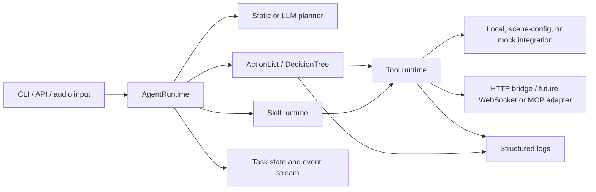

# SensorAgent Architecture

SensorAgent is the repository for agent-side embodied-task orchestration and its
local development integrations. It combines a Python agent runtime,
language-neutral tool contracts, mock/audio/vision/robot adapters, industrial
workflow definitions, and a reproducible RM65-B ROS 2 simulation workspace.

## System role

Within the wider Aether system:

```text
GECA / SensorAgent
  understands tasks, plans, selects workflows, and invokes tools

ECOS and robot runtimes
  provide perception, simulation, motion, hardware, and safety capabilities
```

SensorAgent owns orchestration and integration boundaries. It does not own robot
firmware, vendor drivers, physical safety systems, or production hardware bringup.
The ROS 2 workspace in this repository is a development and simulation integration,
not a replacement for the robot runtime.

## Runtime architecture



### Agent and planner

`src/sensoragent/agent/` owns task orchestration, planner selection, task lifecycle,
and runtime assembly. The static planner provides deterministic tests and scripts.
The LLM planner uses an OpenAI-compatible endpoint and returns a validated
`AgentPlan` with an optional structured `intent`; it can select only targets from
the runtime's allowed ActionList whitelist and does not directly execute low-level
tools.

### Tools, skills, and workflows

- **Tools** are atomic typed capabilities such as `audio.transcribe`,
  `vision.open_vocab_detect`, `robot.move_pose`, or `gripper.open`.
- **Skills** compose reusable tool behavior.
- **ActionLists** execute ordered steps.
- **DecisionTrees** add conditions, retries, and recovery branches.

Tool execution includes contract validation, timeout handling, retry policy, typed
errors, and structured logging.

Failure detection is centralized under `src/sensoragent/recovery/`. Workflow
failures can be normalized into `FailureEvidence`, classified by
`recovery.classify_failure`, and converted into deterministic local replanning
instructions by `recovery.plan`. DecisionTree execution writes a `last_failure`
context object after any failed node so failure branches can classify and plan
without parsing logs. `industrial.recovery_pick_place_tree` wires these pieces
into the industrial pick/place flow and rejoins after bounded local recovery
branches.

Registered durable ActionLists currently include:

| ActionList | Purpose |
| --- | --- |
| `mock.pick_place_actionlist` | Fixture-backed pick/place smoke test |
| `audio.voice_command_ack_actionlist` | Listen once and generate an acknowledgement WAV |
| `industrial.pick_place_actionlist` | Config-detected object, pick, grasp verification, named target placement, release verification |
| `industrial.pick_only_actionlist` | Config-detected object pick with grasp verification |
| `industrial.place_only_actionlist` | Place a held object into a named target |
| `industrial.vision_pick_place_actionlist` | RGB-D open-vocabulary detection followed by industrial pick/place |

Registered durable DecisionTrees currently include:

| DecisionTree | Purpose |
| --- | --- |
| `industrial.recovery_pick_place_tree` | Industrial pick/place with classified recovery for perception, pick, place, release, wrong-bin, and bridge failures |

The initial robot control surface is backend-neutral:

```text
robot.pick / robot.place
  → robot.move_pose / robot.move_linear
  → gripper.open / gripper.close
  → RobotControlClient
  → fake, Gazebo, or hardware backend
```

`RobotPose`, `PickPlan`, and `PlacePlan` deliberately contain no ROS message
types. This keeps Agent orchestration reusable across the Python 3.12 process,
ROS 2 Humble, simulation, and future hardware adapters.

### Contracts

`contracts/` contains language-neutral JSON contracts for cross-module interfaces.
Internal Python schemas remain under `src/sensoragent/schemas/`. External systems
should implement contracts without importing SensorAgent's Python package.

### State and logging

`src/sensoragent/state/` tracks task lifecycle and events. Agent-side logs are written
under ignored `logs/` paths:

```text
logs/app.log
logs/tasks/
logs/traces/
logs/errors/
logs/audio/
```

Task logs use JSONL records for requests, workflow steps, tool calls, retries,
failures, and final status. External robot or simulator logs remain owned by their
runtime unless an integration explicitly imports them.

## Configuration

YAML files under `configs/` select enabled tools, skills, integrations, logging, and
environment mode. Configuration resolution order is:

```text
explicit CLI or code path
SENSORAGENT_CONFIG
SENSORAGENT_ENV -> configs/<env>.yaml
configs/mock.yaml
```

Secrets and machine-local overrides belong in ignored `.env` files.

Current configurations include:

```text
configs/mock.yaml
configs/audio_mock.yaml
configs/audio_local.yaml
configs/robot_mock.yaml
configs/robot_sim.yaml
```

## Audio integration

The audio integration is ROS-independent. `AudioClient`, microphone, and VAD
abstractions live under `src/sensoragent/integrations/`; ASR/TTS/listen tools
live under `src/sensoragent/tools/audio/`.

The local command path is:

```text
16 kHz mono microphone input
→ SoundDeviceVadRecorder
→ Silero VAD ONNX inference
→ utterance WAV
→ SenseVoice through sherpa-onnx
→ normalized command text
→ Agent planner
```

`audio.listen_vad_transcribe` supports realtime VAD termination and per-call
threshold, silence-tail, and padding overrides. The older fixed-duration
`audio.listen_transcribe` remains available. Higher-level audio components
include:

- `audio.listen_command`, which normalizes one recognized command;
- `audio.announce`, which creates task-facing speech output;
- `audio.voice_command_ack_actionlist`, which listens and generates an
  acknowledgement file.

Local TTS supports compatible sherpa-onnx VITS layouts and a CLI path for the
present Baker/icefall assets. SensorAgent intentionally rejects direct local
playback, and `listen-task` does not automatically announce task results.

Local model weights are runtime assets under ignored `models/` paths. Automated
tests use fake clients and fixtures, so the default test suite does not require a
microphone, speaker, or model weights.

The CLI `listen-task` path does not yet imply robot control by itself. With
`configs/audio_local.yaml` or `configs/audio_mock.yaml`, it runs through the
audio tools and then uses the selected planner against the workflows enabled in
the built runtime. The default static planner remains mock-oriented unless a
script or caller chooses another target.

## Robotics simulation

`ros2_ws/` provides the local RM65-B simulation stack for Ubuntu 22.04 and ROS 2
Humble:

| Package | Ownership | Responsibility |
| --- | --- | --- |
| `rm_description` | Imported locally | RM65-B URDF and meshes |
| `rm_gazebo` | Imported locally | Upstream arm-only Gazebo integration |
| `rm_65_config` | Imported locally | Upstream arm-only MoveIt 2 configuration |
| `robotiq_description` | Vendored | Robotiq 2F-85 Xacro and meshes |
| `sensoragent_rm65_b_bringup` | Project-owned | Combined Gazebo, ros2_control, and MoveIt integration |
| `sensoragent_robot_bridge` | Project-owned | HTTP-to-MoveIt/GripperCommand simulation adapter |

Upstream files are imported locally by
`scripts/linux/fetch_rm65_b_upstream.sh` because redistribution permission is
unclear. The repository tracks the import recipe and compatibility adjustments, not
the RealMan model assets. Robotiq assets are redistributed under BSD-3-Clause;
their pinned source and retained license are documented in
`ros2_ws/ROBOTIQ_UPSTREAM.md`.

### Combined robot structure

```text
world
└── base_link
    └── RM65-B joint1 ... joint6
        └── Link6
            └── robotiq_85_base_joint (fixed)
                └── Robotiq 2F-85 rigid parallel-jaw links
```

The mounting joint is defined in
`sensoragent_rm65_b_bringup/urdf/rm65_b_robotiq_2f85.urdf.xacro`. Its default
`xyz` and `rpy` are zero so Gazebo and MoveIt share one configurable transform.
The final flange adapter thickness and orientation remain an Ubuntu simulation
calibration task.

### Control and planning path

```text
MoveIt / direct ROS 2 Action
├── rm_group_controller
│   └── joint1 ... joint6
└── robotiq_gripper_controller
    └── gripper_action_bridge.py
        └── robotiq_gripper_effort_controller
            ├── robotiq_85_left_knuckle_joint
            └── robotiq_85_right_knuckle_joint
                ↓
           gz_ros2_control
                ↓
            Gazebo Sim
```

The simulation uses two bounded-effort prismatic finger joints behind the
standard `control_msgs/action/GripperCommand` API. Each side is collapsed into
one rigid jaw link containing the knuckle, finger, and fingertip meshes. The
jaw has exactly one prismatic opening degree of freedom, so it cannot rotate or
sway relative to the gripper base. Either jaw can still stop independently on
object contact.

The combined SRDF exposes:

- `rm_group`: the `base_link` to `Link6` arm chain;
- `gripper`: the active 2F-85 knuckle joint;
- `robotiq_2f85`: the end effector attached to `Link6`;
- named `open` and `closed` gripper states.

The combined model, arm trajectory execution, and gripper Action interface have
been manually exercised on Ubuntu. Object contact and repeatable grasp stability
still require acceptance testing.

SensorAgent now contains stable atomic robot Tool contracts, deterministic
top-down/oriented pick and place planning helpers, named place-target resolution,
and `robot.pick` / `robot.place` / `robot.verify_*` Skills.
`configs/robot_mock.yaml` registers them against a stateful fake backend for
integration development. `configs/robot_sim.yaml` selects
`HttpRobotControlClient`, which calls the implemented `sensoragent_robot_bridge`
HTTP service and also provides scene object/place-target catalogs. The bridge
translates backend-neutral requests into MoveIt 2 arm planning/execution and
`GripperCommand` actions for Gazebo. Manual Gazebo scripts exercise this path;
automated ROS 2 acceptance is still outside the default Python suite.

## Industrial workflow and vision path

The current tabletop competition path has two perception options:

```text
vision.config_detect
  reads named object poses from configs/robot_sim.yaml scene.objects

vision.open_vocab_detect
  reads RGB-D frame files, uses a YOLOE/Ultralytics backend when weights are
  installed, and projects bbox-center depth into base_link coordinates
```

`industrial.pick_place_actionlist` uses `vision.config_detect` for deterministic
baseline tests. `industrial.vision_pick_place_actionlist` uses
`vision.open_vocab_detect` and the Gazebo RGB-D capture script. The open-vocab
tool returns structured `VISION_MODEL_NOT_READY`,
`VISION_BACKEND_UNAVAILABLE`, `VISION_INPUT_ERROR`, `VISION_DEPTH_ERROR`, or
`OBJECT_NOT_FOUND` failures instead of pretending detection succeeded.

Postcondition verification is split into robot-state and vision-state checks.
`robot.verify_grasp` and `robot.verify_place` read gripper state; the newer
`vision.verify_object_lifted` and `vision.verify_object_in_bin` compare observed
object poses against expected lift and target-cell conditions. These verification
tools produce reportable failures such as `DROPPED_OBJECT` and `WRONG_BIN`,
which feed the recovery planner.

## Runtime compatibility boundary

The current Python Agent package declares Python 3.12 and uses features such as
`enum.StrEnum` and `datetime.UTC`. Ubuntu 22.04 with ROS 2 Humble normally ships
Python 3.10. The implemented integration intentionally uses a separate-process
boundary:

```text
Python 3.12 SensorAgent
→ HttpRobotControlClient
→ HTTP on localhost:8765
→ Python 3.10 sensoragent_robot_bridge under ROS 2 Humble
→ MoveIt 2 / GripperCommand
→ Gazebo
```

This avoids importing Python 3.10 `rclpy` into the Agent process. The bridge
defaults to localhost; remote binding requires network-level protection because
the HTTP server does not provide authentication or TLS.

## Reinforcement learning and simulation assets

`reinforcement_learning/` and top-level `simulation/gazebo/` currently provide
tracked empty structure for future environments, policies, evaluation, worlds,
models, and scenarios. The active industrial Gazebo world and models are in
`ros2_ws/src/sensoragent_rm65_b_bringup/` so they can be installed with the ROS
2 package. No Gymnasium environment, reset interface, reward function, training
entry point, or evaluation harness exists yet. Low-level trajectory planning and
safety remain with MoveIt 2, `ros2_control`, and the robot runtime.

## Repository layout

```text
SensorAgent/
├── configs/                 runtime configurations
├── contracts/               cross-module JSON contracts
├── docs/
│   ├── architecture.md      single repository architecture source
│   ├── guides/              operational setup and test guides
│   └── team/                team-wide conventions and context
├── reinforcement_learning/ future RL structure
├── ros2_ws/                 local RM65-B ROS 2 simulation workspace
├── simulation/              Gazebo worlds, models, and scenarios
├── src/sensoragent/         Python agent runtime
├── tests/                   unit, end-to-end, ROS, simulation, and RL tests
├── README.md                entry point and common commands
└── TODO.md                  authoritative development backlog
```

## Documentation policy

This file is the only repository architecture document. `TODO.md` is the only
development backlog. Team-wide material stays under `docs/team/`; operational
instructions stay under `docs/guides/`. Superseded documents are deleted and remain
available through Git history rather than being copied into an archive folder.
