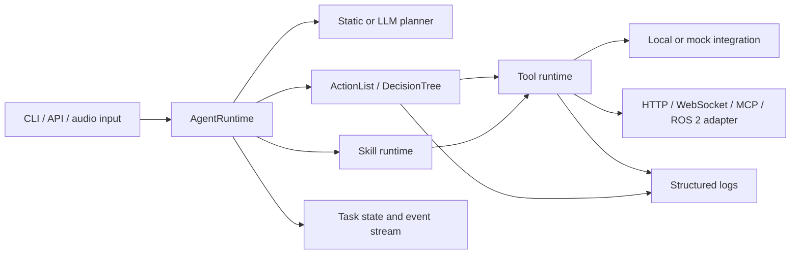

# SensorAgent Architecture

SensorAgent is the repository for agent-side embodied-task orchestration and its
local development integrations. It combines a Python agent runtime, language-neutral
tool contracts, mock and audio adapters, and a reproducible RM65-B ROS 2 simulation
workspace.

## System role

Within the wider Aether system:

```text
GECA / SensorAgent
  understands tasks, plans, selects workflows, and invokes tools

ECOS and robot runtimes
  provide perception, simulation, motion, hardware, and safety capabilities
```

SensorAgent owns orchestration and integration boundaries. It does not own robot
firmware, vendor drivers, physical safety systems, or production hardware bringup.
The ROS 2 workspace in this repository is a development and simulation integration,
not a replacement for the robot runtime.

## Runtime architecture



### Agent and planner

`src/sensoragent/agent/` owns task orchestration, planner selection, task lifecycle,
and runtime assembly. The static planner provides deterministic tests. The LLM
planner uses an OpenAI-compatible endpoint and returns a validated `AgentPlan`; it
does not directly execute low-level tools.

### Tools, skills, and workflows

- **Tools** are atomic typed capabilities such as `audio.transcribe`,
  `vision.mock_detect`, or `robot.mock_pick`.
- **Skills** compose reusable tool behavior.
- **ActionLists** execute ordered steps.
- **DecisionTrees** add conditions, retries, and recovery branches.

Tool execution includes contract validation, timeout handling, retry policy, typed
errors, and structured logging.

### Contracts

`contracts/` contains language-neutral JSON contracts for cross-module interfaces.
Internal Python schemas remain under `src/sensoragent/schemas/`. External systems
should implement contracts without importing SensorAgent's Python package.

### State and logging

`src/sensoragent/state/` tracks task lifecycle and events. Agent-side logs are written
under ignored `logs/` paths:

```text
logs/app.log
logs/tasks/
logs/traces/
logs/errors/
logs/audio/
```

Task logs use JSONL records for requests, workflow steps, tool calls, retries,
failures, and final status. External robot or simulator logs remain owned by their
runtime unless an integration explicitly imports them.

## Configuration

YAML files under `configs/` select enabled tools, skills, integrations, logging, and
environment mode. Configuration resolution order is:

```text
explicit CLI or code path
SENSORAGENT_CONFIG
SENSORAGENT_ENV -> configs/<env>.yaml
configs/mock.yaml
```

Secrets and machine-local overrides belong in ignored `.env` files.

Current configurations include:

```text
configs/mock.yaml
configs/audio_mock.yaml
configs/audio_local.yaml
```

## Audio integration

The audio integration is ROS-independent. `AudioClient` and microphone abstractions
live under `src/sensoragent/integrations/`; ASR/TTS/listen tools live under
`src/sensoragent/tools/audio/`.

Local model weights are runtime assets under ignored `models/` paths. Automated
tests use fake clients and fixtures, so the default test suite does not require a
microphone, speaker, or model weights.

## Robotics simulation

`ros2_ws/` provides the local RM65-B simulation stack for Ubuntu 22.04 and ROS 2
Humble:

| Package | Ownership | Responsibility |
| --- | --- | --- |
| `rm_description` | Imported locally | RM65-B URDF and meshes |
| `rm_gazebo` | Imported locally | Upstream arm-only Gazebo integration |
| `rm_65_config` | Imported locally | Upstream arm-only MoveIt 2 configuration |
| `robotiq_description` | Vendored | Robotiq 2F-85 Xacro and meshes |
| `sensoragent_rm65_b_bringup` | Project-owned | Combined Gazebo, ros2_control, and MoveIt integration |

Upstream files are imported locally by
`scripts/linux/fetch_rm65_b_upstream.sh` because redistribution permission is
unclear. The repository tracks the import recipe and compatibility adjustments, not
the RealMan model assets. Robotiq assets are redistributed under BSD-3-Clause;
their pinned source and retained license are documented in
`ros2_ws/ROBOTIQ_UPSTREAM.md`.

### Combined robot structure

```text
world
└── base_link
    └── RM65-B joint1 ... joint6
        └── Link6
            └── robotiq_85_base_joint (fixed)
                └── Robotiq 2F-85 links and mimic joints
```

The mounting joint is defined in
`sensoragent_rm65_b_bringup/urdf/rm65_b_robotiq_2f85.urdf.xacro`. Its default
`xyz` and `rpy` are zero so Gazebo and MoveIt share one configurable transform.
The final flange adapter thickness and orientation remain an Ubuntu simulation
calibration task.

### Control and planning path

```text
MoveIt / direct ROS 2 Action
├── rm_group_controller
│   └── joint1 ... joint6
└── robotiq_gripper_controller
    └── robotiq_85_left_knuckle_joint
        └── remaining finger joints through mimic relationships
            ↓
       gz_ros2_control
            ↓
        Gazebo Sim
```

`position_controllers/GripperActionController` is used because it is available
in ROS 2 Humble. The newer `parallel_gripper_action_controller` configuration
from the current Robotiq main branch is intentionally not used.

The combined SRDF exposes:

- `rm_group`: the `base_link` to `Link6` arm chain;
- `gripper`: the active 2F-85 knuckle joint;
- `robotiq_2f85`: the end effector attached to `Link6`;
- named `open` and `closed` gripper states.

SensorAgent does not yet contain a completed ROS 2 bridge for issuing robot
tasks directly. Gazebo contact behavior, flange alignment, grasp stability, and
reinforcement-learning interfaces remain separate follow-up work.

## Reinforcement learning and simulation assets

`reinforcement_learning/` and `simulation/gazebo/` currently provide tracked
structure for future environments, policies, evaluation, worlds, models, and
scenarios. They are not yet production runtime components. Low-level trajectory
planning and safety remain with MoveIt 2, `ros2_control`, and the robot runtime.

## Repository layout

```text
SensorAgent/
├── configs/                 runtime configurations
├── contracts/               cross-module JSON contracts
├── docs/
│   ├── architecture.md      single repository architecture source
│   ├── guides/              operational setup and test guides
│   └── team/                team-wide conventions and context
├── reinforcement_learning/ future RL structure
├── ros2_ws/                 local RM65-B ROS 2 simulation workspace
├── simulation/              Gazebo worlds, models, and scenarios
├── src/sensoragent/         Python agent runtime
├── tests/                   unit, end-to-end, ROS, simulation, and RL tests
├── README.md                entry point and common commands
└── TODO.md                  authoritative development backlog
```

## Documentation policy

This file is the only repository architecture document. `TODO.md` is the only
development backlog. Team-wide material stays under `docs/team/`; operational
instructions stay under `docs/guides/`. Superseded documents are deleted and remain
available through Git history rather than being copied into an archive folder.
