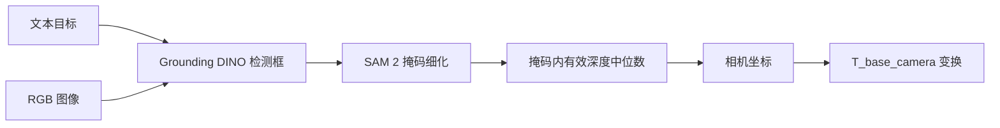

# 开放词汇视觉接入说明

SensorAgent 使用同一个 Tool 接口承载 YOLOE 基线和 Grounding DINO + SAM 2
实验后端：

```text
vision.open_vocab_detect
```

`configs/robot_sim.yaml` 继续默认使用 YOLOE，不会因为安装实验后端而改变 Gazebo
抓取流程。Grounding DINO 和 SAM 2 使用独立配置
`configs/vision_grounding_dino.yaml`。

## 1. 处理流程



SAM 2 默认是可回退步骤。细化失败时 Tool 保留检测框、在 `warnings` 中说明
原因，并继续输出 2D 结果。只有输入 `require_masks=true` 时，掩码失败才会使
本次调用失败。

## 2. 安装可选依赖

在仓库根目录运行：

```powershell
python -m venv .venv-vision
.\.venv-vision\Scripts\python.exe -m pip install --upgrade pip
.\.venv-vision\Scripts\python.exe -m pip install -e .
.\.venv-vision\Scripts\python.exe -m pip install -r requirements-vision.txt
```

需要指定 CUDA 版 PyTorch 时，先按
[PyTorch 官方安装页](https://pytorch.org/get-started/locally/)安装与本机驱动匹配的
版本，再安装 `requirements-vision.txt`。不要把 `.venv-vision`、模型权重或下载缓存
提交到 Git。

首次运行时，默认配置会从 Hugging Face 下载
`IDEA-Research/grounding-dino-tiny`，并由 Ultralytics 获取 `sam2_t.pt`。也可以使用
本地路径：

```yaml
integrations:
  vision:
    backend: grounding_dino
    grounding_dino_model: D:/models/grounding-dino-tiny
    sam2_model_path: D:/models/sam2_t.pt
```

环境变量 `SENSORAGENT_GROUNDING_DINO_MODEL` 和 `SENSORAGENT_SAM2_WEIGHTS` 也可以
指定这两个模型。

## 3. 先验证 Grounding DINO

准备一张普通 RGB 图片后，先关闭 SAM 2，单独确认文本检测：

```powershell
$env:PYTHONPATH = "$(Get-Location)\src"
python -m sensoragent.services.cli.main vision-detect `
  --config configs\vision_grounding_dino.yaml `
  --image examples\scene.jpg `
  --query "wrench" `
  --device 0 `
  --no-refine
```

CPU 环境将 `--device 0` 改成 `--device cpu`。确认检测框正常后，去掉
`--no-refine` 验证 SAM 2：

```powershell
python -m sensoragent.services.cli.main vision-detect `
  --config configs\vision_grounding_dino.yaml `
  --image examples\scene.jpg `
  --query "扳手" `
  --device 0
```

常用参数：

- `--box-threshold` 控制检测框置信度阈值，默认 `0.35`。
- `--text-threshold` 控制文本匹配阈值，默认 `0.25`。
- `--require-masks` 禁止 SAM 2 失败后退回检测框。
- `--no-refine` 完全跳过 SAM 2，适合定位依赖或显存问题。
- `--spatial-relation` / `--spatial-ordinal` 在多个同类物件里挑一个，见第 7 节。

## 4. Tool 输入输出

最小输入：

```json
{
  "query": "wrench",
  "image_path": "examples/scene.jpg",
  "refine_masks": true,
  "require_masks": false
}
```

成功输出保留原有字段，并按实际可用信息增加掩码和诊断字段：

```json
{
  "found": true,
  "label": "wrench",
  "confidence": 0.91,
  "source": "grounding_dino_sam2",
  "object_id": "wrench_001",
  "bbox_2d": [120.0, 80.0, 310.0, 260.0],
  "center_px": [214.7, 171.3],
  "mask_area_px": 18234.5,
  "mask_polygons": [[[130.0, 90.0], [300.0, 100.0], [290.0, 250.0]]],
  "model": "IDEA-Research/grounding-dino-tiny",
  "timing_ms": {
    "grounding_dino": 132.4,
    "sam2": 46.8
  }
}
```

`source` 含 `sam2_fallback_box` 时表示掩码细化失败，本次结果只有检测框。具体原因在
`warnings` 中。现有 ActionList 依赖的 `position_camera`、`position_base` 和
`pose_3d` 字段保持不变。`pose_3d` 的后三位（旋转）恒为 `0`，仅用于兼容下游
`robot.plan_top_down_pick` 的位姿槽位；视觉侧只提供位置，朝向由机械臂侧决定。

## 5. RGB-D 定位

深度图目前必须是二维 `.npy` 数组。相机参数可通过 JSON 文件传入：

```json
{
  "k": [615.0, 0.0, 320.0, 0.0, 615.0, 240.0, 0.0, 0.0, 1.0]
}
```

命令示例：

```powershell
python -m sensoragent.services.cli.main vision-detect `
  --image examples\scene.jpg `
  --query "wrench" `
  --depth examples\scene_depth.npy `
  --camera-info configs\camera_info.json `
  --depth-scale 0.001 `
  --device 0
```

当深度数组单位是毫米时使用 `depth_scale=0.001`；单位已经是米时使用默认值
`1.0`。有掩码时取掩码内所有有限正深度的中位数，没有掩码时沿用检测框中心局部
窗口采样。

只有同时配置相机内参和 `T_base_camera`，才能输出机械臂基坐标
`position_base`、`pose_3d` 与结构化的 `position_3d`。`position_3d` 形如
`{"x": 0.31, "y": -0.08, "z": 0.42, "frame_id": "base_link", "unit": "m"}`，显式标注
坐标系与单位，是推荐给下游消费的带元数据位置字段；`pose_3d` 数组仅为兼容既有抓取
管线保留。缺少变换时只输出 `position_camera`，不能把像素坐标或相机坐标当作机械臂
抓取坐标。

## 6. 错误边界

- `VISION_MODEL_NOT_READY`：本地 YOLOE 权重路径不存在，或 SAM 2 权重文件缺失。
- `VISION_BACKEND_UNAVAILABLE`：缺少 Transformers、Ultralytics、Pillow 等依赖。
- `VISION_INPUT_ERROR`：图片、深度、相机参数或数值参数不合法，也包括文件不存在
  和无读取权限。
- `VISION_BACKEND_ERROR`：模型推理失败、权重下载等 IO 失败，或严格掩码模式下
  SAM 2 失败。
- `OBJECT_NOT_FOUND`：推理成功，但没有超过阈值的目标。
- `OBJECT_AMBIGUOUS`：只在使用空间约束时出现，见第 7 节。

单元测试只使用假后端，不下载模型，也不代表工业场景精度已经达标。提交前仍需用
比赛现场图像完成真实模型冒烟测试，再分别记录检测召回率、掩码质量、深度有效率、
坐标误差和端到端耗时。

## 7. 多候选空间选择

场景里有多个同类物件时（例如两个滚柱），仅靠 `query` 只能拿到置信度最高的那
一个。用 `spatial_constraint` 指定"哪一个"：

```json
{
  "query": "roller",
  "image_path": "logs/vision/latest/rgb.png",
  "spatial_constraint": {"relation": "left", "ordinal": 1}
}
```

CLI 对应 `--spatial-relation left --spatial-ordinal 1`。

支持的 `relation`：

| relation | 排序依据 | 是否需要深度/内参 |
| --- | --- | --- |
| `left` / `right` | 检测框中心像素 X | 否 |
| `front` / `back` | 检测框中心像素 Y | 否 |
| `largest` / `smallest` | 检测框像素面积 | 否 |
| `nearest` / `farthest` | base_link XY 到原点的距离 | 需要相机内参和 `T_base_camera` |

`ordinal` 从 `1` 开始，`{"relation": "left", "ordinal": 2}` 表示"左边第二个"。

前六种关系只在图像平面上排序，**不读深度**，因此在深度缺失或不可靠时依然可用。
`nearest` / `farthest` 需要把像素反投影到 base 坐标，用的是 `scene.workspace.table_z`
指定的桌面平面高度（假设物件位于桌面上），同样不读深度图。

选择流程：先用后端的多框输出收集候选 → 按 `scene.workspace` 的 x/y 包络过滤掉
机械臂够不到的候选 → 按关系排序取第 `ordinal` 个 → **只对胜出者**跑 SAM 2 和深度
估计。因此加空间约束不会带来 N 倍的分割开销。

`scene.workspace` 在 `configs/robot_sim.yaml` 里配置：

```yaml
scene:
  workspace:
    frame: base_link
    x: [0.15, 0.60]
    y: [-0.35, 0.35]
    z: [0.10, 0.30]
    table_z: 0.12
```

缺少相机内参或 `T_base_camera` 时无法反投影，可达域过滤会被跳过（不阻塞纯图像
平面的选择）。

成功时输出在原有字段外附带落选候选，便于上层复核或让操作员改口：

```json
{
  "found": true,
  "label": "roller",
  "object_id": "roller_001",
  "position_3d": {"x": 0.24, "y": 0.23, "z": 0.142, "frame_id": "base_link", "unit": "m"},
  "candidates": [
    {"found": true, "label": "roller", "confidence": 0.83, "bbox_2d": [402.0, 210.0, 452.0, 262.0]}
  ]
}
```

失败时返回 `OBJECT_AMBIGUOUS`，`output.candidates` 给出所有候选、
`output.spatial_constraint` 回显本次约束。触发条件有三种：

- 排序键相差在 `tolerance_px`（默认 `8.0` 像素）以内，分不出左右/前后；
- `ordinal` 超过候选数量（比如只有 2 个却要"第三个"）；
- `nearest` / `farthest` 缺少内参或 `T_base_camera`，拿不到 base 坐标。

这三种都不应该被当成"没找到"，正确处理是向操作员追问，而不是抓一个猜的目标。

语言侧由 `src/sensoragent/agent/prompts/intent_to_workflow.md` 负责把空间修饰词从
物件名里剥出来：`"把左侧的扳手放到料箱第三格"` 会解析成
`object_query="扳手"` 加 `spatial_constraint={"relation":"left","ordinal":1}`，
避免把"左侧的扳手"整串丢给检测器。
