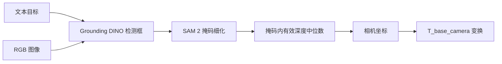

# 开放词汇视觉接入说明

SensorAgent 使用同一个 Tool 接口承载 YOLOE 基线和 Grounding DINO + SAM 2
实验后端：

```text
vision.open_vocab_detect
```

`configs/robot_sim.yaml` 继续默认使用 YOLOE，不会因为安装实验后端而改变 Gazebo
抓取流程。Grounding DINO 和 SAM 2 使用独立配置
`configs/vision_grounding_dino.yaml`。

## 1. 处理流程



SAM 2 默认是可回退步骤。细化失败时 Tool 保留检测框、在 `warnings` 中说明
原因，并继续输出 2D 结果。只有输入 `require_masks=true` 时，掩码失败才会使
本次调用失败。

## 2. 安装可选依赖

在仓库根目录运行：

```powershell
python -m venv .venv-vision
.\.venv-vision\Scripts\python.exe -m pip install --upgrade pip
.\.venv-vision\Scripts\python.exe -m pip install -e .
.\.venv-vision\Scripts\python.exe -m pip install -r requirements-vision.txt
```

需要指定 CUDA 版 PyTorch 时，先按
[PyTorch 官方安装页](https://pytorch.org/get-started/locally/)安装与本机驱动匹配的
版本，再安装 `requirements-vision.txt`。不要把 `.venv-vision`、模型权重或下载缓存
提交到 Git。

首次运行时，默认配置会从 Hugging Face 下载
`IDEA-Research/grounding-dino-tiny`，并由 Ultralytics 获取 `sam2_t.pt`。也可以使用
本地路径：

```yaml
integrations:
  vision:
    backend: grounding_dino
    grounding_dino_model: D:/models/grounding-dino-tiny
    sam2_model_path: D:/models/sam2_t.pt
```

环境变量 `SENSORAGENT_GROUNDING_DINO_MODEL` 和 `SENSORAGENT_SAM2_WEIGHTS` 也可以
指定这两个模型。

## 3. 先验证 Grounding DINO

准备一张普通 RGB 图片后，先关闭 SAM 2，单独确认文本检测：

```powershell
$env:PYTHONPATH = "$(Get-Location)\src"
python -m sensoragent.services.cli.main vision-detect `
  --config configs\vision_grounding_dino.yaml `
  --image examples\scene.jpg `
  --query "wrench" `
  --device 0 `
  --no-refine
```

CPU 环境将 `--device 0` 改成 `--device cpu`。确认检测框正常后，去掉
`--no-refine` 验证 SAM 2：

```powershell
python -m sensoragent.services.cli.main vision-detect `
  --config configs\vision_grounding_dino.yaml `
  --image examples\scene.jpg `
  --query "扳手" `
  --device 0
```

常用参数：

- `--box-threshold` 控制检测框置信度阈值，默认 `0.35`。
- `--text-threshold` 控制文本匹配阈值，默认 `0.25`。
- `--require-masks` 禁止 SAM 2 失败后退回检测框。
- `--no-refine` 完全跳过 SAM 2，适合定位依赖或显存问题。

## 4. Tool 输入输出

最小输入：

```json
{
  "query": "wrench",
  "image_path": "examples/scene.jpg",
  "refine_masks": true,
  "require_masks": false
}
```

成功输出保留原有字段，并按实际可用信息增加掩码和诊断字段：

```json
{
  "found": true,
  "label": "wrench",
  "confidence": 0.91,
  "source": "grounding_dino_sam2",
  "object_id": "wrench_001",
  "bbox_2d": [120.0, 80.0, 310.0, 260.0],
  "center_px": [214.7, 171.3],
  "mask_area_px": 18234.5,
  "mask_polygons": [[[130.0, 90.0], [300.0, 100.0], [290.0, 250.0]]],
  "model": "IDEA-Research/grounding-dino-tiny",
  "timing_ms": {
    "grounding_dino": 132.4,
    "sam2": 46.8
  }
}
```

`source` 含 `sam2_fallback_box` 时表示掩码细化失败，本次结果只有检测框。具体原因在
`warnings` 中。现有 ActionList 依赖的 `position_camera`、`position_base` 和
`pose_3d` 字段保持不变。

## 5. RGB-D 定位

深度图目前必须是二维 `.npy` 数组。相机参数可通过 JSON 文件传入：

```json
{
  "k": [615.0, 0.0, 320.0, 0.0, 615.0, 240.0, 0.0, 0.0, 1.0]
}
```

命令示例：

```powershell
python -m sensoragent.services.cli.main vision-detect `
  --image examples\scene.jpg `
  --query "wrench" `
  --depth examples\scene_depth.npy `
  --camera-info configs\camera_info.json `
  --depth-scale 0.001 `
  --device 0
```

当深度数组单位是毫米时使用 `depth_scale=0.001`；单位已经是米时使用默认值
`1.0`。有掩码时取掩码内所有有限正深度的中位数，没有掩码时沿用检测框中心局部
窗口采样。

只有同时配置相机内参和 `T_base_camera`，才能输出机械臂基坐标
`position_base` 与 `pose_3d`。缺少变换时只输出 `position_camera`，不能把像素坐标或
相机坐标当作机械臂抓取坐标。

## 6. 错误边界

- `VISION_MODEL_NOT_READY`：本地 YOLOE 权重路径不存在。
- `VISION_BACKEND_UNAVAILABLE`：缺少 Transformers、Ultralytics、Pillow 等依赖。
- `VISION_INPUT_ERROR`：图片、深度、相机参数或数值参数不合法。
- `VISION_BACKEND_ERROR`：模型推理失败，或严格掩码模式下 SAM 2 失败。
- `OBJECT_NOT_FOUND`：推理成功，但没有超过阈值的目标。

单元测试只使用假后端，不下载模型，也不代表工业场景精度已经达标。提交前仍需用
比赛现场图像完成真实模型冒烟测试，再分别记录检测召回率、掩码质量、深度有效率、
坐标误差和端到端耗时。
