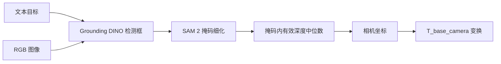
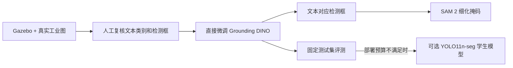

# 开放词汇视觉接入说明

SensorAgent 使用同一个 Tool 接口承载 YOLOE 基线和 Grounding DINO + SAM 2
实验后端：

```text
vision.open_vocab_detect
```

`configs/robot_sim.yaml` 继续默认使用 YOLOE，不会因为安装实验后端而改变 Gazebo
抓取流程。Grounding DINO 和 SAM 2 使用独立配置
`configs/vision_grounding_dino.yaml`。

## 0. 当前结论和基础版交付路径

截至 2026-07-30，仓库里已经有可运行的 Grounding DINO + SAM 2 教师链路、固定清单
评测工具和单图叠加结果，但**没有已经用比赛数据训练完成的模型**。之前的扳手、螺丝刀、
滚筒和齿轮测试属于正样本冒烟测试，只能证明真实模型推理和掩码输出已经跑通。

当前“训练”明确指**直接微调 Grounding DINO 本体**。第一轮先让模型学习比赛类别文本
与目标框之间的对应关系，SAM 2 继续负责由框细化掩码。YOLO11n-seg 不再作为近期主训练
对象，只保留为后续可选轻量学生模型：只有 Grounding DINO 微调结果跑出来后，确实达不到
机械臂侧的延迟、显存或模型大小预算，才有必要再训练学生模型做同测试集比较。

仓库已提供开训前检查和训练入口：

```powershell
# 只检查数据，不加载模型、不占用 GPU
python scripts\vision_train_grounding_dino.py `
  --config configs\vision_train_grounding_dino.example.yaml `
  --manifest data\vision\competition_train.jsonl `
  --dry-run

# 数据检查通过后直接微调 Grounding DINO
python scripts\vision_train_grounding_dino.py `
  --config configs\vision_train_grounding_dino.example.yaml `
  --manifest data\vision\competition_train.jsonl `
  --device cuda:0
```

训练配置模板在 `configs/vision_train_grounding_dino.example.yaml`，数据格式模板在
`configs/vision_train_grounding_dino.example.jsonl`。配置里的 `classes` 是实际输入模型
的候选文本顺序，目标框的 `class_labels` 按这个顺序映射，不能在同一轮训练中途改顺序。
例如工程对象标识 `hex_nut` 对应文本提示 `hex nut`。训练框使用原图绝对坐标
`bbox_xyxy=[x_min,y_min,x_max,y_max]`，脚本再交给官方处理器转换成模型需要的归一化
中心点格式。

当前已验证配置固定 `batch_size: 1`，通过 `gradient_accumulation_steps` 调整有效批量，
用于规避当前 Transformers 版本在更大 batch 下的标签图偏移风险。训练结束后，本地目录
会保存 `checkpoint-best`、`checkpoint-last`、数据/清单哈希、checkpoint SHA-256、软件
版本、参数、每轮损失和耗时。权重、图片、标签、缓存和 `runs/` 都不进入 Git。

真正开训前需要冻结类别文本顺序；每张图完成检测框标注并人工复核；完整采集会话先按
train/val/test 分开。SAM 2 掩码可以同时保留，供掩码复核、后续分割训练和消融使用，
但不能写成 Grounding DINO 本身的训练目标。没有冻结验证集和真实工位困难样本时，不能
把一次微调结果称为“稳定版本”。

## 1. 处理流程



SAM 2 默认是可回退步骤。细化失败时 Tool 保留检测框、在 `warnings` 中说明
原因，并继续输出 2D 结果。只有输入 `require_masks=true` 时，掩码失败才会使
本次调用失败。

## 2. 安装可选依赖

在仓库根目录运行：

```powershell
python -m venv .venv-vision
.\.venv-vision\Scripts\python.exe -m pip install --upgrade pip
.\.venv-vision\Scripts\python.exe -m pip install -e .
.\.venv-vision\Scripts\python.exe -m pip install -r requirements-vision.txt
```

需要指定 CUDA 版 PyTorch 时，先按
[PyTorch 官方安装页](https://pytorch.org/get-started/locally/)安装与本机驱动匹配的
版本，再安装 `requirements-vision.txt`。不要把 `.venv-vision`、模型权重或下载缓存
提交到 Git。

`requirements-vision.txt` 已包含 `hf_xet`，用于稳定续传 Hugging Face 的 Xet 权重。
首次下载两个模型可能需要数分钟，不要重复启动多个下载进程。如果权重已经下载完成但
首次 CLI 调用因超时返回失败，直接重新运行同一条命令；只有第二次返回结构化成功结果
后，才能作为真实推理验收记录。

首次运行时，默认配置会从 Hugging Face 下载
`IDEA-Research/grounding-dino-tiny`，并由 Ultralytics 将 `sam2_t.pt` 下载到
`models/vision/sam2_t.pt`。也可以使用
本地路径：

```yaml
integrations:
  vision:
    backend: grounding_dino
    grounding_dino_model: D:/models/grounding-dino-tiny
    sam2_model_path: D:/models/sam2_t.pt
```

环境变量 `SENSORAGENT_GROUNDING_DINO_MODEL` 和 `SENSORAGENT_SAM2_WEIGHTS` 也可以
指定这两个模型。

## 3. 先验证 Grounding DINO

准备一张普通 RGB 图片后，先关闭 SAM 2，单独确认文本检测：

```powershell
$env:PYTHONPATH = "$(Get-Location)\src"
python -m sensoragent.services.cli.main vision-detect `
  --config configs\vision_grounding_dino.yaml `
  --image examples\scene.jpg `
  --query "wrench" `
  --device 0 `
  --no-refine
```

CPU 环境将 `--device 0` 改成 `--device cpu`。确认检测框正常后，去掉
`--no-refine` 验证 SAM 2：

```powershell
python -m sensoragent.services.cli.main vision-detect `
  --config configs\vision_grounding_dino.yaml `
  --image examples\scene.jpg `
  --query "扳手" `
  --device 0 `
  --overlay logs\vision\wrench_overlay.jpg
```

常用参数：

- `--box-threshold` 控制检测框置信度阈值，默认 `0.35`。
- `--text-threshold` 控制文本匹配阈值，默认 `0.25`。
- `--require-masks` 禁止 SAM 2 失败后退回检测框。
- `--no-refine` 完全跳过 SAM 2，适合定位依赖或显存问题。
- `--overlay` 保存检测框、半透明掩码、中心点、标签和置信度，便于肉眼验收。
- `--spatial-relation` / `--spatial-ordinal` 在多个同类物件里挑一个，见第 7 节。

## 4. Tool 输入输出

最小输入：

```json
{
  "query": "wrench",
  "image_path": "examples/scene.jpg",
  "refine_masks": true,
  "require_masks": false
}
```

成功输出保留原有字段，并按实际可用信息增加掩码和诊断字段：

```json
{
  "found": true,
  "label": "wrench",
  "confidence": 0.91,
  "source": "grounding_dino_sam2",
  "object_id": "wrench_001",
  "bbox_2d": [120.0, 80.0, 310.0, 260.0],
  "center_px": [214.7, 171.3],
  "mask_area_px": 18234.5,
  "mask_polygons": [[[130.0, 90.0], [300.0, 100.0], [290.0, 250.0]]],
  "overlay_path": "logs/vision/wrench_overlay.jpg",
  "model": "IDEA-Research/grounding-dino-tiny",
  "timing_ms": {
    "grounding_dino": 132.4,
    "sam2": 46.8
  }
}
```

`source` 含 `sam2_fallback_box` 时表示掩码细化失败，本次结果只有检测框。具体原因在
`warnings` 中。现有 ActionList 依赖的 `position_camera`、`position_base` 和
`pose_3d` 字段保持不变。`pose_3d` 的后三位（旋转）恒为 `0`，仅用于兼容下游
`robot.plan_top_down_pick` 的位姿槽位；视觉侧只提供位置，朝向由机械臂侧决定。

## 5. RGB-D 定位

深度图目前必须是二维 `.npy` 数组。相机参数可通过 JSON 文件传入：

```json
{
  "k": [615.0, 0.0, 320.0, 0.0, 615.0, 240.0, 0.0, 0.0, 1.0]
}
```

命令示例：

```powershell
python -m sensoragent.services.cli.main vision-detect `
  --image examples\scene.jpg `
  --query "wrench" `
  --depth examples\scene_depth.npy `
  --camera-info configs\camera_info.json `
  --depth-scale 0.001 `
  --device 0
```

当深度数组单位是毫米时使用 `depth_scale=0.001`；单位已经是米时使用默认值
`1.0`。有掩码时取掩码内所有有限正深度的中位数，没有掩码时沿用检测框中心局部
窗口采样。

只有同时配置相机内参和 `T_base_camera`，才能输出机械臂基坐标
`position_base`、`pose_3d` 与结构化的 `position_3d`。`position_3d` 形如
`{"x": 0.31, "y": -0.08, "z": 0.42, "frame_id": "base_link", "unit": "m"}`，显式标注
坐标系与单位，是推荐给下游消费的带元数据位置字段；`pose_3d` 数组仅为兼容既有抓取
管线保留。缺少变换时只输出 `position_camera`，不能把像素坐标或相机坐标当作机械臂
抓取坐标。

## 6. 错误边界

- `VISION_MODEL_NOT_READY`：本地 YOLOE 权重路径不存在，或 SAM 2 权重文件缺失。
- `VISION_BACKEND_UNAVAILABLE`：缺少 Transformers、Ultralytics、Pillow 等依赖。
- `VISION_INPUT_ERROR`：图片、深度、相机参数或数值参数不合法，也包括文件不存在
  和无读取权限。
- `VISION_BACKEND_ERROR`：模型推理失败、权重下载等 IO 失败，或严格掩码模式下
  SAM 2 失败。
- `OBJECT_NOT_FOUND`：推理成功，但没有超过阈值的目标。
- `OBJECT_AMBIGUOUS`：只在使用空间约束时出现，见第 7 节。

单元测试只使用假后端，不下载模型，也不代表工业场景精度已经达标。提交前仍需用
比赛现场图像完成真实模型冒烟测试，再分别记录检测召回率、掩码质量、深度有效率、
坐标误差和端到端耗时。

## 7. 多候选空间选择

场景里有多个同类物件时（例如两个滚柱），仅靠 `query` 只能拿到置信度最高的那
一个。用 `spatial_constraint` 指定"哪一个"：

```json
{
  "query": "roller",
  "image_path": "logs/vision/latest/rgb.png",
  "spatial_constraint": {"relation": "left", "ordinal": 1}
}
```

CLI 对应 `--spatial-relation left --spatial-ordinal 1`。

支持的 `relation`：

| relation | 排序依据 | 是否需要深度/内参 |
| --- | --- | --- |
| `left` / `right` | 检测框中心像素 X | 否 |
| `front` / `back` | 检测框中心像素 Y | 否 |
| `largest` / `smallest` | 检测框像素面积 | 否 |
| `nearest` / `farthest` | base_link XY 到原点的距离 | 需要相机内参和 `T_base_camera` |

`ordinal` 从 `1` 开始，`{"relation": "left", "ordinal": 2}` 表示"左边第二个"。

前六种关系只在图像平面上排序，**不读深度**，因此在深度缺失或不可靠时依然可用。
`nearest` / `farthest` 需要把像素反投影到 base 坐标，用的是 `scene.workspace.table_z`
指定的桌面平面高度（假设物件位于桌面上），同样不读深度图。

选择流程：先用后端的多框输出收集候选 → 按 `scene.workspace` 的 x/y 包络过滤掉
机械臂够不到的候选 → 按关系排序取第 `ordinal` 个 → **只对胜出者**跑 SAM 2 和深度
估计。因此加空间约束不会带来 N 倍的分割开销。

`scene.workspace` 在 `configs/robot_sim.yaml` 里配置：

```yaml
scene:
  workspace:
    frame: base_link
    x: [0.15, 0.60]
    y: [-0.35, 0.35]
    z: [0.10, 0.30]
    table_z: 0.12
```

缺少相机内参或 `T_base_camera` 时无法反投影，可达域过滤会被跳过（不阻塞纯图像
平面的选择）。

成功时输出在原有字段外附带落选候选，便于上层复核或让操作员改口：

```json
{
  "found": true,
  "label": "roller",
  "object_id": "roller_001",
  "position_3d": {"x": 0.24, "y": 0.23, "z": 0.142, "frame_id": "base_link", "unit": "m"},
  "candidates": [
    {"found": true, "label": "roller", "confidence": 0.83, "bbox_2d": [402.0, 210.0, 452.0, 262.0]}
  ]
}
```

失败时返回 `OBJECT_AMBIGUOUS`，`output.candidates` 给出所有候选、
`output.spatial_constraint` 回显本次约束。触发条件有三种：

- 排序键相差在 `tolerance_px`（默认 `8.0` 像素）以内，分不出左右/前后；
- `ordinal` 超过候选数量（比如只有 2 个却要"第三个"）；
- `nearest` / `farthest` 缺少内参或 `T_base_camera`，拿不到 base 坐标。

这三种都不应该被当成"没找到"，正确处理是向操作员追问，而不是抓一个猜的目标。

语言侧由 `src/sensoragent/agent/prompts/intent_to_workflow.md` 负责把空间修饰词从
物件名里剥出来：`"把左侧的扳手放到料箱第三格"` 会解析成
`object_query="扳手"` 加 `spatial_constraint={"relation":"left","ordinal":1}`，
避免把"左侧的扳手"整串丢给检测器。

## 8. 数据清单与防泄漏检查

仓库使用两类 JSONL 清单：`configs/vision_dataset.example.jsonl` 用于推理评测，
`configs/vision_train_grounding_dino.example.jsonl` 用于 Grounding DINO 微调。两者都按
一行一张图记录相对路径、来源和 `scene_id`，但训练清单允许一张图包含多个目标框。

训练清单核心字段如下：

```json
{
  "sample_id": "sim_train_gear_001",
  "scene_id": "sim_train_gear_a",
  "split": "train",
  "image": "images/train/gear_001.png",
  "objects": [
    {
      "class_name": "gear",
      "bbox_xyxy": [120, 90, 360, 330],
      "mask": "masks/train/gear_001.png"
    }
  ],
  "source": {
    "kind": "simulation",
    "capture_session": "sim_train_gear_a"
  }
}
```

`objects: []` 表示负样本。`class_name` 必须与训练 YAML 中的文本提示完全一致；`mask`
可选，只保留作 SAM 2/分割复核，不会传给 Grounding DINO 损失。训练预检命令：

```powershell
python scripts\vision_train_grounding_dino.py `
  --config configs\vision_train_grounding_dino.example.yaml `
  --manifest data\vision\competition_train.jsonl `
  --dry-run
```

下面是推理评测清单示例：

```json
{
  "sample_id": "factory_wrench_001",
  "scene_id": "capture_session_20260729_a",
  "split": "test",
  "query": "wrench",
  "image": "../data/vision/images/factory_wrench_001.jpg",
  "expected": {
    "found": true,
    "bbox_2d": [120, 80, 360, 300],
    "mask": "../data/vision/masks/factory_wrench_001.png",
    "center_px": [240, 190]
  },
  "source": {
    "kind": "owned",
    "capture_session": "capture_session_20260729_a"
  }
}
```

路径必须相对清单，不能写 `C:\...`、`D:\...` 等个人电脑绝对路径。公开图片必须填写
`source.url` 和已核对的 `source.license`。同一连续拍摄场景的邻近帧使用同一个
`scene_id`，整个场景只能进入一个 split，不能把相邻帧分别放进训练集和测试集。

仅检查推理评测模板结构：

```powershell
python scripts\vision_eval.py validate `
  --manifest configs\vision_dataset.example.jsonl `
  --allow-missing-files
```

检查正式清单时去掉 `--allow-missing-files`。工具会检查文件是否存在、JSON 字段、
重复 `sample_id`、框坐标、公共数据授权记录和 `scene_id` 跨集合泄漏。

## 9. 批量评测

正式评测必须复用同一个模型实例，首张图作为预热，不要逐张启动 Python。示例：

```powershell
python scripts\vision_eval.py run `
  --manifest data\vision\competition_test.jsonl `
  --config configs\vision_grounding_dino.yaml `
  --output-dir runs\vision\competition_test `
  --device 0 `
  --require-masks `
  --save-overlays `
  --warmup-runs 1
```

输出目录包含：

- `results.jsonl`：每个样本的输入标识、预测、TP/FP/TN/FN、单图指标和墙钟耗时；
- `summary.json`：precision、recall、F1、box/mask IoU、中心误差、掩码输出率和热启动
  P50/P95；
- `tool_calls.jsonl`：原始 Tool 调用日志；
- `overlays/`：使用 `--save-overlays` 时生成的肉眼检查图。

需要在自动验收中设门槛时，可追加：

```powershell
  --min-precision 0.90 `
  --min-recall 0.90 `
  --min-box-iou 0.50 `
  --min-mask-iou 0.50 `
  --max-center-error-px 20 `
  --max-warm-p95-ms 3000
```

这些数值只是命令格式示例，不是已经通过评审的比赛指标。只在同一冻结测试集上比较
模型；更换图片、标注、阈值或硬件后要生成新的结果，不能与旧表直接拼接。

## 10. 数据来源路线

比赛语义类别和工业几何验证需要分两条路线准备，不能指望一个公开数据集解决全部问题。

语义训练优先级：

1. 比赛 Gazebo 精确对象标识：`roller`、`gear`、`hex_nut`、`short_bolt`、
   `stepped_shaft`、`flange`；Grounding DINO 文本提示分别使用 `roller`、`gear`、
   `hex nut`、`short bolt`、`stepped shaft`、`flange`。自动生成多视角、遮挡和光照
   变化后人工复核检测框。
2. 团队自采真实工位数据：使用最终相机、背景、摆放方式和干扰物，记录完整采集会话。
3. Open Images V7：可补充 `Wrench`、`Screwdriver`、`Drill (Tool)`、`Tool`，但没有
   覆盖全部比赛零件，下载前还要核对图片级许可证。

几何和鲁棒性参考：

- T-LESS、ITODD：含 6D 位姿、2D 框和二值掩码，适合研究弱纹理、遮挡和位姿评测；
  对象常用实例编号，不适合作为自然语言语义类别的唯一训练集。
- MVTec D2S：适合实例分割和工业数据采集设计参考；许可证为
  `CC BY-NC-SA 4.0`，不能在没有额外授权时当作商业可用数据。

任何公开数据进入训练前都要记录下载页、许可证、原始类别、映射后的比赛类别和处理
脚本。比赛现场图片是否允许上传公共仓库由团队确认；未确认前只提交清单模板和脚本，
不提交原图。公开数据集的详细筛选、下载入口、许可证和 COCO 转换命令见[视觉公开数据集选择与使用](vision_public_datasets_cn.md)。

## 11. 当前主模型、掩码模块与后续学生模型

当前阶段先直接微调主模型：



第一轮只训练 Grounding DINO，避免同时比较过多架构。建议每类先准备 20～30 张不同
场景图片完成 V0，再累计到至少 50 张，并加入负样本、多实例、遮挡、反光和相似干扰物。
这只是尽快得到可测内部模型的起点，不是工业稳定性的充分条件。结果出来后根据冻结验证集
的漏检和误检定向补数据。

如果直接微调后的 Grounding DINO 确实不满足部署预算，再把它的预测和人工真值用于
YOLO11n-seg 等轻量学生模型。学生模型必须与主模型在完全相同的 test split 上比较。
至少记录是否微调、是否使用 SAM 2、模型尺寸、输入分辨率、精度、延迟、显存和文件大小，
不能只报“更快”或“更准”。预训练 Grounding DINO 和 SAM 2 的输出都只能作为标注草稿，
细长工具、反光金属、齿轮孔洞和互相遮挡的同类零件必须人工复核。

## 12. 当前证据与待补项

2026-07-26 已在 RTX 4060 Laptop GPU 上完成 Grounding DINO Tiny + SAM 2 Tiny 的
真实 RGB 单图测试：

| 对象 | 置信度 | DINO | SAM 2 | CLI 冷启动 |
| --- | ---: | ---: | ---: | ---: |
| bus | 0.9049 | 893.6 ms | 1682.8 ms | 25.86 s |
| wrench | 0.9311 | 810.3 ms | 1548.4 ms | 25.82 s |
| screwdriver | 0.8152 | 882.3 ms | 1472.5 ms | 23.07 s |
| conveyor roller | 0.6682 | 755.4 ms | 1462.6 ms | 22.38 s |
| spur gear | 0.8692 | 692.2 ms | 1395.5 ms | 22.85 s |

五组掩码的 `source` 都是 `grounding_dino_sam2`，没有 box fallback。这证明代码和
真实模型链路在该机器上跑通过，但图片数量太少、没有人工真值，不能计算比赛 precision、
recall、mAP 或 mask IoU，也不是热启动吞吐测试。

当前仍需外部条件才能完成的项目：最终类别表、足量真实工业图和人工标注、RGB-D 同步
数据、相机内参、`T_base_camera`、机械臂侧允许的延迟/显存预算。拿到这些输入后，用
第 8、9 节的固定清单和评测命令产出可比较指标。
