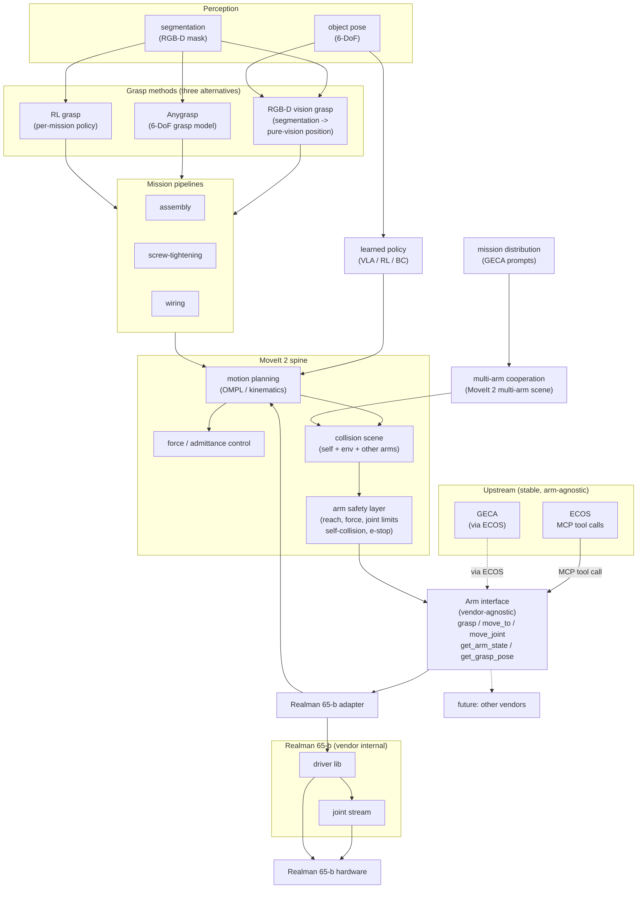
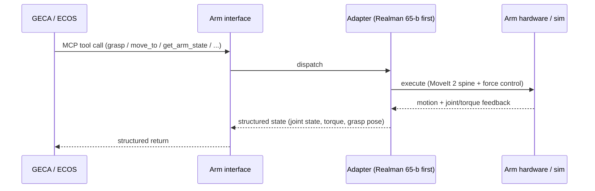
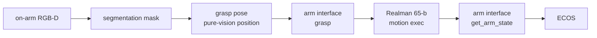
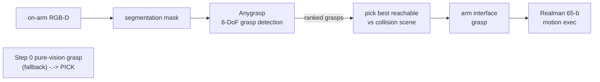
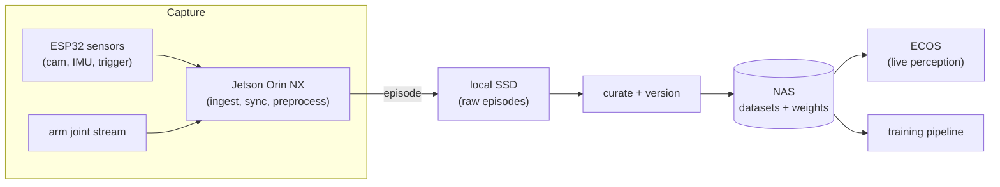
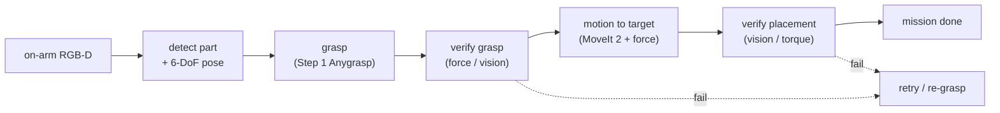
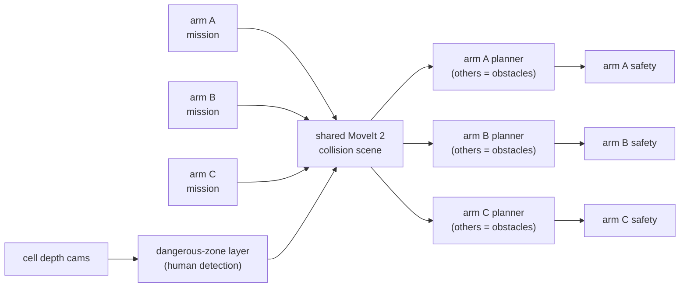
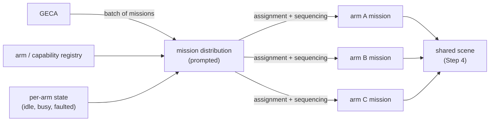
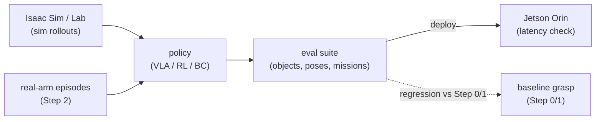

# Robotic Arm Group

> Group doc. Robot-side runtime for manipulators: motion planning, force-controlled grasping, embodied manipulation. Cross-cutting with [ECOS](ecos.md) (which consumes the arm interface), [GECA](geca.md) (which calls the arm through ECOS over MCP), and the [Robotic Base](base.md) (mobile manipulation). See [../team/general_cn.md](../team/general_cn.md) for system-level context.

> **Version Lineage:** Radish (2602) -> **Aether (2607)**

---

## Overview

Responsible for control, operation, and grasping-related task development for robotic manipulators, focusing on motion planning, force-controlled grasping, and embodied intelligence manipulation algorithms.

> **Platform Note:** We actively test on the **Realman 65-b** robotic arm as our current manipulator platform. The control and grasping stack is **platform-crossing**: vendor-specific drivers are abstracted behind a common arm interface, so manipulators from other vendors can be integrated with minimal changes. The build path below describes how the Realman 65-b is used and how the same architecture maps onto other arms.

The point of building the arm stack behind a vendor-agnostic interface is separation of concerns: the manipulation stack evolves on its own cadence, gets evaluated against reproducible task suites in Isaac Sim and on the Realman 65-b, and can be swapped or rolled back without touching ECOS or GECA. ECOS consumes a fixed MCP tool surface; what runs underneath is the arm group's to change.

The sections below are versioned per release cycle. Each cycle records its target architecture and the incremental build path to reach it; future cycles supersede or extend prior ones rather than silently rewriting them.

---

## Aether - 2607

This cycle defines the target architecture for the arm stack and the incremental path to build it. We don't ship the full stack on day one - we start from a minimal geometric grasp baseline and add layers one at a time. Each step runs end-to-end through the arm interface and is testable on its own; later steps stack on top of earlier ones.

### Target architecture

The final arm stack is a vendor-agnostic manipulation layer that ECOS consumes over MCP. At the top sits the **arm interface** - the only thing ECOS or GECA ever see - which dispatches to a per-arm adapter (Realman 65-b first, other vendors later). Underneath the adapter, a MoveIt 2 spine carries motion planning, force control, the three grasp methods (RGB-D vision grasp / Anygrasp / RL grasp), and mission pipelines; perception fuses on-arm RGB-D, external ESP32 sensors, and joint torque into the views the grasp methods, planners, and policies consume.

Core principle: **the arm is a black box to ECOS and GECA.** They call grasp / move / mission tools; the arm decides how to execute them on its specific hardware. Adding a new arm means writing a new adapter under the same interface - nothing upstream changes.

In text form, the flow is:

- **Upstream (arm-agnostic):** ECOS (and GECA through it) call MCP tools on the arm interface. They never see MoveIt, drivers, or the Realman 65-b specifically - only the vendor-agnostic tool surface.
- **Arm interface (the only coupling):** `grasp`, `move_to`, `move_joint`, `get_arm_state`, `get_grasp_pose`. Dispatches to the active adapter; the Realman 65-b adapter is the first implementation, future arms plug in alongside it without touching ECOS or GECA.
- **MoveIt 2 spine:** carries motion planning (OMPL + kinematics), force / admittance control for contact-rich tasks, and a collision scene that includes self-collision, the environment, and (in multi-arm setups) the other arms. The arm safety layer - reach, force/torque limits, joint limits, self-collision, e-stop - is the only thing allowed to write motion through the arm interface; everything else proposes intents, the safety layer gates them.
- **Perception:** on-arm RGB-D produces a segmentation mask; object pose estimation gives 6-DoF targets. The mask and pose feed the three grasp methods and the learned policies. External ESP32 sensors (extra cameras, triggers) extend the view beyond what the on-arm camera sees.
- **Grasp methods (three alternatives):** the arm has three interchangeable grasp strategies, any of which can feed a mission pipeline: (1) **RGB-D vision grasp** - segmentation mask -> pure-vision position from RGB-D, the geometric baseline; (2) **Anygrasp** - a learned 6-DoF grasp model that proposes ranked grasp poses from RGB-D; (3) **RL grasp** - a per-mission reinforcement-learning policy trained for specific tasks. The three share the same segmentation + pose input and the same downstream execution path; which one a mission uses is chosen per task.
- **Mission pipelines:** assembly, screw-tightening, wiring - each is a sequence of perception -> grasp (via one of the three grasp methods) -> motion -> verification steps, wrapped as one ECOS skill the agent can call without knowing the internals.
- **Learned policy (VLA / RL / BC):** trained in Isaac Sim, fine-tuned on real-arm data, deployed as an alternative to the hand-authored mission pipelines for tasks that benefit from learning.
- **Multi-arm cooperation:** multiple arms share one MoveIt 2 collision scene, so motion planning for one arm sees the others as dynamic obstacles; depth-based dangerous-zone avoidance keeps human-occupied space out of the collision scene; GECA prompts distribute missions across arms.

#### Modules

##### Arm interface (vendor-agnostic)

The only surface ECOS and GECA see. Covers grasp / move_to / move_joint commands on the input side and joint state, torque, and grasp pose on the feedback side. Exposed as MCP tools (`grasp`, `move_to`, `move_joint`, `get_arm_state`, `get_grasp_pose`), so the agent never talks to MoveIt or drivers directly. The contract is documented, versioned, and change-controlled per the inter-group rules in [../team/general_cn.md](../team/general_cn.md). The interface is identical in sim and on hardware.

##### Arm adapter (Realman 65-b first)

The per-arm implementation behind the interface. The Realman 65-b adapter is the first; arms from other vendors plug in by writing a new adapter, without touching ECOS or GECA. The adapter owns the vendor driver binding and the joint stream ingestion.

##### MoveIt 2 spine

The internal motion layer. OMPL for planning, IK for joint solutions, `tf2` for kinematics, `rosbag2` for replay. ROS 2 distro differences (Humble on 22.04, Jazzy on 24.04) are isolated behind adapter layers, per [ecos.md](ecos.md). ROS specifics never leak north of the arm interface.

##### Force / admittance control

Contact-rich tasks (assembly, screw-tightening, wiring) need more than position control. Force / admittance control on the MoveIt 2 spine lets the arm comply against contact - insert until resistance, tighten until torque, route until tension - rather than blindly following a position trajectory.

##### Arm safety layer

Where physics safety for the arm lives - reach, force/torque limits, joint limits, self-collision, workspace bounds, and e-stop. It is the only layer allowed to write motion through the arm interface; everything else proposes intents, the safety layer gates them. On hardware it is a hard stop; in sim it runs the same way (the physics side is simply more permissive). This mirrors the base's security layer - the same "only one writer to motion" rule, applied to the arm.

##### Perception (segmentation, pose)

On-arm RGB-D produces a segmentation mask; object pose estimation gives 6-DoF targets. The perception surface no longer proposes grasps itself - it produces the mask and pose that the grasp methods consume. External ESP32 sensors (extra cameras, triggers) extend the view beyond what the on-arm camera sees.

##### Grasp methods (three alternatives)

The arm has three interchangeable grasp strategies. All three share the same segmentation + pose input from perception and the same downstream execution path through the arm interface; which one a mission uses is chosen per task.

1. **RGB-D vision grasp (pure-vision position).** The geometric baseline. Segmentation mask + RGB-D depth give a pure-vision grasp position - simple, fast, no learned model required. Ships first as the regression target for the other two.
2. **Anygrasp (learned 6-DoF grasp model).** A learned grasp detector that takes the mask + depth and proposes multiple ranked 6-DoF grasp poses per object; the pipeline picks the best one that's reachable in the current collision scene. A drop-in upgrade to the RGB-D vision grasp for objects/poses the geometric baseline handles poorly.
3. **RL grasp (per-mission policy).** A reinforcement-learning policy trained for specific missions (assembly, screw-tightening, wiring). Best for contact-rich or dynamic tasks where a static pose proposal isn't enough. Trained in Isaac Sim, fine-tuned on real-arm data, deployed as a policy that emits grasp intents.

The three methods are alternatives, not a pipeline - a mission pipeline picks one. The RGB-D vision grasp is always in tree as a fallback when Anygrasp or the RL policy returns nothing reachable.

##### Mission pipelines (assembly, screw-tightening, wiring)

Specific missions the arm is built for. Each is a sequence of perception -> grasp (via one of the three grasp methods) -> verification steps, wrapped as one ECOS skill. A mission pipeline typically looks like: **vision -> detection -> processing -> grasp -> motion -> verification -> place / execution** - perceive the part, detect its pose, plan the grasp (RGB-D vision grasp / Anygrasp / RL grasp, chosen per task), execute it, verify the grasp held, move to the target, verify the placement. The exact steps vary per mission (screw-tightening adds a torque-controlled tightening step and a thread-engagement check; wiring adds a tension monitor), but the verify-after-each-step shape is shared.

##### Learned policy (VLA / RL / BC)

An alternative to hand-authored mission pipelines, for tasks that benefit from learning. Trained in Isaac Sim (cheap, parallel, reproducible), fine-tuned on real-arm episodes, deployed as a policy that emits joint actions or grasp intents. Candidate families: VLA for instruction-following, RL/DRL for reward-driven skills, BC warm-started from the geometric grasps.

##### Multi-arm cooperation

Multiple arms share one MoveIt 2 collision scene, so each arm's motion planner sees the others as dynamic obstacles. This is what makes a factory-line cell safe: arm A's planner won't route through arm B's current pose. Depth-based dangerous-zone avoidance keeps human-occupied space in the collision scene as well, so arms slow or halt when a person enters the cell.

#### Notes

- **The arm is a black box upstream.** ECOS and GECA see only the MCP tool surface. MoveIt, vendor drivers, force control, and the grasp methods all live behind the adapter - that division is what lets the same agent run unchanged across sim and any arm.
- **Safety is the only writer to motion.** Mission pipelines, learned policies, and ECOS-issued intents all propose; the arm safety layer disposes. Keeping motion writes funneled through one gated path is what makes the arm safe to run autonomously and around humans. This mirrors the base's security layer - same rule, different kinematics.
- **Missions verify after each step.** Vision -> detection -> grasp -> verify-grasp -> motion -> verify-placement. A mission that doesn't verify is just a trajectory; verification is what makes it robust to perceptual and execution noise.
- **Hand-authored first, learned second.** The RGB-D vision grasp (pure-vision position) ships first as the regression baseline; Anygrasp and the RL grasp stack on top and have to beat it on the same tasks. This keeps the learned path honest and gives a fallback when Anygrasp or the RL policy fails.
- **Platform-crossing by construction.** Arms from other vendors plug in by writing a new adapter under the same interface. The MoveIt spine, force control, perception, and safety layers are reused unchanged; only the adapter and (for arms with different kinematics) the IK config differ.
- **Sim-first, then hardware.** Every layer is validated in Isaac Sim first and then on the Realman 65-b. The arm interface is identical in both, which is what lets iteration happen in sim and transfer later.

### Channel contract (invariant across all steps)

Before any layer work, the MCP channel between ECOS and the arm interface is fixed and stays stable as layers are added underneath. Every build step below speaks the same contract.

In text form, the round trip per step is: ECOS (or GECA through it) issues an MCP tool call to the arm interface; the interface dispatches to the active adapter; the adapter executes through whatever spine it has (MoveIt 2 + force control on the Realman 65-b) and the arm hardware or sim world returns motion and joint/torque feedback; the adapter turns that into a structured state and returns it through the interface. This contract is fixed: every build step below uses the same request/response shape, even when the layers underneath change.

### Build path

Incremental development, in this order: **RGB-D vision grasp (baseline) -> Anygrasp -> Data collection -> Mission pipelines -> Multi-arm cooperation -> Agent prompts for multi-arm distribution -> Learned policy training (RL grasp) -> Other.** Each step produces an arm that ECOS can drive end-to-end; later steps stack on top of earlier ones. The RGB-D vision grasp stays in tree throughout as the regression target and fallback - every other grasp method has to beat it on the same tasks.

The build path lands the three grasp methods in order of complexity: the pure-vision RGB-D grasp first (Step 0, geometric baseline), then Anygrasp (Step 1, learned 6-DoF detection), then the RL grasp (Step 6, per-mission policy trained on the dataset and missions). The three are alternatives at runtime - a mission picks one - but they're built sequentially because each later one is validated against the earlier ones.

The order is chosen so each step's dependencies already exist: the grasp baseline must work before replacing it with a learned detector; data collection must flow before training policies on it; mission pipelines need a working grasp primitive; multi-arm cooperation needs single-arm missions to coordinate; agent prompts need a multi-arm cell to distribute over.

#### Step 0 - RGB-D vision grasp (pure-vision position baseline)

A minimal single-arm grasp pipeline: on-arm RGB-D produces a segmentation mask, and a pure-vision grasp position is computed from the mask + depth, the Realman 65-b executes. Exists to de-risk the channel - segmentation, grasp-pose proposal, motion execution, end-to-end grasp on one canonical object. This is the "signal" step: ECOS can make the arm pick up a thing at all. It is also the regression baseline and runtime fallback for every other grasp method (Anygrasp, RL grasp) later.

ECOS calls `grasp` on the arm interface; the interface runs the segmentation -> pure-vision-position -> motion pipeline and dispatches to the Realman 65-b; joint state flows back. No Anygrasp, no RL policy, no missions - just prove the arm picks up an object on command and reports state. The whole pipeline is wrapped as one ECOS skill (MCP tool), so the agent can call it without knowing the internals.

#### Step 1 - Anygrasp (learned 6-DoF grasp detection)

Replace the pure-vision grasp position with **Anygrasp** for 6-DoF grasp detection. Same RGB-D input, same arm execution, but Anygrasp proposes multiple grasp poses per object ranked by success likelihood, and the pipeline picks the best one that's reachable in the current collision scene. The Step 0 pure-vision grasp stays as a fallback when Anygrasp returns nothing.

Same as Step 0, but Anygrasp replaces the pure-vision position as the grasp proposer. Anygrasp takes the mask + depth and emits a ranked list of 6-DoF grasp poses; the pipeline picks the highest-ranked one that's reachable given the current collision scene and arm kinematics, falling back to the Step 0 pure-vision grasp if Anygrasp returns nothing reachable. This is the first place a learned component enters the stack, and it's a drop-in upgrade to an existing primitive rather than a new path.

Why after the baseline: Anygrasp is only meaningful once there's a working grasp pipeline to plug into. Landing it first would mean a learned detector with no execution path to test it against.

#### Step 2 - Data collection (vision + action dataset)

Build a vision + action dataset, primarily for dynamic data collection via **ESP32** and **Jetson Orin**. ESP32s handle low-latency distributed sensors (extra cameras, IMU, triggers) and stream over USB/Wi-Fi; the Jetson Orin NX ingests, time-syncs, optionally preprocesses on-device, and writes episodes to storage. Result feeds ECOS (live perception) and the training pipeline (Step 6).

ESP32 sensors (extra cameras, IMU, trigger) and the arm's joint stream both feed the Jetson Orin NX, which ingests, time-syncs, and optionally preprocesses on-device before writing raw episodes to local SSD. Those raw episodes are curated, versioned, and pushed to the NAS; from there ECOS reads them for live perception and the training pipeline reads them for model training. The capture setup is tuned for **arm efficiency**: episodes are labeled with the grasp / motion primitive used and its outcome (success, slip, drop, mis-grasp), so downstream training can weight toward motions that actually improved arm usage rather than raw volume.

Each episode is a stream of synchronized `(RGB, depth, joint state, action, timestamp)` tuples plus a task label, the primitive used, and an outcome flag. Vision and action frames are aligned against the arm's joint stream so they're usable for downstream training. Raw episodes live on local SSD; curated, versioned snapshots live on the NAS, indexed by a small SQLite/JSON metadata store that ECOS and the training pipeline both query.

Why before missions and training: missions generate the contact-rich episodes (assembly, screws, wiring) that the learned policy needs, and the dataset schema has to be fixed before either produces usable data. Landing it after Anygrasp lets us capture Anygrasp-proposed grasps and their outcomes as part of each episode.

#### Step 3 - Mission pipelines (single-arm)

Specific missions the arm is built for: **assembly, screw-tightening, wiring**. Each is a sequence of perception -> detection -> processing -> grasp -> verification -> motion -> verification steps, wrapped as one ECOS skill. The shared shape is: perceive the part, detect its pose, plan the grasp, execute it, verify the grasp held, move to the target, verify the placement; the exact steps vary per mission.

A mission pipeline runs the same verify-after-each-step loop for every mission type. Vision detects the part and its 6-DoF pose; one of the three grasp methods (Step 0 RGB-D vision grasp / Step 1 Anygrasp / Step 5 RL grasp, chosen per task) picks it up; a verification step (force feedback for grip, vision for pose) confirms the grasp held; MoveIt 2 plus force control moves it to the target; a second verification confirms placement. Any verification failure routes back to retry / re-grasp rather than continuing blind. Per-mission differences live in the middle:

- **Assembly:** pick part, align by pose, insert with admittance control until resistance, verify seat.
- **Screw-tightening:** pick screwdriver bit (or use fixed tool), engage thread by torque signature, tighten to target torque, verify torque held.
- **Wiring:** pick connector or wire, route along planned path with tension monitor, mate / terminate, verify continuity or seat.

Why after grasp + data: missions are sequences of grasps, so they need Step 1 working first; and they're the richest source of contact-rich episodes for Step 6's learned policy, so the dataset (Step 2) needs to be ready to capture them.

#### Step 4 - Multi-arm cooperation (factory-line cell)

Coordinate multiple arms in one factory-line cell. Arms share a single MoveIt 2 collision scene, so each arm's motion planner sees the others as dynamic obstacles. **MoveIt 2** is the cooperation spine; **depth-based dangerous-zone avoidance** keeps human-occupied space in the collision scene as well, so arms slow or halt when a person enters the cell. The specific avoidance method (strict depth-costmap, predictive velocity obstacle, or a learned policy) is open - we pick the most suitable during development.

Each arm still runs its own mission pipeline (Step 3) and its own safety layer; the new piece is the shared collision scene. MoveIt 2's multi-arm planning treats every other arm as a dynamic obstacle in the scene, so arm A's planner won't route through arm B's current pose. A dangerous-zone layer fed by the cell's depth cameras adds human-occupied space to the same scene, so arms slow or halt when a person enters the cell. The exact method for dynamic obstacle avoidance - a depth-driven costmap, a velocity-obstacle predictor, or a learned avoidance policy - isn't fixed at architecture time; we evaluate candidates during development and pick the one that's reliable enough to gate motion.

Why after single-arm missions: cooperation is just single-arm missions running in parallel against a shared scene. Landing it before Step 3 would mean coordinating arms that have nothing useful to do.

#### Step 5 - Agent prompts for multi-arm mission distribution

Let GECA distribute missions across arms in the cell. The agent receives a batch of missions (e.g., "assemble 3 units, tighten their screws, wire them"), sees each arm's current state and capability via the registry, and emits a per-arm assignment plus sequencing. Distribution prompts are authored and versioned; the agent never bypasses the arm safety layer - it only picks which arm runs which mission.

GECA's mission-distribution prompt takes a batch of missions and the current per-arm state (idle / busy / faulted, plus capability from the registry) and emits an assignment: which arm runs which mission, in what order, with what handoffs. Distribution is a planning decision, not a motion decision - the agent picks who does what, but each arm still executes through its own mission pipeline (Step 3), shared collision scene (Step 4), and safety layer. Prompts are versioned alongside the MCP schemas so a prompt change can be rolled back independently.

Why after cooperation: distribution needs a working multi-arm cell to distribute over. Landing it before Step 4 would mean assigning missions to arms that can't yet avoid each other.

#### Step 6 - Learned policy training (VLA / RL / BC; produces the RL grasp method)

Train manipulation models - **VLA / RL / DRL / BC** - as an alternative to the hand-authored mission pipelines for tasks that benefit from learning. This step also produces the third grasp method, the **RL grasp**: a per-mission reinforcement-learning policy that emits grasp intents for specific tasks (assembly, screw-tightening, wiring). Train in NVIDIA Isaac (Isaac Sim / Isaac Lab) first, because it's cheap, parallel, and reproducible; then fine-tune and evaluate on real-arm data from Step 2. Candidate families: VLA for instruction-following, RL/DRL for reward-driven skills (this is the RL grasp), BC warm-started from the geometric grasps.

Sim rollouts from Isaac Sim / Lab and real-arm episodes from Step 2 both feed policy training (VLA / RL / BC candidates); the resulting policy runs through an eval suite of objects, poses, and mission fragments, then deploys to the Jetson Orin for a latency check before going live on the arm. The policy has to beat the Step 0 / Step 1 grasp baselines on the same eval suite - if it doesn't, the baseline ships and the policy keeps training. Compute mapping (see [../team/general_cn.md](../team/general_cn.md)): VLA fine-tune and concurrent sim run on the 3x P40 server; heavy RL/DRL goes on the 2x 3090 workstation.

Why after data + missions: the policy needs Step 2's dataset to train and Step 3's missions as the things it learns to do. Landing it earlier would mean training on a dataset that doesn't exist yet, against tasks the arm can't yet perform.

#### Step 7 - Other

Anything that didn't fit above: tool changer integration, fixture / jig perception, in-hand manipulation, bin-picking at scale, wear-and-tear monitoring on the arm, and the long tail of factory-line primitives. Slotted here because each depends on at least one of the earlier layers being in place.

This step is intentionally open - it's where the cycle absorbs whatever turns out to matter most once Steps 0-6 are running. Candidates include: a tool-changer interface (so the arm swaps between gripper, screwdriver, and wiring head mid-mission), fixture / jig perception (so missions don't assume a known part pose), in-hand manipulation (so the arm re-grasps without putting the part down), and bin-picking (so the arm picks from a pile rather than a presented pose). None of these are pinned at architecture time; they slot in as the rest of the stack matures.

Why last: every candidate here is an extension of an existing layer (grasp, mission, perception), so it needs that layer to exist first.

---

## xxxx - xxxx

> Placeholder for the next cycle. Replace this section when the next version lands: record the target architecture and incremental build path for that cycle. Keep prior cycles intact above for history.

