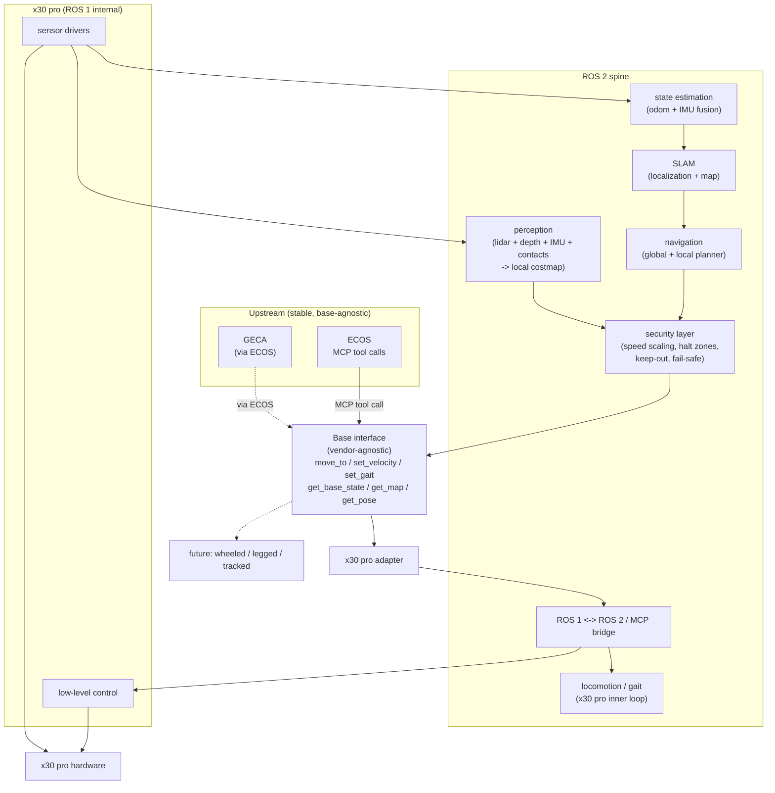
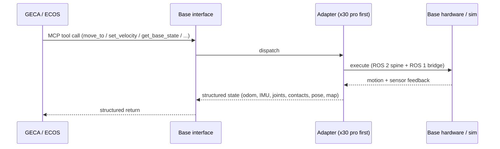
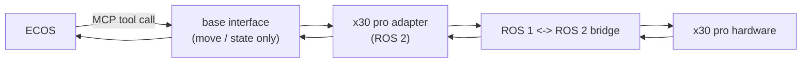
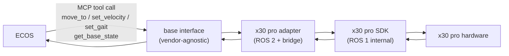
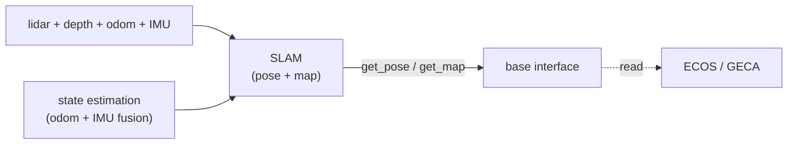
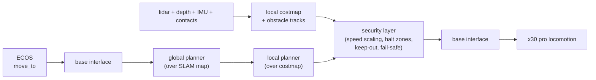
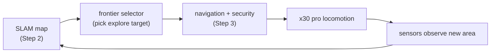
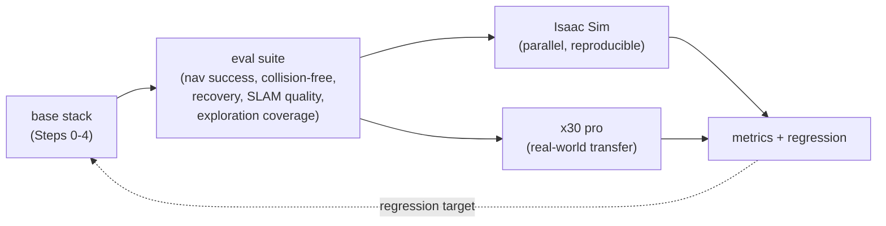

# Robotic Base Group

> Group doc. Robot-side runtime for mobile bases: locomotion, navigation, deployment. Cross-cutting with [ECOS](ecos.md) (which consumes the base interface), [GECA](geca.md) (which calls the base through ECOS over MCP), and the [Robotic Arm](arm.md) (mounted mobile manipulation). See [../team/general_cn.md](../team/general_cn.md) for system-level context.

> **Version Lineage:** Radish (2602) -> **Aether (2607)**

---

## Overview

Responsible for motion control, navigation, and deployment-related development for mobile robotic bases, focusing on gait/locomotion planning, environment perception, and autonomous decision-making algorithms.

> **Platform Note:** We actively test on the **x30 pro** robot dog as our current mobile-base platform. The locomotion and navigation stack is **platform-crossing**: hardware-specific motion interfaces are abstracted behind a common base interface, so other mobile bases (wheeled, legged, or tracked) can be integrated with minimal changes. The build path below describes how the x30 pro is used and how the same architecture maps onto other bases.

The point of building the base stack behind a vendor-agnostic interface is separation of concerns: the locomotion and navigation stack evolves on its own cadence, gets evaluated against reproducible task suites in Isaac Sim and on the x30 pro, and can be swapped or rolled back without touching ECOS or GECA. ECOS consumes a fixed MCP tool surface; what runs underneath is the base group's to change.

The sections below are versioned per release cycle. Each cycle records its target architecture and the incremental build path to reach it; future cycles supersede or extend prior ones rather than silently rewriting them.

---

## Aether - 2607

This cycle defines the target architecture for the base stack and the incremental path to build it. We don't ship the full stack on day one - we start from a minimal ROS 2 adapter that just exposes the vendor SDK, and add layers one at a time. Each step runs end-to-end through the base interface and is testable on its own; later steps stack on top of earlier ones.

### Target architecture

The final base stack is a vendor-agnostic motion + perception layer that ECOS consumes over MCP. At the top sits the **base interface** - the only thing ECOS or GECA ever see - which dispatches to a per-base adapter (x30 pro first, wheeled / legged / tracked later). Underneath the adapter, a ROS 2 spine carries locomotion, state estimation, SLAM, and the navigation/security layer; the x30 pro's own ROS 1 nodes live inside the base behind a single ROS 1 <-> ROS 2 / MCP bridge, so nothing upstream ever sees ROS 1 directly.

Core principle: **the base is a black box to ECOS and GECA.** They call motion and state tools; the base decides how to execute them on its specific hardware. Adding a new base means writing a new adapter under the same interface - nothing upstream changes.

In text form, the flow is:

- **Upstream (base-agnostic):** ECOS (and GECA through it) call MCP tools on the base interface. They never see ROS, drivers, or the x30 pro specifically - only the vendor-agnostic tool surface.
- **Base interface (the only coupling):** `move_to`, `set_velocity`, `set_gait`, `get_base_state`, `get_map`, `get_pose`. Dispatches to the active adapter; the x30 pro adapter is the first implementation, future wheeled/legged/tracked bases plug in alongside it without touching ECOS or GECA.
- **ROS 2 spine:** carries the navigation and security logic. The global + local planners compute motion intents; the security layer (speed scaling, halt zones, geo-fenced keep-out, perception/comms-loss fail-safe) gates them; only intents that survive the security layer are written back through the base interface to the x30 pro's locomotion inner loop. SLAM feeds the planners with pose and map; state estimation fuses odometry and IMU into SLAM; perception fuses lidar, depth, IMU, and contacts into a local costmap that drives the security layer.
- **ROS 1 internal (x30 pro only):** sensor drivers and low-level control run as ROS 1 nodes on the base, behind a single ROS 1 <-> ROS 2 / MCP bridge at the boundary. Everything inside the base stays ROS 1; nothing upstream sees it directly.

#### Modules

##### Base interface (vendor-agnostic)

The only surface ECOS and GECA see. Covers velocity / waypoint / gait commands on the input side and odometry, IMU, joint status, contacts, pose, and map on the feedback side. Exposed as MCP tools (`move_to`, `set_velocity`, `set_gait`, `get_base_state`, `get_map`, `get_pose`), so the agent never talks to ROS or drivers directly. The contract is documented, versioned, and change-controlled per the inter-group rules in [../team/general_cn.md](../team/general_cn.md). The interface is identical in sim and on hardware.

##### Base adapter (x30 pro first)

The per-base implementation behind the interface. The x30 pro adapter is the first; wheeled, legged, and tracked bases plug in by writing a new adapter, without touching ECOS or GECA. The adapter owns the ROS 1 <-> ROS 2 / MCP bridge for bases that ship a ROS 1 stack (the x30 pro does), and the direct ROS 2 driver binding for bases that don't.

##### ROS 2 spine

The internal bus that carries locomotion, state estimation, SLAM, navigation, and the security layer. Lifecycle nodes for deterministic bring-up, DDS via the rmw abstraction, `tf2` for kinematics, `rosbag2` for replay. ROS 2 distro differences (Humble on 22.04, Jazzy on 24.04) are isolated behind adapter layers, per [ecos.md](ecos.md). ROS specifics never leak north of the base interface.

##### ROS 1 internal (x30 pro only)

ROS 1 nodes handle low-level motion control, sensor drivers, state estimation, and gait/locomotion on the x30 pro. This bus is internal only - nothing upstream sees ROS 1 directly. A single ROS 1 <-> ROS 2 / MCP bridge sits at the boundary; everything inside the base stays ROS 1 for now. Hardening: deterministic loop rates, watchdogs, clean shutdown on comms loss with ECOS.

##### State estimation

Fuses wheel/leg odometry, IMU, and (when available) contact events into a stable pose and velocity estimate. Feeds SLAM and the planners. On the x30 pro this runs partly inside the ROS 1 stack (the base's own estimator) and is reconciled on the ROS 2 side; on future bases it may run entirely ROS 2-side.

##### SLAM (localization + map)

Simultaneous localization and mapping: maintains the base's pose in a map and the map itself, fusing lidar / depth / odometry. Feeds the navigation planners with `get_pose` and `get_map`, which are also the feedback side of the base interface. SLAM runs continuously while the base is moving; map updates are versioned so ECOS and the debug GUI read a consistent snapshot.

##### Navigation (global + local planner)

Global + local planner on the ROS 2 side (Nav2-style), calling into the base interface, with the x30 pro's own locomotion as the inner loop. The global planner produces a route over the map; the local planner produces velocity/waypoint commands that respect the costmap. Both feed into the security layer, which is the only thing allowed to write motion through the base interface.

##### Perception (local costmap)

Fuses lidar, depth, IMU, and contacts into a local costmap with dynamic obstacle tracks. Feeds the security layer directly. The costmap is the base's real-time view of its immediate surroundings; SLAM's map is the longer-range structural view.

##### Security layer (dynamic secure)

The "dynamic secure" part of navigation. Speed scaling and halt zones around humans and unexpected obstacles, geo-fenced keep-out and slow zones configurable from ECOS, and a fail-safe that drops the base into a controlled stop on loss of perception or comms. This is where physics safety for the base lives - collision avoidance, force/contact thresholds, proximity, and workspace bounds. It is the only layer allowed to write motion through the base interface; everything else proposes intents, the security layer gates them. On hardware it is a hard stop; in sim it runs the same way (the physics side is simply more permissive).

#### Notes

- **The base is a black box upstream.** ECOS and GECA see only the MCP tool surface. ROS dialect (1 vs 2), vendor SDK, gait controller, and sensor drivers all live behind the adapter - that division is what lets the same agent run unchanged across sim and any base.
- **Security is the only writer to motion.** Global planner, local planner, and ECOS-issued intents all propose; the security layer disposes. Keeping motion writes funneled through one gated path is what makes the base safe to run autonomously and around humans.
- **ROS 1 is internal and temporary.** The x30 pro ships a ROS 1 stack; we contain it behind the bridge rather than rewrite it. Future bases that are ROS 2-native skip the bridge entirely.
- **Platform-crossing by construction.** Wheeled, legged, and tracked bases plug in by writing a new adapter under the same interface. The navigation, SLAM, and security layers are reused unchanged; only the adapter and (for legged bases) the gait mapping differ.
- **Sim-first, then hardware.** Every layer is validated in Isaac Sim first (cheap, parallel, reproducible) and then on the x30 pro. The base interface is identical in both, which is what lets iteration happen in sim and transfer later.

### Channel contract (invariant across all steps)

Before any layer work, the MCP channel between ECOS and the base interface is fixed and stays stable as layers are added underneath. Every build step below speaks the same contract.

In text form, the round trip per step is: ECOS (or GECA through it) issues an MCP tool call to the base interface; the interface dispatches to the active adapter; the adapter executes through whatever spine it has (ROS 2 + ROS 1 bridge on the x30 pro) and the base hardware or sim world returns motion and sensor feedback; the adapter turns that into a structured state and returns it through the interface. This contract is fixed: every build step below uses the same request/response shape, even when the layers underneath change.

### Build path

Incremental development, in this order: **ROS 2 adapter -> SDK interfaces exposure -> SLAM -> Navigation / Dynamic Security -> Self adventure -> Benchmarks.** Each step produces a base that ECOS can drive end-to-end; later steps stack on top of earlier ones. The adapter-only baseline stays in tree throughout as a regression target - every step has to beat it on the same tasks.

The order is chosen so each step's dependencies already exist: the adapter must expose the SDK before anything can drive the base; SLAM must localize before navigation can plan; navigation must move the base safely before self-adventure can explore; and benchmarks need the full stack to measure against.

#### Step 0 - ROS 2 adapter (baseline)

A minimal ROS 2 adapter that talks to the x30 pro over its ROS 1 stack through the bridge, exposing nothing more than the raw motion commands. Exists to de-risk the channel - bridge bring-up, latency, error handling, end-to-end motion on one canonical command. This is the "signal" step: ECOS can drive the base to move at all.

ECOS calls a minimal motion/state tool on the base interface; the interface dispatches to the x30 pro adapter; the adapter crosses the ROS 1 <-> ROS 2 bridge and drives the hardware; feedback flows back the same way. No SLAM, no navigation, no security - just prove the base moves on command and reports state.

#### Step 1 - SDK interfaces exposure

Expose the vendor SDK's full motion and perception surface through the vendor-agnostic base interface. Velocity / waypoint / gait commands on the input side; odometry, IMU, joint status, and contacts on the feedback side. The interface is now the complete contract ECOS consumes for the rest of the cycle.

Same as Step 0, plus the full SDK surface is now exposed through the vendor-agnostic interface. ECOS can command velocity, waypoints, and gait, and read back odometry, IMU, joint status, and contacts. Future bases plug in by writing a new adapter that satisfies the same interface - ECOS and GECA see no change. The contract is documented, versioned, and change-controlled per [../team/general_cn.md](../team/general_cn.md).

Why first: every later layer (SLAM, navigation, security) consumes the base through this interface. Nailing it early - and fixing it as the contract - prevents cascading rework when the layers underneath change.

#### Step 2 - SLAM (localization + map)

Stand up simultaneous localization and mapping. Fuse lidar / depth / odometry / IMU into a running pose estimate and a versioned map. Expose `get_pose` and `get_map` through the base interface so ECOS, GECA, and the debug GUI can read where the base is and what the world looks like.

Sensors (lidar, depth, odom, IMU) fuse into state estimation, which feeds SLAM; SLAM maintains the base's pose in a map and the map itself, both exposed through the base interface. Motion still comes from Step 1's direct SDK commands - there is no planner yet, so ECOS is driving the base manually while SLAM builds the map.

Why before navigation: the planners need a pose and a map to plan over. Standing up SLAM first means navigation has something to consume on day one, rather than landing alongside a half-built map.

#### Step 3 - Navigation / Dynamic Security

Global + local planner on the ROS 2 side, with the security layer as the only writer to motion. ECOS issues a `move_to` goal; the global planner routes over the SLAM map; the local planner produces velocity/waypoint commands; the security layer gates them against the local costmap (dynamic obstacles, humans, keep-out, fail-safe) and only then writes through the base interface to the x30 pro's locomotion.

ECOS's `move_to` no longer drives the base directly. The global planner routes it over the SLAM map; the local planner turns the route into velocity/waypoint commands; the security layer gates those commands against the local costmap - speed scaling and halt zones around humans and unexpected obstacles, geo-fenced keep-out and slow zones configurable from ECOS, and a fail-safe that drops the base into a controlled stop on loss of perception or comms. Only intents that survive the security layer reach the x30 pro's locomotion. This is the step where the base becomes safe to move autonomously.

Why now: SLAM (Step 2) gives the planners a map and a pose, and the SDK exposure (Step 1) gives them a way to write motion. Navigation is what turns "the base can move" into "the base can get somewhere on its own," and the security layer is load-bearing the moment it does - so they ship together. Eval covers navigation success rate, collision-free time, and recovery under perturbation, in both Isaac Sim and on the x30 pro.

#### Step 4 - Self adventure (autonomous exploration)

Let the base explore an unknown environment on its own, building and refining the SLAM map without a human-issued goal. The base picks frontier targets from the current map, navigates to them with the Step 3 stack, and folds the new observations back into SLAM. This is the first step where the base decides where to go, rather than executing a goal ECOS handed it.

The base loops over its own SLAM map: a frontier selector picks the most informative boundary between known and unknown space as the next explore target; the Step 3 navigation + security stack drives the base there; new sensor observations expand the map; the loop repeats until the frontier is exhausted or a budget (time, battery, area) runs out. Exploration still respects the security layer fully - it is autonomous, not uncontrolled. ECOS can start, stop, and bound exploration (geo-fence, budget) through the base interface.

Why after navigation: exploration is just repeated `move_to` to self-chosen goals, so it depends on the Step 3 stack being solid first. Landing it earlier would mean exploring with no security layer, which is unsafe; landing it later would delay the map-quality and coverage metrics that feed the benchmarks.

#### Step 5 - Benchmarks

Stand up the eval suite that measures the whole stack, in both Isaac Sim and on the x30 pro. Navigation success rate, collision-free time, recovery under perturbation, SLAM map quality (drift, coverage, loop closure), exploration coverage vs. time/budget, and latency on the Jetson Orin deployment target. Benchmarks run on every later step as a regression target; this step formalizes them and pins the numbers.

The full stack (Steps 0-4) runs through an eval suite that measures navigation success rate, collision-free time, recovery under perturbation, SLAM map quality, exploration coverage vs. budget, and deployment latency. The suite runs in Isaac Sim (cheap, parallel, reproducible) and on the x30 pro (real-world transfer). Results feed back as a regression target: every later change to the stack has to beat the pinned numbers on the same tasks.

Why last: benchmarks need the full stack to measure against. Standing them up earlier would measure a partial stack; standing them up now locks the numbers the rest of the cycle (and future cycles) regress against.

---

## xxxx - xxxx

> Placeholder for the next cycle. Replace this section when the next version lands: record the target architecture and incremental build path for that cycle. Keep prior cycles intact above for history.

