# ECOS - Embodied Cognition Operating System

> Component doc. Robot-side runtime, ROS 2 based. Cross-cutting: receives skills/perception from [Robotic Arm](arm.md) and [Robotic Base](base.md); exposes state to [GECA](geca.md) and to the Frontend debug GUI. See [../team/general_cn.md](../team/general_cn.md) for system-level context.

> **Version Lineage:** Clover (2602) -> **Robusta (2607)**

---

## Overview

ECOS is the robot-side runtime, built on **ROS 2** (Humble on Ubuntu 22.04, Jazzy on 24.04). It owns perception, motion and grasp control, hardware drivers, the sim bridge, and the MCP surface GECA talks to - all behind stable, documented interfaces. Upstream callers (GECA, the debug GUI, the data pipeline) never touch drivers, ROS topics, or hardware directly; they call MCP tools and read shared state.

> **MCP scope note.** "MCP" here is a general message-channel contract, not a strict JSON-RPC wire format. A tool call or resource read may carry JSON, but also plain strings, mask-encoded payloads, base64 blobs, or raw token/vector embeddings - whatever the tool's schema declares. We refer to all of these uniformly as "MCP". Schema versioning (per tool, in the registry) is what keeps this stable, not a fixed serialization.

The design goal is isolation: vendor drivers, ROS dialects (1 vs 2), platform/arch differences, and sim-vs-real differences live behind adapters. Swapping the x30 pro for a different base, or the Realman 65-b for a different arm, does not change the surface GECA sees. ROS 2 is the spine - lifecycle nodes for deterministic bring-up, DDS via the rmw abstraction, `ros2_control` for the driver layer, `tf2` for kinematics, `rosbag2` for replay - but ROS specifics never leak north of the MCP surface.

---

## Architecture

Six infra/control-plane modules around two workload subsystems, wrapped by an environment module. Everything above the northbound surface stays stable; everything below it may change freely.

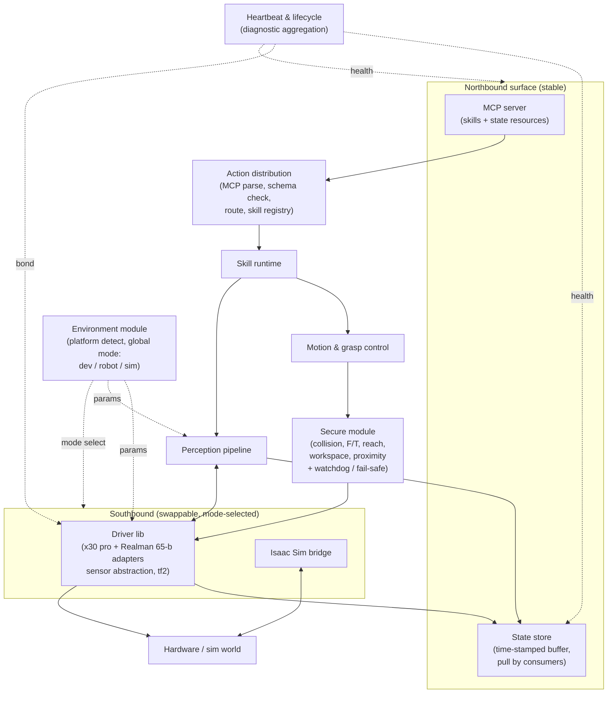

In text: the **environment module** wraps everything - it detects platform (Ubuntu 22.04/24.04, x86_64/arm64), holds the global mode flag (`dev` / `robot` / `sim`), and feeds mode-selected params to the southbound layer. The **northbound surface** is the contract: the MCP server (tools and state resources GECA calls) and the state store (what GECA and the GUI read). Below it, **action distribution** parses and routes incoming MCP calls through the skill registry into the **skill runtime**, which dispatches into **motion & grasp control** or the **perception pipeline**. Motion intents pass through the **secure module** - a synchronous gate that checks collision, force/torque, joint reach, workspace bounds, and human proximity before any command reaches hardware - then through the **driver lib** to the robot. Perception reads back from the same drivers. Both publish into the state store. **Heartbeat & lifecycle** runs cross-cutting: it aggregates node diagnostics, owns ROS 2 lifecycle transitions, and holds bonds to critical drivers so comms loss triggers fail-safe. The **southbound layer** is swappable: the environment module's mode flag selects the real driver lib or the Isaac Sim bridge, so the same core runs against hardware or sim.

---

## ECOS <-> GECA channel

This is a protocol-level channel, not a code API. It runs over MCP plus structured prompts. "MCP" is a message-channel contract, not a strict JSON-RPC wire: a tool call or observation may be JSON, a plain string, a mask-encoded payload, base64, or a raw token/vector blob, as declared by the tool's schema. The contract is fixed; both sides evolve independently as long as the MCP schema (per tool, in the registry) and prompt shape hold.

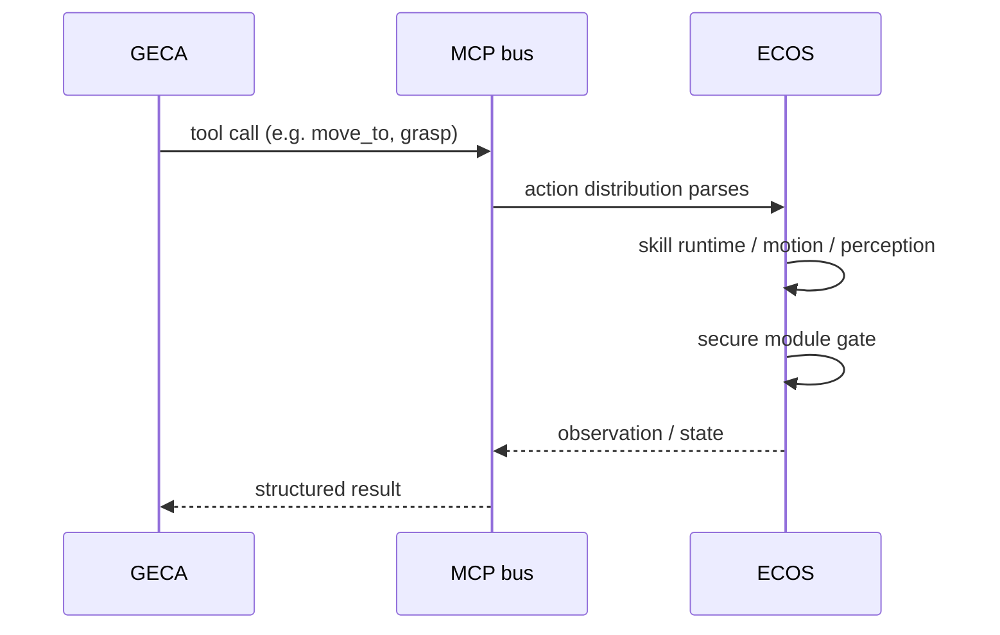

In text: GECA issues a tool call (e.g. `move_to`, `grasp`) onto the MCP bus; action distribution parses and validates it, dispatches through the skill runtime, the secure module gates any motion, and ECOS returns an observation or state snapshot through the bus as a structured result. Schema changes are proposed, documented, and coordinated per the inter-group rules in [../team/general_cn.md](../team/general_cn.md).

The safety split between the two sides is explicit and mirrors [GECA](geca.md): GECA's Safety/verification gate checks the **LLM side** (repeated calls, loops, off-task actions, malformed arguments) and explicitly does **not** check collision, force/torque, reach, workspace, or proximity. Those physics-level checks belong to ECOS's secure module below.

---

## Subsystems

### Environment module

Detects the platform at startup and owns the global mode flag. Concretely: Ubuntu version (22.04 vs 24.04), architecture (x86_64 vs arm64), ROS 2 distro (Humble vs Jazzy), and a single `mode` parameter - `dev` (drivers stubbed, no hardware), `robot` (real driver lib), or `sim` (Isaac Sim bridge). Mode selection decides which southbound adapter is loaded, which launch file is used, and which param set is applied. This is also where global config lives: declared ROS 2 parameters per node, hot-reloadable where safe, with hardcoded values pulled out of code. The Isaac Sim bridge is one mode of this module, not a separate adapter sitting beside the driver lib.

### MCP server & action distribution (Interfaces for GECA)

The northbound surface. The MCP server exposes two kinds of endpoints: **tools** (skills the brain can call - `move_to`, `grasp_segmented`, `read_base_state`, `replay_episode`) and **resources** (state snapshots the brain or GUI can read). Action distribution sits behind it: it parses incoming tool calls, validates arguments against the skill registry's schemas, routes to the skill runtime, and tracks in-flight calls. Skill discovery, schema versioning, and the capability listing live here - symmetric to GECA's tool registry. Streams are supported (a tool may emit a stream of results over time rather than one-shot).

### State store

A time-stamped buffer that every producer writes to - perception, drivers, runtime observations, tool results. Consumption is pull-only: GECA, the GUI, and internal modules read on demand. The drop policy is conservative: only entries stale beyond a TTL or flagged invalid/error are dropped. This is the symmetric half of GECA's state queue - the contract holds only if both sides share the same timestamp discipline. Replay (rosbag2 + MCP trace, time-aligned) reads back through this store.

### Skill runtime & registry

Executes MCP tool calls. A skill is the unit GECA composes with; each skill wraps one or more internal pipelines (perception + control) and exposes a typed schema. The registry handles registration, versioning, and discovery - the brain queries it to know what tools exist before calling. Skills are the only path from MCP to motion or perception.

### Perception / state

Ingests sensor streams (cameras, depth, lidar, IMU, contacts), fuses them, and publishes a coherent state snapshot to the state store. Sensor abstraction lives in the driver lib so perception is vendor-blind - it consumes a uniform timestamped message regardless of which camera or IMU produced it. State is what GECA reasons over and what the debug GUI visualizes, time-aligned to support replay.

### Motion & grasp control

Consumes high-level intents from skills (`move_to`, `grasp pose`, `set_velocity`) and turns them into joint-level commands via `ros2_control`. For manipulation, the [Robotic Arm](arm.md) baseline grasp and learned policies execute here. For locomotion, the [Robotic Base](base.md) interface lands here. Every command passes through the secure module before reaching the driver lib.

### Driver lib (hardware adapters)

Vendor-specific code lives here and only here, as `ros2_control` hardware-interface plugins. The x30 pro adapter (base) and Realman 65-b adapter (arm) are the first implementations. New platforms drop in by writing a new plugin that satisfies the hardware interface; nothing upstream changes. This module also owns **sensor abstraction** (a uniform timestamped message across camera/depth/lidar/IMU/contact) and **tf2 tree ownership** - a single owner of base->world, base->arm, arm->tool, and camera frames so kinematics never disagree.

### Secure module

The runtime-side safety gate. It is hardcoded, not learned, and synchronous on the motion command path: every joint or cartesian command passes through collision, force/torque limits, human proximity, joint reach, and workspace-bounds checks before it reaches the driver lib. This is exactly the physics-level concern GECA's Safety gate explicitly defers to the runtime. The secure module also owns the **watchdog / fail-safe** half: on comms loss with GECA or on a bond timeout from a critical driver, the base goes to a controlled stop and the arm holds pose. Hard gate on hardware; no-op stub in sim during early development.

### Heartbeat & lifecycle

Node health aggregation and deterministic bring-up. Uses ROS 2 managed (lifecycle) nodes so bring-up order is fixed: drivers -> perception -> motion -> secure -> MCP server -> action distribution. Shutdown mirrors in reverse. `diagnostic_updater` aggregates per-node health into the state store and onto an MCP status channel; bonds to critical drivers feed the secure module's watchdog. Without this, heartbeat has nothing to gate against and fail-safe has nothing to act on.

---

## Channel contract (invariant across all steps)

Before any module work, the MCP channel between GECA and ECOS is fixed and stays stable as modules are added on the ECOS side. Every build step below speaks the same contract.

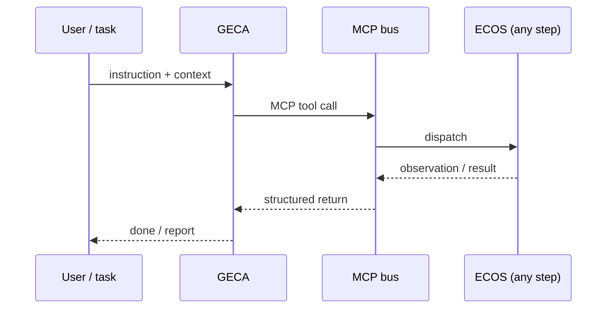

In text: the user (or task harness) hands GECA an instruction; GECA issues an MCP tool call to the bus; the bus dispatches to ECOS (whatever modules that step has); ECOS returns an observation or result as a structured value; GECA turns that into a done/report. This contract is fixed: every build step below uses the same request/response shape, even when ECOS's internals change.

---

## Build path

Incremental development. Each step produces a runnable runtime; later steps stack on top of earlier ones. The baseline stays in tree throughout as a regression target - every step has to beat it on the same tasks.

#### Step 0 - Baseline ROS 2 node + MCP channel

A single ROS 2 node serving one trivial MCP tool (e.g. `read_base_state`) over the MCP bus. Exists to de-risk the channel - schema, transport, latency, error handling, end-to-end round trip with GECA.

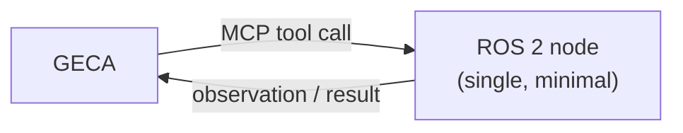

In text: GECA calls one MCP tool served by a single minimal ROS 2 node; the node returns an observation/result. No drivers, no state store, no skills - just node <-> GECA.

#### Step 1 - Add environment module

Platform detection and the global mode flag land first because everything downstream branches on mode. Detect Ubuntu version, arch, ROS 2 distro; expose `dev` / `robot` / `sim`; load mode-selected params.

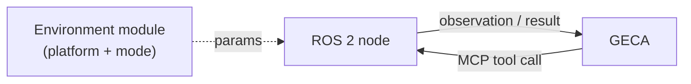

In text: the environment module wraps the node, detects the platform, and feeds mode-selected parameters to it. The MCP channel is unchanged. Why first: the choice of real driver lib vs Isaac Sim bridge vs stubs depends on mode, so it has to be in place before any adapter work.

#### Step 2 - Add driver lib skeleton + one adapter

Stand up the `ros2_control` hardware-interface contract and one adapter (real x30 pro base, or the Isaac Sim bridge in sim mode). Behind the internal interface; nothing upstream changes when the adapter swaps.

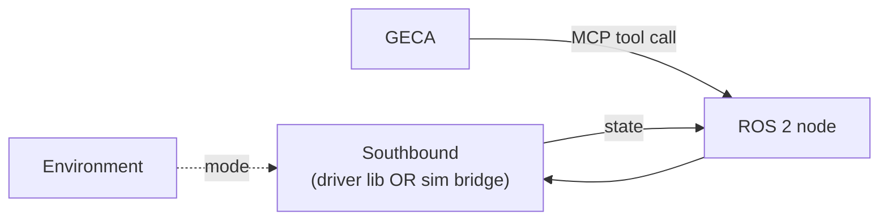

In text: the southbound layer now exists with one adapter selected by the environment module's mode flag. The node reads hardware state through the adapter contract. Still no skill runtime, no perception - just node -> adapter -> hardware/sim.

#### Step 3 - Add state store

Decouple producers from consumers. All inputs (driver state, later perception, later tool results) land in a time-stamped buffer; the MCP server and GUI pull on demand.

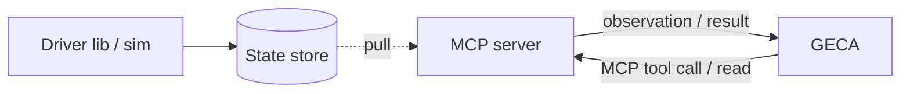

In text: the driver lib writes into the state store; the MCP server reads from it to answer GECA's tool calls and resource reads. The store is the read half of the northbound surface. Why before action distribution: routing and skill results both need a place to land that consumers can pull from.

#### Step 4 - Add action distribution + skill registry

Stand up the MCP parser/router and skill discovery. Incoming tool calls are parsed, validated against the registry's schemas, routed to a minimal skill runtime, and tracked in-flight.

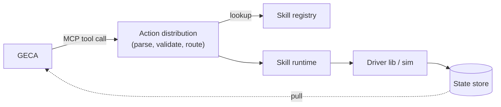

In text: GECA's tool calls now hit action distribution, which validates them against the skill registry and dispatches into the skill runtime; skills act through the driver lib; results land in the state store, which GECA pulls. Why before perception/motion: the brain needs to know what tools exist before those tools do real work.

#### Step 5 - Add perception pipeline

Ingest sensor streams through the driver lib's sensor abstraction, fuse them, publish coherent state into the store. tf2 ownership lands here.

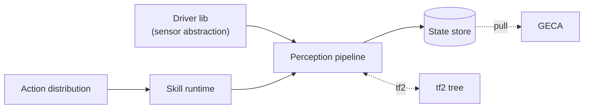

In text: the driver lib now produces uniform timestamped sensor messages; the perception pipeline fuses them and writes into the state store; tf2 is owned in one place so kinematics agree; skills can now call perception-backed tools. GECA reads the richer state.

#### Step 6 - Add motion & grasp control + secure module

Turn high-level intents (`move_to`, `grasp pose`, `set_velocity`) into `ros2_control` joint commands, **and gate every command through the secure module before it reaches the driver lib.** The secure module ships together with motion: there is never an ungated motion step on hardware. This is a hard priority - gating is load-bearing the moment motion exists, so the two land as one step rather than motion-first, gate-later.

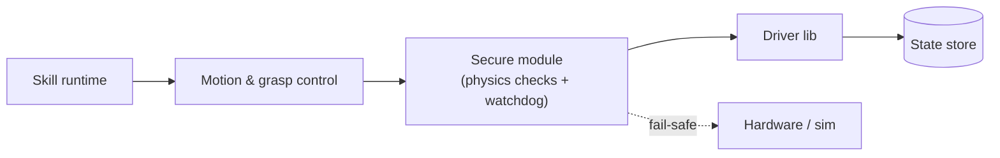

In text: skills issue motion intents; motion & grasp control turns them into joint-level commands; those commands pass through the secure module - collision, force/torque, joint reach, workspace bounds, human proximity - before reaching the driver lib. On comms loss with GECA or on a critical-driver bond timeout, base -> controlled stop, arm -> hold pose. Hard gate on hardware; no-op stub in sim during early development.

#### Step 7 - Add heartbeat & lifecycle

ROS 2 managed nodes for deterministic bring-up order (drivers -> perception -> motion -> secure -> MCP -> action distribution). `diagnostic_updater` aggregates health into the state store and onto an MCP status channel; driver bonds feed the secure module's watchdog. This closes the loop on the target architecture.

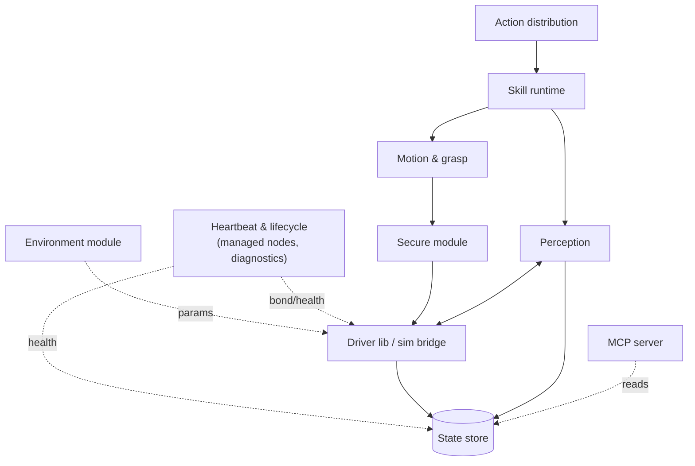

In text: every node is now a managed ROS 2 node with a fixed bring-up order; heartbeat aggregates diagnostics into the state store and onto an MCP status channel; driver bonds feed the secure module's watchdog. Everything from Step 6 carries over unchanged - this closes the loop on the target architecture described above.

---

## Deployment

Edge target is the Jetson Orin NX 16G on the robot, running the arm64 build. Heavier perception and sim runs off-board on the team's GPU servers (see [../team/general_cn.md](../team/general_cn.md) compute section). The same source tree builds for arm64 and x86_64, Ubuntu 22.04 / 24.04, ROS 2 Humble / Jazzy; distro and arch differences stay behind the environment module's adapter layers.

---

## xxxx - xxxx

> Placeholder for the next cycle. Replace this section when the next version lands: record the target architecture and incremental build path for that cycle. Keep prior cycles intact above for history.

