# GECA - General Embodied Cognition Agent

> Component doc. Decision side of the stack - a robot agent, runtime-agnostic by design. Talks to any runtime that speaks the MCP contract; [ECOS](ecos.md) is our preferred runtime. See [../team/general_cn.md](../team/general_cn.md) for system-level context.

> **Version Lineage:** Radish (2602) -> **Aether (2607)**

---

## Overview

GECA is the decision side - a robot agent. Think "LangChain, but running a robot": a chain of pluggable models (ASR, VLM brain, TTS, ...) wired to memory, a planner, and custom control interfaces over MCP. It takes instructions, observations, and robot state in, and emits task plans, tool calls, and motion intents that a runtime executes. It does not touch drivers, ROS, or hardware directly - everything goes through the MCP contract. Any runtime that speaks the contract works; [ECOS](ecos.md) is our preferred runtime.

> **MCP scope note.** "MCP" here is a general message-channel contract, not a strict JSON-RPC wire format. A tool call, observation, or status message may be JSON, but it may equally be a plain string, a mask-encoded payload, a base64 blob, or raw token/vector embeddings - whatever the tool's schema declares. We refer to all of these uniformly as "MCP". Schema versioning (per tool, in the registry) is what keeps this stable, not a fixed serialization.

The point of building GECA as its own component (rather than a monolithic LLM-on-robot) is separation of concerns: decision logic evolves on its own cadence, gets evaluated against reproducible task suites, and can be swapped or rolled back without touching the runtime.

The sections below are versioned per release cycle. Each cycle records its target architecture and the incremental build path to reach it; future cycles supersede or extend prior ones rather than silently rewriting them.

---

## Aether - 2607

This cycle defines the target architecture for GECA and the incremental path to build it. We don't ship the full stack on day one - we start from a minimal baseline and add modules one at a time. Each step runs end-to-end against the MCP contract and is testable on its own; later steps stack on top of earlier ones.

### Target architecture

The final GECA is a brain-centered agent. A VLM runs as the brain at its own loop frequency and actively pulls what it needs from a time-stamped state queue via an attention mechanism - producers never push into the brain. Around the brain sit voice I/O, a planner for sequencing, memory, a tool registry, a cognitive safety gate, and an execution monitor. Everything that touches the robot goes through MCP.

Core principle: **the brain decides what and when to see, and what to do.** Inputs land in a queue; the brain pulls a compressed view of them. Data is dropped only when stale or invalid.

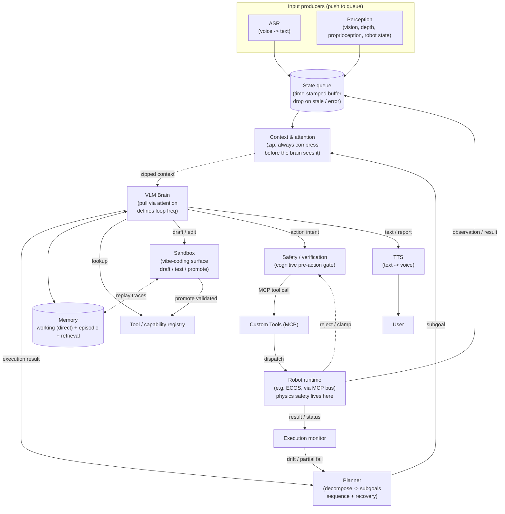

In text form, the flow is:

- **Inbound (push to queue):** ASR transcribes voice to text; perception emits vision, depth, proprioception, and robot state. Every producer writes time-stamped entries into the state queue. Nothing pushes into the brain.
- **Zip then pull (Context & attention):** the queue does not feed the brain raw. A Context & attention layer sits between the queue and the brain: on each tick it attends over the queue plus memory and emits a **zipped** (compressed, token-budgeted) context the brain actually consumes. The brain never sees the raw backlog - only the zipped view.
- **Brain tick (pull on zipped context):** on each loop tick the VLM brain consumes the zipped context, reads/writes memory (working direct, episodic/retrieval by similarity), looks up the tool registry for available capabilities and argument schemas, receives the next subgoal from the Planner (also routed through the zip), and - when a task calls for new tooling or behaviors - drafts and iterates on them in the Sandbox.
- **Outbound (decide):** the brain emits either an action intent (into the action path) or text (to TTS, then to the user). These are two separate paths - text never goes through the safety gate.
- **Action path (gated):** action intent -> cognitive Safety / verification gate -> MCP tool call -> Custom Tools -> Robot runtime (e.g. ECOS) over the MCP bus. Physics safety (collision, force, reach, workspace) is enforced runtime-side; the runtime may reject or clamp an intent and push that verdict back to the gate.
- **Feedback loop:** the runtime returns observations/results back into the state queue (so the brain pulls them on a later tick) and sends status to the Execution monitor. The monitor flags drift / partial failure to the Planner, which then re-sequences, retries, or escalates by feeding a revised subgoal back to the brain.

#### Modules

##### Voice I/O

ASR turns voice into text and writes it to the state queue as transcribed user input. TTS takes the brain's text output - final reports, confirmations, follow-up questions - and synthesizes it back to voice.

##### Brain (VLM)

The central per-step decider. It runs at its own loop frequency and consumes the **zipped context** handed up by the Context & attention layer - it never reads the raw queue backlog. Per step it grounds in the zipped view of current state, picks a tool or produces an action intent, and emits text/speech when needed. The VLM is pluggable: any model that fits the interface (vision + language in, structured intent out) works.

##### Planner

Owns task decomposition and long-horizon sequencing. It turns an instruction into an ordered set of subgoals, feeds them to the brain, and revises as execution results come back. Decomposition is HTN-light: known task families use a hand-authored hierarchical template (domain-specific, fast, deterministic); novel instructions fall back to LLM-based decomposition. It also owns recovery: on subgoal failure or an execution-monitor flag, it picks retry (same subgoal, backoff), re-plan (new subgoal set), or escalate (ask the user / abort). The planner operates at the subgoal level - it does not pick tools; the brain maps each subgoal to a concrete tool call via the registry.

##### Context & attention (zip-always)

The layer between the state queue and the brain. Its invariant is simple: **always zip context.** The brain never consumes the raw queue; every tick, this layer attends over the queue (plus working memory and the current subgoal) and emits a compressed, token-budgeted context that the brain actually reads. This is the modern memory + attention mechanism for the agent: a slow VLM coexists with high-frequency perception because the zip decides what survives into the brain's view, not the producer.

Concretely:

- **Always zip.** There is no code path where the brain reads the queue directly. Every consumer of the queue (the brain, and the Planner's subgoal framing) goes through the zip. This is what makes the invariant load-bearing rather than aspirational.
- **Attention, not FIFO.** Entries are scored by a weighted sum of recency (exponential decay), relevance to the active subgoal (cosine similarity between entry embedding and subgoal embedding), and salience (motion delta, contact events, new-object detection, safety flags). Top-k within the token budget survive; an important event a few ticks ago can outrank a fresh but irrelevant one.
- **Hierarchical compression.** The most recent N ticks pass through near-verbatim; mid-range history is summarized into chunk summaries; the oldest entries beyond a TTL are dropped. When a chunk is compressed away, its summary is written to long-term memory so later ticks can still retrieve it by similarity without replaying raw entries.
- **Token budget.** The zipped context has a hard token ceiling set by the VLM's context window minus reserves for the system prompt, tool schemas, and scratch output. Over-budget content is summarized, merged, or dropped oldest-first - but never passed through uncompressed.
- **Pluggable policy.** The attention / compression policy is a swappable component, not hardwired: different VLMs or task types can ship different zippers. The interface is fixed (queue + memory + subgoal in, zipped context out); the policy is not.

##### State queue

A time-stamped buffer that every producer writes to - ASR, perception, runtime observations, tool results. Consumption is pull-only - by the Context & attention layer, which is the sole reader; the brain itself never reads the queue directly. The drop policy is conservative: only entries stale beyond a TTL or flagged invalid/error are dropped; nothing else is silently discarded.

##### Memory

Three stores with distinct roles and distinct write paths.

- **Working memory (direct, uncompressed):** short-term scratch the brain reads and writes every tick - current task, recent raw observations, in-flight tool calls, intermediate results. Stored directly, never compressed; small and recent by design. This is what the brain mutates as it works.
- **Episodic memory (compressed, long-term):** a vector DB of prior task traces. Crucially, it stores the **compressed summaries** produced by the zip, not raw queue entries - the zip runs first, then its summaries are persisted here. Retrieved by semantic similarity (embedding lookup). This is why Context & attention is built before memory: the zip produces what episodic memory stores.
- **Retrieval memory (reference, long-term):** environment facts, object properties, manuals, SOPs - a separate curated source, also accessed by semantic similarity. Distinct from episodic because it is authored reference material, not recorded traces.

The split keeps the hot path cheap: working memory is small and direct; episodic/retrieval are only touched when the brain issues a similarity query.

##### Custom MCP (tools & status)

We design a custom MCP that the runtime serves and GECA consumes. It carries two kinds of modules:

- **Output modules (action surface):** tools the brain can call, plus any custom MCP endpoints the runtime exposes. Streams are allowed (a tool may emit a stream of results over time rather than one-shot).
- **Input modules (status surface):** additional status channels beyond tool results - robot state, runtime health, sensor feeds, anything the runtime wants the brain to see.

MCP tool discovery, schema versioning, and the capability listing live in the registry. The brain queries this to know what tools exist, what arguments they need, and what status is available before calling. The same surface is used in sim and on hardware.

##### Safety / verification

A **cognitive** pre-action gate on the brain's output. It inspects the LLM's emitted tool call / intent, not the physics. Concretely it runs cheap deterministic checks: loop detection (hash of recent tool-call signatures; reject identical repeats within a window), argument validation against the tool's schema, rate limiting, off-task / nonsense-action guards, and policy rule checks. It does **not** check collision, force/torque, human proximity, joint reach, or workspace bounds - those are robot-specific and belong to the runtime. The runtime enforces physics safety and may reject or clamp an intent; that verdict flows back to the gate and surfaces to the brain as a failed intent. Keeping GECA's gate cognitive is what lets the same agent run unchanged across sim and any robot.

##### Execution monitor

Focuses on error recovery during execution. It reads the status/result stream coming back from the runtime (separate from the observation stream that refills the queue) and watches each in-flight tool call: watchdog timers detect stalls, heartbeat checks detect sensor dropout, and a simple anomaly detector (divergence between predicted and observed state) flags drift. When something goes wrong mid-flight - a camera feed drops, a sensor times out, a tool call stalls - it first attempts local recovery (restart the camera, retry the read, fall back to a different sensor) and feeds the Planner for higher-level recovery (re-plan / escalate) when local fixes fail. Without it, recovery only triggers on hard errors.

##### Sandbox

A vibe-coding surface inside GECA - the same idea as a vibe-coding IDE, but for the agent itself. When the brain faces a task the existing tool set doesn't cover well, it drafts new tool snippets, prompt fragments, or short behaviors in the Sandbox instead of emitting them straight to the action path. The Sandbox is where the agent tries things out before they reach the robot.

Concretely, the Sandbox provides:

- **Draft / edit.** The brain writes candidate code or prompt fragments - a new MCP tool wrapper, a revised argument schema, a small helper routine, or a behavior sketch. Edits land in a working copy, never in the live registry.
- **Run against replay.** Drafts execute against replayed traces pulled from episodic memory (recorded observations + recorded runtime results), not against the live robot. This is the equivalent of a vibe-coding IDE's run panel: the agent sees what its draft would have done on prior tasks, with no hardware in the loop.
- **Promote.** A draft that survives replay and the Safety / verification gate can be promoted into the tool / capability registry as a first-class tool the brain (and future tasks) can call. Promotion is explicit and versioned - the registry never accepts un-versioned ad-hoc code.
- **Rollback.** Drafts and promotions are tracked so a bad promotion can be rolled back. Episodic memory keeps both the trace that motivated the draft and the trace of the draft running, so the decision is auditable.

The Sandbox is the path by which GECA grows its own capability surface over time, rather than being frozen to whatever was hand-registered at startup. It is always opt-in: the brain can still complete tasks using only the existing registry, and the Sandbox is only entered when the brain decides a draft is worth it.

#### Notes

- **Brain is the active consumer, but it pulls from the zip, not the queue.** Producers push to the queue; nothing pushes to the brain; and the brain never reads the queue directly. The Context & attention layer is the sole queue reader and emits a zipped context the brain consumes. The attention policy decides what survives the zip at each tick, which is what lets a slow VLM coexist with high-frequency perception without drowning.
- **Always zip context.** This is a hard invariant, not a default. If a future change adds a code path where the brain reads the raw queue, that path bypasses the token budget and the attention policy - treat it as a bug.
- **Memory write paths are split by design.** Working memory is written directly (uncompressed scratch); episodic memory stores the zip's compressed summaries. This is why the zip ships before memory: the zip produces what episodic memory persists.
- **Safety is cognitive, physics is runtime-side.** GECA's gate catches LLM mistakes (loops, bad args, off-task actions). Collision, force, reach, and workspace checks are the runtime's job - that division is what keeps GECA runtime-agnostic.
- **Drop policy is conservative.** Only stale or invalid entries are dropped. Everything else stays in the queue for the brain to pull on demand.
- **Runtime-agnostic.** GECA never assumes a particular runtime, robot, or ROS dialect. It sees the same tool surface in sim and on hardware, which is what lets iteration happen in Isaac Sim first and transfer later.
- **Sandbox is self-improvement, not a shortcut to the action path.** Drafts run against replay, never against live hardware; promotion is gated by Safety / verification and versioned in the registry. This keeps the brain's ability to grow its own tools from becoming a way to bypass the safety gate.

### Channel contract (invariant across all steps)

Before any module work, the MCP channel between GECA and the runtime is fixed and stays stable as modules are added on the GECA side. Every build step below speaks the same contract.

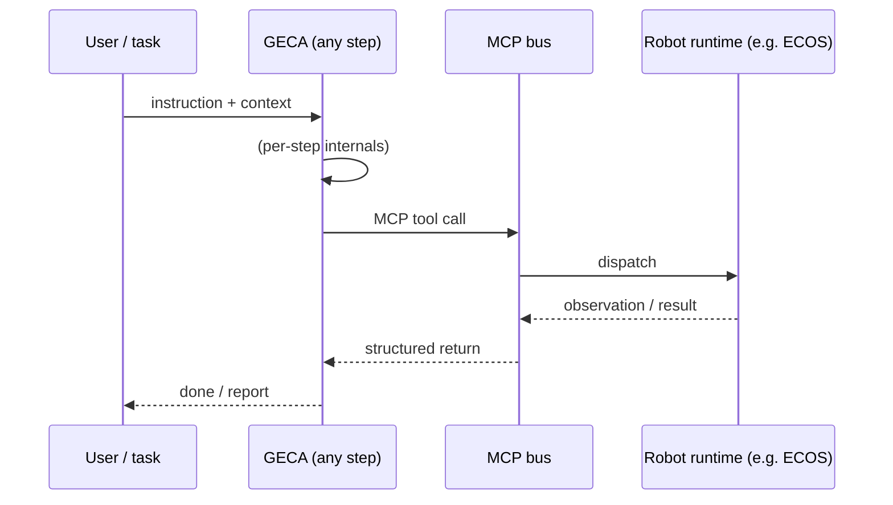

In text form, the round trip per step is: the user (or task harness) hands GECA an instruction plus context; GECA runs its per-step internals (whatever modules that step has); GECA issues an MCP tool call to the bus; the bus dispatches to the robot runtime (e.g. ECOS); the runtime returns an observation or result through the bus as a structured value; GECA turns that into a done/report back to the user. This contract is fixed: every build step below uses the same request/response shape, even when GECA's internals change. The payload itself is not pinned to JSON-RPC - "MCP" is a general message-channel contract, so a tool call or observation may also be a plain string, mask-encoded payload, base64 blob, or raw token/vector blob, as declared by the tool's schema.

### Build path

Incremental development, in this order: **Signal -> Queue -> Planner -> Safety (basic) -> Context & attention -> Memory -> Tool registry -> Execution monitor -> Other (Sandbox).** Each step produces a runnable agent; later steps stack on top of earlier ones. The baseline stays in tree throughout as a regression target - every step has to beat it on the same tasks.

The order is chosen so each step's dependencies already exist: the queue is the spine everything reads from; the planner sequences subgoals before anything gates or compresses them; safety guards action intents as soon as the planner is directing them; the zip is built before memory because episodic memory stores the zip's summaries; the registry is consulted by the brain when mapping subgoals to tools; the monitor watches an action path that already exists; the Sandbox replays episodic traces and promotes into the registry, so it lands last.

#### Step 0 - Signal (baseline single-loop agent)

A minimal agent: one LLM in a loop, MCP tool calls straight to the runtime, no internal structure. Exists to de-risk the channel - schema, latency, error handling, end-to-end completion on one canonical task. This is the "signal" step: the agent reacts to the incoming signal (instruction + observation) directly.

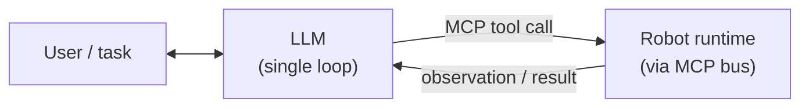

The user/task talks directly to one LLM in a loop. The LLM emits MCP tool calls to the runtime; the runtime returns observations/results that the LLM consumes on its next iteration. No queue, no memory, no planner - just LLM <-> runtime.

#### Step 1 - Add state queue

Decouple producers from the brain. All inputs (text, perception, robot state, tool results) land in a time-stamped queue; the brain pulls at its own frequency. Still a single-loop agent, but no longer driven by whatever arrived last.

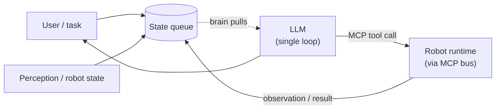

User/task input and perception/robot state both write into the state queue; the single-loop LLM pulls from the queue on each iteration instead of being fed directly; the LLM's MCP tool calls still go to the runtime, and the runtime's observations flow back into the queue (not straight to the LLM). The LLM reports back to the user.

Why first: the pull-based queue is the spine every later module reads from. Nailing it early prevents cascading rework.

#### Step 2 - Add Planner

Introduce task decomposition and sequencing. The Planner turns an instruction into an ordered set of subgoals and feeds them to the brain one at a time; execution results flow back and the Planner revises. At this stage it feeds the brain directly (the zip does not exist yet). Recovery (retry / re-plan / escalate) lives here.

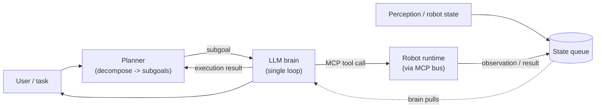

The user instruction no longer hits the brain raw. The Planner decomposes it into an ordered set of subgoals and hands them to the brain one at a time; after each tool call, the execution result flows back to the Planner, which can revise the remaining subgoals. On failure, the Planner decides retry / re-plan / escalate. The brain is still the per-step decider - the Planner sequences, the brain acts. The brain still pulls from the raw queue at this step (the zip arrives in Step 4, after which the Planner's subgoals get routed through it).

Why before safety: the planner produces the subgoal-directed action intents that the safety gate will inspect. Until something is sequencing real intents, there is nothing load-bearing to gate. The planner works at the subgoal level and does not need the tool registry to exist - it sequences "what to achieve," not "which tool to call."

#### Step 3 - Add Safety / verification (basic)

Pre-action gate between brain and MCP bus. This is the **cognitive** gate: loop detection, argument-schema validation, rate limiting, and off-task guards on the brain's emitted tool call. It does not check physics - collision, force, reach, and workspace bounds stay runtime-side, enforced by ECOS, which may reject or clamp an intent and push the verdict back. Hard gate on hardware; the cognitive checks run identically in sim.

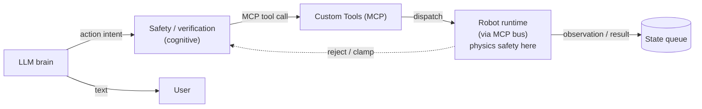

The brain's action intent no longer goes straight to the MCP bus. It first passes through the cognitive Safety / verification gate, which runs cheap deterministic checks: a rolling hash of recent tool-call signatures catches loops; arguments are validated against the tool's schema; rate limits and off-task guards reject clearly bad intents. Only if the gate accepts does the intent become an MCP tool call dispatched to the runtime. Physics safety is the runtime's responsibility - it may reject or clamp an intent and return that verdict to the gate, which surfaces it to the brain as a failed intent. On hardware the cognitive gate is a hard stop; in sim it runs the same way (the physics side is simply more permissive in sim).

Why now: once the Planner (Step 2) is directing real action intents, gating them becomes load-bearing. Adding it earlier would have gated a single-loop agent with nothing meaningful to check; adding it later would leave the planner's intents unchecked for several steps.

#### Step 4 - Add Context & attention (zip-always)

Insert the layer between the state queue and the brain. From this step on, the brain never reads the queue directly - every tick, Context & attention attends over the queue and emits a compressed, token-budgeted context the brain consumes. The "always zip context" invariant is established here. At this step the zip is per-tick only: it has no persistent store to write summaries to yet (memory lands in Step 5), so summaries are ephemeral within a tick. The Planner's subgoal is now routed through the zip too, so the brain sees subgoal + attended state together.

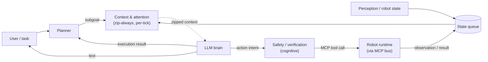

Same as Step 3, plus a Context & attention layer now sits between the queue and the brain. The queue feeds the layer; the layer emits a zipped context; the brain consumes the zipped context. The Planner's subgoal is now an input to the layer as well, so the brain receives the subgoal already framed alongside the attended state. There is no code path where the brain reads the raw queue - that is the invariant this step establishes. Summaries of compressed-away history are computed per-tick but not yet persisted; persistence arrives with memory in Step 5.

Why before memory: the zip produces the compressed summaries that episodic memory will store. Building memory first would mean either storing raw entries (defeating the point of long-term storage) or bolting the zip on as a retrofit. Building the zip first makes the write path read-then-compress-then-persist by construction.

#### Step 5 - Add Memory

Stand up the three stores. Working memory is short-term scratch the brain reads/writes directly each tick - current task, recent observations, in-flight tool calls, intermediate results - stored uncompressed. Episodic memory is a vector DB that stores the **compressed summaries** the zip emits when it compresses away queue history, retrieved by semantic similarity. Retrieval memory holds environment facts, manuals, and SOPs, also retrieved by similarity. From this step on, the zip persists its summaries to episodic memory, and the brain can issue similarity queries against episodic + retrieval.

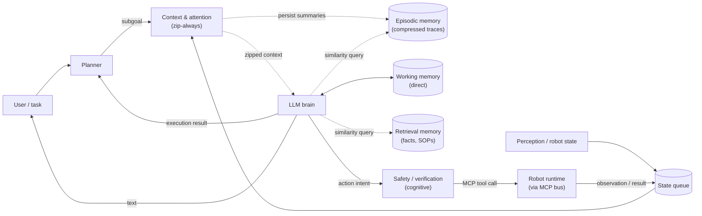

Same as Step 4, plus three memory stores. Working memory is direct, uncompressed scratch - the brain mutates it as it works. Episodic memory closes the loop opened in Step 4: the zip's compressed summaries now persist there instead of evaporating, so later ticks can retrieve them by similarity rather than replaying raw entries. Retrieval memory is a separate curated store of reference material. The hot path stays cheap - working memory is small and direct; episodic/retrieval are only touched on an explicit similarity query.

Why after the zip, and in one step: the dependency is zip -> compressed summaries -> episodic store, so the zip must precede memory. Working, episodic, and retrieval ship together because they share retrieval plumbing (embedding + similarity search) and because splitting them across steps would leave the agent with a half-memory that can't yet replay or reference.

#### Step 6 - Add Tool / capability registry

Stand up MCP tool discovery, schema versioning, and capability listing. The brain now queries the registry to know what tools exist and what arguments they need before mapping a subgoal to a concrete tool call.

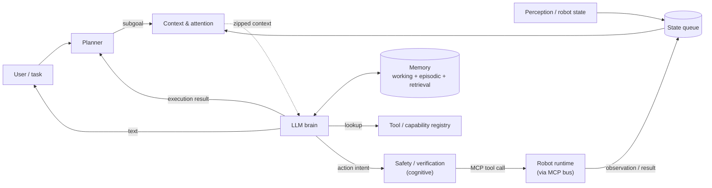

Same as Step 5, plus the brain can now look up the tool/capability registry before it acts. The registry exposes MCP tool discovery, schema versions, and the capability list, so the brain knows which tools exist and what arguments each one needs before emitting a tool call - and the safety gate (Step 3) validates against those same schemas.

Why after the planner and memory: the Planner sequences subgoals without needing the tool surface (it works at the "what to achieve" level), and memory lets the brain recall how similar subgoals were solved before. The registry is what the brain consults when it actually maps a subgoal to a concrete tool call, so it lands once decomposition and recall already work.

#### Step 7 - Add Execution monitor

Watch each tool call's result mid-flight. Detect partial failure, stalls, drift, sensor dropout; attempt local recovery and feed the Planner for higher-level recovery. Without it, recovery only triggers on hard errors.

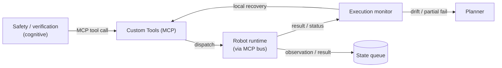

An Execution monitor now reads the status/result stream coming back from the runtime (separate from the observation stream that refills the queue). It watches each in-flight tool call: watchdog timers catch stalls, heartbeat checks catch sensor dropout, and a divergence detector flags drift between predicted and observed state. When it detects any of these, it first attempts local recovery (restart the camera, retry the read, fall back to a different sensor) and, when local fixes fail, flags the Planner, which can then retry, re-plan, or escalate. Without the monitor, recovery only triggers on hard errors that the runtime throws.

Why after the registry: the monitor needs a real, registry-backed action path to watch. By Step 7 the brain is emitting schema-valid tool calls through the gate; instrumenting their execution is the natural next layer.

#### Step 8 - Other things (Sandbox)

Add the vibe-coding surface: a place for the brain to draft, run, and promote new tools or behaviors. Drafts run against replayed episodic traces (no live hardware), pass Safety / verification, then promote into the registry as versioned tools. This closes the loop on the target architecture shown at the top.

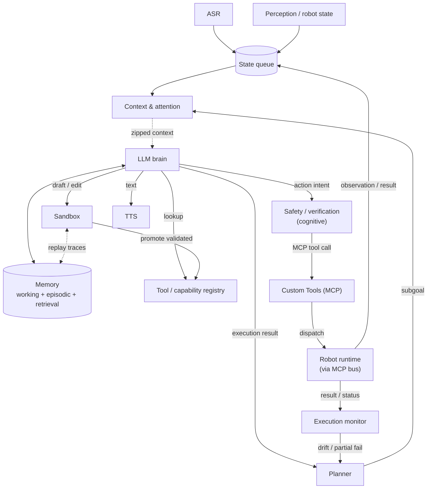

This step adds the Sandbox alongside the closed-loop architecture from Step 7. When the brain decides the existing registry doesn't cover a task, it drafts a candidate tool or behavior in the Sandbox; the draft runs against replayed episodic traces (no hardware in the loop); drafts that pass replay and the Safety / verification gate are promoted into the tool / capability registry as versioned entries, so future ticks and future tasks can call them. The Sandbox never bypasses Safety / verification - promotion is the only path from a draft to a callable tool, and it is gated and versioned.

Why last: drafting against replay requires episodic memory (Step 5) to be in place, promotion requires the registry (Step 6), and the value of the Sandbox only shows once the rest of the agent is already doing real, observable work to replay against.

---

## xxxx - xxxx

> Placeholder for the next cycle (e.g. Anima). Replace this section when the next version lands: record the target architecture and incremental build path for that cycle. Keep prior cycles intact above for history.

