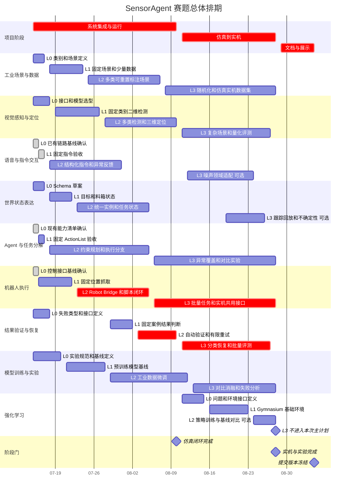

# 赛题甘特图与进度基线

本文用于团队共同讨论 2026 年工业环境交互型智能体赛题的任务排期。
最终提交截止时间为 **2026 年 9 月 5 日**，项目计划在 **9 月 4 日完成冻结**，
保留最后一天处理提交问题。

相关总体方案见：
[`competition-plan.md`](competition-plan.md)。

## 1. 排期规则

技术小模块统一按照 L0～L3 四个阶段推进：

| 等级 | 阶段目标 | 进入下一阶段的条件 |
| --- | --- | --- |
| L0 | 骨架 | 职责、接口草案、依赖和负责人明确 |
| L1 | 可运行 | 理想条件下能够独立跑通固定案例 |
| L2 | 可集成 | 接口稳定，可进入闭环，有异常处理和可重复测试 |
| L3 | 有竞争力 | 有量化指标、批量实验、复杂场景和失败分析 |

以下三个原模块改为项目级阶段，不再单独套用 L0～L3：

1. **系统集成与运行阶段：**形成稳定的仿真闭环；
2. **仿真到实机阶段：**将同一套上层接口迁移到真实机械臂和相机；
3. **文档与展示阶段：**冻结功能，整理实验、报告、视频和复现材料。

文档、视频片段和实验数据仍应从开发第一天持续积累；第三阶段是集中整理和交付，
不是到最后才开始记录。

## 2. 三个项目阶段

| 项目阶段 | 日期 | 阶段目标 | 阶段门 |
| --- | --- | --- | --- |
| 第一阶段：系统集成与运行 | 7 月 15 日～8 月 10 日 | 核心闭环模块达到 L2，仿真中形成可重复完整闭环 | 8 月 10 日前完成仿真闭环验收 |
| 第二阶段：仿真到实机 | 8 月 11 日～8 月 28 日 | 完成真实 RGB-D、RM65-B 和 Robotiq 分拣入格 | 8 月 28 日完成实机与批量实验验收 |
| 第三阶段：文档与展示 | 8 月 29 日～9 月 4 日 | 冻结功能，完成报告、视频、说明和提交包 | 9 月 4 日形成可提交版本 |

### 2.1 第一阶段验收

- 文本或语音指令能够生成受约束任务序列；
- 感知能够输出目标实例及机器人坐标系下的三维位置；
- Agent 能够通过 Robot Bridge 调用机械臂和夹爪；
- 仿真中能够完成抓取、指定格放置和结果验证；
- 至少覆盖未识别、规划失败、未抓住和放错格；
- 场景可以重置，任务可以批量运行并生成日志。

### 2.2 第二阶段验收

- 完成相机内参、外参或手眼标定；
- 仿真和实机共用世界状态、任务和 Robot Skill 接口；
- 完成真实零件识别、定位、抓取和指定格放置；
- 具有工作空间限制、速度限制、人工确认和紧急停止；
- 完成实机重复实验，并记录成功率、定位误差和失败原因。

### 2.3 第三阶段验收

- 代码、配置、模型获取和启动流程可复现；
- 技术报告中的核心结论均有实验数据支持；
- 演示视频覆盖正常闭环、失败检测与自主恢复；
- 仿真和实机素材完整，画面中能看到指令、状态和执行结果；
- 提交包在一台干净环境或替代环境中完成最终复现检查。

## 3. 2026 年 7 月 31 日进度判断

当前已完成 Agent、工作流、Robot Bridge、初始工业场景、RGB-D 视觉入口和
分类恢复的代码接线。尚未完成第一阶段要求的自动场景重置、批量任务、正式视觉
指标和稳定 Gazebo 验收。

| 阶段门证据 | 当前状态 |
| --- | --- |
| 文本或语音生成受约束任务序列 | 已实现；缺固定指令集准确率 |
| 感知输出 `base_link` 三维位置 | 代码路径已实现；缺固定数据集与标定误差 |
| Agent 调用 Robot Bridge | 已实现并有手工 Gazebo 脚本 |
| 抓取、指定区放置和结果验证 | 配置坐标基线可运行；实时视觉链待批量验收 |
| 四类失败检测与恢复 | 已有分类和恢复树；缺 Gazebo 成功率统计 |
| 场景重置、批量运行和日志 | 日志已有；重置、批量运行和汇总未实现 |

因此 7 月 31 日联调节点为**部分通过**，8 月 10 日阶段门存在进度风险。

## 4. 总体甘特图

> 当前日期为 2026 年 7 月 31 日。对于已有基础的模块，L0 或 L1 表示重新确认
> 接口和验收证据，不代表从零重做。



## 5. 小模块分级日程

| 小模块 | 当前基础 | L0 完成 | L1 完成 | L2 完成 | L3 完成 | 比赛目标 |
| --- | --- | --- | --- | --- | --- | --- |
| 工业场景与数据 | L1 | 7 月 17 日 | 已完成 | 8 月 7 日 | 8 月 28 日 | L3 |
| 视觉感知与定位 | L1+～L2- | 7 月 18 日 | 已完成 | 8 月 10 日 | 8 月 27 日 | L3 |
| 语音与指令交互 | L1+ | 7 月 15 日确认 | 已完成 | 延至 8 月 7 日 | 8 月 24 日，可选 | L2 |
| 世界状态表达 | L1 | 7 月 17 日 | 已完成 | 8 月 5 日，高风险 | 8 月 26 日，可选 | L2 |
| Agent 与任务分解 | L2 | 7 月 15 日确认 | 已完成 | 基本完成，待指标 | 8 月 28 日 | L3 |
| 机器人执行 | L2- | 7 月 15 日确认 | 已完成 | 8 月 5 日，待自动验收 | 8 月 28 日 | L3 |
| 结果验证与恢复 | L2- | 7 月 18 日 | 已完成 | 8 月 10 日，待 Gazebo 统计 | 8 月 27 日 | L3 |
| 模型训练与实验 | L1 | 7 月 20 日 | 代码基线完成 | 8 月 12 日 | 8 月 28 日 | L3 |
| 强化学习 | L0 | 8 月 15 日 | 8 月 23 日 | 8 月 28 日，可选 | 本次不排期 | L1，可选 L2 |

## 6. 关键依赖与并行关系

```text
工业场景与数据 L1
├── 视觉感知与定位 L1
└── 模型训练与实验 L1

视觉感知与定位 L2
→ 世界状态表达 L2
→ 结果验证与恢复 L2

世界状态表达 L1
→ Agent 与任务分解 L2

机器人执行 L2
+ Agent 与任务分解 L2
+ 视觉感知与定位 L2
→ 仿真完整闭环

仿真完整闭环
→ 仿真到实机阶段
→ 实机批量实验
→ 文档与展示阶段
```

为减少串行等待，7 月 15 日至 18 日优先冻结四类接口：

1. 结构化指令；
2. 感知结果；
3. 世界状态；
4. Robot Skill 请求与执行结果。

模块内部算法可以继续变化，但跨模块字段和错误语义在第一阶段中期以后应保持稳定。

## 7. 每周讨论与验收节点

| 日期 | 讨论重点 | 必须展示的证据 |
| --- | --- | --- |
| 7 月 18 日 | 接口、类别、场景和失败类型冻结 | Schema、类别表、场景草图、接口样例 |
| 7 月 24 日 | L1 集中验收 | 各模块独立运行固定案例 |
| 7 月 31 日 | 第一轮联调，部分通过 | Agent 已调用 Robot Bridge；视觉入口已接线；统一世界状态和重复验收未完成 |
| 8 月 7 日 | 核心模块 L2 检查 | 多物体三维定位、脚本抓取放置、统一日志 |
| 8 月 10 日 | 第一阶段验收 | 仿真完整闭环、失败重试、批量任务结果 |
| 8 月 22 日 | 实机中期检查 | 标定结果、真实定位、受控抓取 |
| 8 月 28 日 | 第二阶段验收 | 实机闭环、微调对比、批量实验 |
| 9 月 1 日 | 提交材料预审 | 报告初稿、视频初剪、完整运行说明 |
| 9 月 4 日 | 最终冻结 | 最终代码、模型说明、报告、视频和提交包 |

每次周会只按以下问题更新，不按代码提交数量判断进度：

```text
当前等级是否真正通过验收？
进入下一等级还缺少什么证据？
阻塞了哪个下游模块？
风险是否需要切换备选方案？
是否已经保存报告和视频可用素材？
```

## 8. 初始验收指标

以下指标用于确定排期方向，首轮基线完成后可以共同调整：

| 指标 | 初始目标 |
| --- | ---: |
| 任务序列有效率 | >= 95% |
| 仿真端到端任务成功率 | >= 85% |
| 实机端到端任务成功率 | >= 70% |
| 失败检测召回率 | >= 90% |
| 恢复后成功率提升 | >= 10 个百分点 |
| 仿真批量评测次数 | 每个核心场景 >= 30 次 |
| 实机批量评测次数 | 每个代表性任务 >= 20 次 |

视觉 mAP、FPS 和三维定位误差应在完成首轮数据和模型基线后确定目标值，
避免在不了解相机、物体尺寸和计算平台的情况下制定失真的指标。

## 9. 当前决策与逾期事项

| 决策项 | 当前建议 | 最迟确定日期 | 最终结论 |
| --- | --- | --- | --- |
| 比赛主物体类别 | 选择 4～6 类外观和抓取特征有差异的工业零件 | 7 月 18 日 | 逾期未冻结，阻塞数据和微调 |
| 代表性任务数量 | 3 类正常任务 + 4 类失败任务 | 7 月 18 日 | 代码已覆盖多类失败，正式任务集未冻结 |
| RGB-D 相机型号和安装方式 | 尽早固定，避免重复标定 | 7 月 18 日 | 逾期未冻结，阻塞实机坐标验收 |
| 视觉模型基线 | Gazebo 暂用 YOLOE，Grounding DINO + SAM2 作为教师模型 | 7 月 20 日 | 技术路线已确定，指标未完成 |
| Agent 基线对比 | 固定 ActionList 对比受约束 LLM + DecisionTree | 7 月 24 日 | 方案已确定，实验运行器未完成 |
| 是否推进语音 L3 | 不阻塞闭环，资源有余再做 | 8 月 12 日 | 待讨论 |
| 是否推进强化学习 L2 | 仅在仿真闭环成功率达到 80% 后启动 | 8 月 10 日 | 待讨论 |
| 实机可用时间窗口 | 第二阶段前必须锁定 | 7 月 18 日 | 逾期未锁定，高风险 |

## 10. 负责人表

| 工作方向 | 主负责人 | 协作成员 | 当前等级 | 本周目标 |
| --- | --- | --- | --- | --- |
| 工业场景与数据 | 待定 | 待定 | L1 | 完成重置、随机化和正式类别表 |
| 视觉感知与定位 | 待定 | 待定 | L1+～L2- | 冻结验证集并输出三维误差 |
| 语音与指令交互 | 待定 | 待定 | L1+ | 补指令集、缺参和歧义验收 |
| 世界状态表达 | 待定 | 待定 | L1 | 冻结统一 WorldState Schema |
| Agent 与任务分解 | 待定 | 待定 | L2 | 完成批量指令与方案对比 |
| 机器人执行 | 待定 | 待定 | L2- | 自动化 Gazebo 闭环与抓取稳定性 |
| 结果验证与恢复 | 待定 | 待定 | L2- | 四类故障各完成批量统计 |
| 模型训练与实验 | 待定 | 待定 | L1 | 冻结数据并完成首轮微调指标 |
| 强化学习 | 待定 | 待定 | L0 | 暂不进入关键路径 |

负责人确定后，每个方向应至少保证一名主负责人，跨模块接口由相关负责人共同验收。
