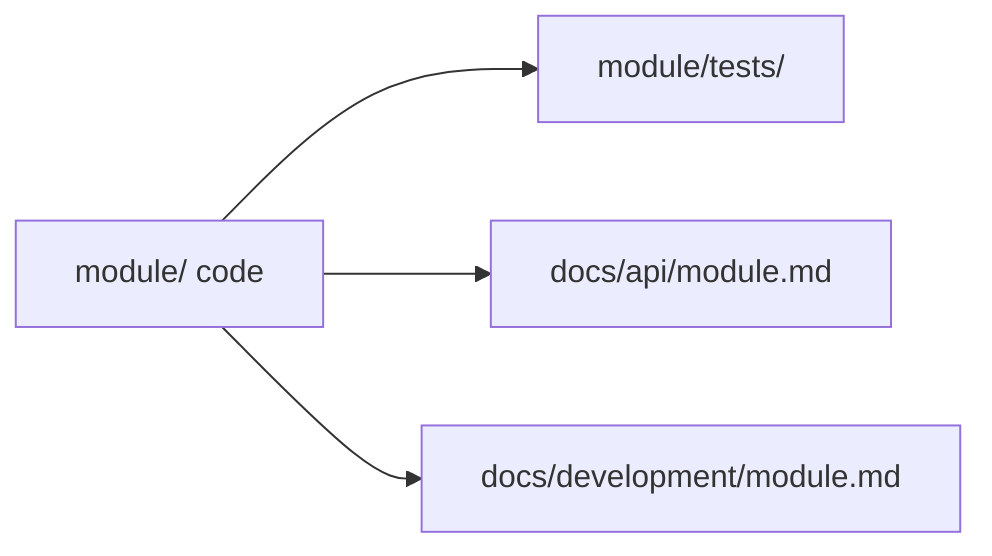

# Conventions

Repository-wide rules for code, docs, CMake, and git. When something here conflicts with a module-specific note in `docs/development/`, the development doc wins for that folder only.

## C and C++

Follow the [Google C++ Style Guide](https://google.github.io/styleguide/cppguide.html) with a **100-column** line limit.

Format all C/C++ with **clang-format**. The repo root `.clang-format` sets `BasedOnStyle: Google` and `ColumnLimit: 100`.

```bash
# One file
clang-format -i path/to/file.cpp

# Whole tree (from repo root)
find . \( -name '*.c' -o -name '*.cc' -o -name '*.cpp' -o -name '*.h' -o -name '*.hpp' \) \
  -not -path './build/*' -not -path './generated/*' -not -path './third_party/*' \
  -exec clang-format -i {} +

# Or use the project script
./format.sh
```

**VS Code / Cursor**

Install the **clang-format** extension (or use **clangd**, which respects `.clang-format` on format).

`.vscode/settings.json`:

```json
{
  "editor.formatOnSave": true,
  "[cpp]": { "editor.defaultFormatter": "xaver.clang-format" },
  "[c]": { "editor.defaultFormatter": "xaver.clang-format" },
  "C_Cpp.clang_format_style": "file"
}
```

If you use clangd instead, set `"editor.defaultFormatter": "llvm-vs-code-extensions.vscode-clangd"` for C/C++ and keep `"C_Cpp.clang_format_style": "file"`.

**Documentation**

Each C or C++ module that exposes a C ABI, C-style interface, or C++ class interface must provide a public header under `include/`. Keep implementation-only helpers in module-local headers or `detail/`; never include private headers outside the module.

Public headers under `include/` and any function/type meant for cross-module use need **Doxygen** comments. Document ownership, units, thread-safety, blocking behavior, and error handling when they affect callers.

```cpp
/// Returns the current joint positions in radians.
/// Thread-safe; safe to call from non-RT contexts.
std::vector<double> GetJointPositions();
```

Implementation code should also contain short inline notes for non-obvious control flow, numerical assumptions, concurrency decisions, hardware constraints, or safety-critical behavior. Keep inline comments close to the code they explain; do not restate the code.

Run Doxygen in CI; output goes to `generated/doxygen/`.

---

## Python

Follow the [Google Python Style Guide](https://google.github.io/styleguide/pyguide.html), except **indent with 2 spaces** (not 4).

Type hints on public functions. Docstrings on modules, classes, and public methods — Google docstring format is fine. All in-code comments, docstrings, and inline notes must be written in English. Add inline comments for non-obvious algorithm choices, numerical assumptions, async/concurrency behavior, hardware assumptions, or failure handling. Do not comment obvious assignments or direct framework calls.

**VS Code / Cursor**

Set Pylance to at least **standard** type checking:

`.vscode/settings.json`:

```json
{
  "[python]": {
    "editor.defaultFormatter": "ms-python.black-formatter",
    "editor.tabSize": 2
  },
  "python.analysis.typeCheckingMode": "standard",
  "editor.tabSize": 2
}
```

Use `pyproject.toml` or `.editorconfig` so indent stays 2 outside the editor too.

---

## Markdown

Use **mermaid** for dataflow and architecture diagrams. Plain prose or fenced code blocks beat tables when the content is just a short list.

Keep bullet lists short — if you need more than a handful, split into sections or write a paragraph. Bold (`**…**`) for emphasis is fine; don't bold every other phrase.

Write like internal engineering notes, not a generated spec. One idea per paragraph; skip filler openers.

Docs may be written in English or Chinese. Prefer English for original docs. If a Chinese version is needed, use the same path and base name with `_cn.md`, for example `docs/api/scheduler.md` and `docs/api/scheduler_cn.md`. Keep translated docs structurally aligned with the original: same headings, same diagrams, same API names, and a note when the translation intentionally omits or summarizes details.

Do not edit generated documentation directly. Update the source comments, docstrings, or hand-written Markdown, then regenerate the output.

---

## CMake

Every module directory that compiles code has its own `CMakeLists.txt`. Pattern:

```cmake
# kernel/sched/CMakeLists.txt
add_library(kernel_sched
  scheduler.cpp
  task_queue.cpp
  rt_bridge.cpp
)

target_include_directories(kernel_sched
  PUBLIC  ${CMAKE_SOURCE_DIR}/include
  PRIVATE ${CMAKE_CURRENT_SOURCE_DIR}
)

target_link_libraries(kernel_sched
  PUBLIC  kernel_lib
  PRIVATE drivers_common
)

if(BUILD_TESTS)
  add_subdirectory(tests)
endif()
```

Root `CMakeLists.txt` adds subdirs in dependency order. Options like `BUILD_TESTS` live in `cmake/ProjectConfig.cmake`. Generated IDL targets are wired through a CMake helper; modules link the generated interface target, not raw generated paths.

Executable modules (`rtcore/`, `userspace/*/`, tools) use `add_executable` and the same include/link rules.

---

## Module layout

C++ and Python modules share the same idea: one folder, one concern, tests beside the code, API doc in `docs/api/`.

**C++**

```
kernel/sched/
├── CMakeLists.txt
├── scheduler.h          # module-local header (if not in include/)
├── scheduler.cpp
├── detail/              # private headers — never included outside this module
└── tests/
    ├── scheduler_test.cpp
    └── mock/            # fakes for IPC, drivers, clocks
```

**Python**

```
ai/perception/detection/
├── model.py
├── config.yaml
└── tests/
    └── test_model.py
```

**Unit tests** live in `<module>/tests/`. Each test file picks one unit under test, feeds **mock input**, and asserts **expected output**. No hardware in unit tests — mock drivers and IPC at the module boundary.

Every module needs three hand-written docs, updated in the same PR as the code:

**API docs** — one Markdown file per public module surface under `docs/api/` (e.g. `docs/api/sched.md` for `kernel/sched/` syscalls exposure). Interfaces are the first priority: define the stable inputs, outputs, data types, ownership, units, errors, timing, and caller responsibilities before binding the module to any specific data source. Include one minimal request/response, call sequence, or message example when it clarifies correct use. Link to generated Doxygen/Sphinx detail instead of duplicating every signature.

**Module docs** — one Markdown file under `docs/development/` for the module design. Cover purpose, ownership boundaries, interface contracts, algorithm choices, architecture, methods, dataflow, state transitions, timing assumptions, dependencies, and known limits. Treat simulation, replay, reference code, hardware drivers, and live services as interchangeable data sources behind the same interface whenever possible. Use mermaid for architecture and dataflow diagrams when a diagram is clearer than prose.

**Test docs** — one Markdown file under `docs/development/tests/` for the module's verification story. State what is tested, how to run it, what result counts as pass/fail, and what quality signal the test gives. Name the method used: smoke test, unit test with mock, stubbed integration test, simulation, replay, benchmark, hardware-in-loop, or manual acceptance test. For simulation or reference implementations, document which interface they exercise and why the result is representative of real behavior. Summarize test results instead of pasting long logs; link CI artifacts or benchmark reports when raw output is needed.



Userspace and tools call the kernel through **syscalls** (UDS RPC), not by linking `drivers/` directly.

---

## Development workflow

Use the larger workflow when adding or redesigning a module. Use the small-change workflow when the architecture and API already exist.

**Module workflow**

1. Define the problem, success criteria, constraints, and non-goals.
2. Research existing approaches, dependencies, algorithms, hardware limits, and failure modes.
3. Define the public interface before choosing final data sources. Keep simulation, replay, mock, hardware, and live inputs behind the same contract where practical.
4. Write or update the module design doc under `docs/development/`. Include architecture, algorithm choice, methods, dataflow, dependencies, and expected limits.
5. Write or update the test doc under `docs/development/tests/`. Explain how the design will be proven: unit tests, mocks, stubs, simulation, replay, benchmarks, hardware-in-loop, smoke tests, or manual acceptance tests. State what result is good enough and why.
6. Build an MVP with the smallest useful API and unit tests. Record the first meaningful test result in the test doc.
7. Update the API doc under `docs/api/`. Add Doxygen/Sphinx comments for public interfaces before relying on them from other modules.
8. Finish the implementation, tests, docs, formatting, and local checks.
9. Commit the complete module change after review-ready code and docs are together.
10. Run global tests or CI before merging.

**Small implementation workflow**

1. Update public API comments first when the change touches public behavior.
2. Implement the code.
3. Add inline notes only where behavior is not obvious.
4. Add or update focused unit tests, preferably with mocks or stubs at module boundaries.
5. Commit the code and required API comments. Do not upload local test artifacts, logs, build outputs, or generated reports unless the repository explicitly tracks them.

---

## File naming

Use **one word** for file names when possible. If a single word isn't descriptive enough, prefer **abbreviations** over multi-word names.

```
scheduler.cpp     # good — one word
ipc.hpp           # good — one word
dds_node.h        # ok — abbreviation, not "dds_node_participant"
srv.py            # good — abbreviation for "server"
boot_seq.cpp      # ok — abbreviated, not "boot_sequence"
cam_info.idl      # ok — abbreviated, not "camera_info"
```

Avoid hyphens, underscores to join multiple full words. Abbreviate instead: `seq` not `sequence`, `cfg` not `config_file`, `srv` not `server`, `cam` not `camera`, `det` not `detection`.

---

## Git branches

Prefix branches by intent. Multi-word names use **hyphens**.

```
feat/arm-velocity-limit
fix/rtcore-queue-overflow
docs/conventions-clang-format
chore/bump-realsense-sdk
dev/experiment-different-scheduler
```

`main` or `master` stays deployable. Feature work merges through PR from `feat/` or `fix/`; long-running integration may use `dev/`.

**Basic GitHub workflow**

Start from an up-to-date base branch:

```bash
git checkout main
git pull --rebase
```

If the repository uses `master`, replace `main` with `master`.

Create a focused branch:

```bash
git checkout -b feat/short-description
```

Check changes before staging:

```bash
git status
git diff
```

Stage only intended files. Prefer explicit paths over `git add .` so generated files, local logs, credentials, and unrelated edits are not committed accidentally.

```bash
git add path/to/file.cpp path/to/test.cpp docs/api/module.md
git status
```

Commit with a concise message that explains the reason for the change:

```bash
git commit -m "feat: add module capability"
```

Keep the branch current before opening or updating a PR:

```bash
git checkout main
git pull --rebase
git checkout feat/short-description
git rebase main
```

Resolve conflicts, rerun relevant tests, then push:

```bash
git push -u origin feat/short-description
```

For later pushes on the same branch:

```bash
git push
```

Do not force-push shared branches unless the team agrees.

**Commit contents**

Commits contain source code, tests, configuration, and hand-written docs needed to review and reproduce the change. Do not commit logs, build directories, temporary files, runtime state, cache files, local environment files, generated reports, or machine-specific artifacts. Test results belong in CI, the test doc summary, or an external artifact link unless the repository explicitly tracks them.