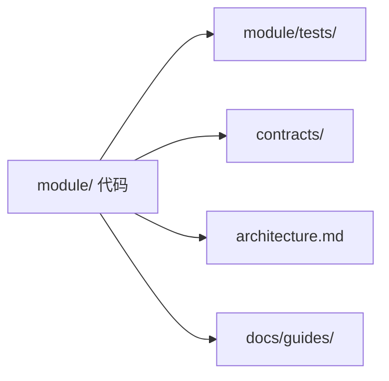

# 约定

项目级代码、文档、CMake 与 git 规则。仓库架构统一维护在
根目录 `architecture.md`，操作说明统一维护在 `docs/guides/`。

## C 与 C++

遵循 [Google C++ Style Guide](https://google.github.io/styleguide/cppguide.html)，**100 列**行宽上限。

所有 C/C++ 用 **clang-format** 格式化。仓库根目录的 `.clang-format` 设置 `BasedOnStyle: Google` 与 `ColumnLimit: 100`。

```bash
# 单个文件
clang-format -i path/to/file.cpp

# 整棵树（从仓库根目录）
find . \( -name '*.c' -o -name '*.cc' -o -name '*.cpp' -o -name '*.h' -o -name '*.hpp' \) \
  -not -path './build/*' -not -path './generated/*' -not -path './third_party/*' \
  -exec clang-format -i {} +

# 或使用项目脚本
./format.sh
```

**VS Code / Cursor**

安装 **clang-format** 扩展（或使用 **clangd**，它会遵循 `.clang-format` 进行格式化）。

`.vscode/settings.json`：

```json
{
  "editor.formatOnSave": true,
  "[cpp]": { "editor.defaultFormatter": "xaver.clang-format" },
  "[c]": { "editor.defaultFormatter": "xaver.clang-format" },
  "C_Cpp.clang_format_style": "file"
}
```

若改用 clangd，则对 C/C++ 设置 `"editor.defaultFormatter": "llvm-vs-code-extensions.vscode-clangd"`，并保留 `"C_Cpp.clang_format_style": "file"`。

**文档**

`include/aether/` 下的公共头文件，以及任何供跨模块使用的函数/类型，需要 **Doxygen** 注释。`.cpp` 文件中的内联辅助函数，当行为不能从签名一目了然时，也加简短说明。

```cpp
/// 返回当前关节位置（弧度）。
/// 线程安全；可在非实时上下文中调用。
std::vector<double> GetJointPositions();
```

CI 中运行 Doxygen；输出到 `generated/doxygen/`。

---

## Python

遵循 [Google Python Style Guide](https://google.github.io/styleguide/pyguide.html)，但**缩进 2 个空格**（而非 4）。

公共函数加类型注解。模块、类与公共方法加 docstring —— Google docstring 格式即可。

**VS Code / Cursor**

将 Pylance 类型检查至少设为 **standard**：

`.vscode/settings.json`：

```json
{
  "[python]": {
    "editor.defaultFormatter": "ms-python.black-formatter",
    "editor.tabSize": 2
  },
  "python.analysis.typeCheckingMode": "standard",
  "editor.tabSize": 2
}
```

使用 `pyproject.toml` 或 `.editorconfig`，让缩进在编辑器之外也保持 2 空格。

---

## Markdown

数据流与架构图使用 **mermaid**。当内容仅是短列表时，纯文本或围栏代码块胜过表格。

保持列表简短 —— 若超过几条，拆分为小节或写成段落。粗体（`**…**`）强调可以；不要每隔几句就加粗。

按内部工程笔记的口吻写，而非生成的规格书。每段一个观点；跳过套话式开头。

---

## CMake

每个编译代码的模块目录都有自己的 `CMakeLists.txt`。模式：

```cmake
# kernel/sched/CMakeLists.txt
add_library(aether_kernel_sched
  scheduler.cpp
  task_queue.cpp
  rt_bridge.cpp
)

target_include_directories(aether_kernel_sched
  PUBLIC  ${CMAKE_SOURCE_DIR}/include
  PRIVATE ${CMAKE_CURRENT_SOURCE_DIR}
)

target_link_libraries(aether_kernel_sched
  PUBLIC  aether_kernel_lib
  PRIVATE aether_drivers_common
)

if(AETHER_BUILD_TESTS)
  add_subdirectory(tests)
endif()
```

根 `CMakeLists.txt` 按依赖顺序添加子目录。`AETHER_BUILD_TESTS` 类选项位于 `cmake/AetherConfig.cmake`。生成的 IDL 目标经 `cmake/AetherIDL.cmake` 接入 —— 模块链接 `aether_idl`，而非原始生成路径。

可执行模块（`rtcore/`、`userspace/*/`、tools）使用 `add_executable`，并沿用同样的 include/link 规则。

---

## 模块布局

C++ 与 Python 模块共享同一理念：一个文件夹、一个关注点、测试与代码同放。
跨模块接口统一维护在 `contracts/` 或公共代码注释中。

**C++**

```
kernel/sched/
├── CMakeLists.txt
├── scheduler.h          # 模块本地头（若不在 include/aether/ 中）
├── scheduler.cpp
├── detail/              # 私有头 —— 绝不在本模块之外被 include
└── tests/
    ├── scheduler_test.cpp
    └── mock/            # IPC、驱动、时钟的桩
```

**Python**

```
ai/perception/detection/
├── model.py
├── config.yaml
└── tests/
    └── test_model.py
```

**单元测试**位于 `<module>/tests/`。每个测试文件选取一个被测单元，喂入 **mock 输入**，并断言 **预期输出**。单元测试中不得出现硬件 —— 在模块边界上 mock 驱动与 IPC。

不要为每个模块单独创建 Markdown。稳定的跨模块输入、输出、所有权、单位、
错误和调用方责任应写入 `contracts/` 或公共代码注释。

**架构文档** —— 仓库级设计和职责边界只维护在根目录 `architecture.md`，
不要为各模块创建相互竞争的架构文档。只有长期有效的安装、运行和验证说明才放入
`docs/guides/`，并优先更新已有文件。



用户态与工具通过 **syscall**（UDS RPC）调用内核，而非直接链接 `drivers/`。

---

## 文件命名

文件名尽量用 **单个词**。若单词不够描述，优先用 **缩写** 而非多词名。

```
scheduler.cpp     # 好 —— 单词
ipc.hpp           # 好 —— 单词
dds_node.h        # 可 —— 缩写，而非 "dds_node_participant"
srv.py            # 好 —— "server" 的缩写
boot_seq.cpp      # 可 —— 缩写，而非 "boot_sequence"
cam_info.idl      # 可 —— 缩写，而非 "camera_info"
```

避免用连字符、下划线连接多个完整词。改用缩写：`seq` 而非 `sequence`，`cfg` 而非 `config_file`，`srv` 而非 `server`，`cam` 而非 `camera`，`det` 而非 `detection`。

---

## Git 分支

按意图给分支加前缀。多词名用 **连字符**。

```
feat/arm-velocity-limit
fix/rtcore-queue-overflow
docs/conventions-clang-format
chore/bump-realsense-sdk
dev/experiment-different-scheduler
```

`main` 保持可部署。特性工作经 `feat/` 或 `fix/` 的 PR 合入；长期集成可使用 `dev/`。
