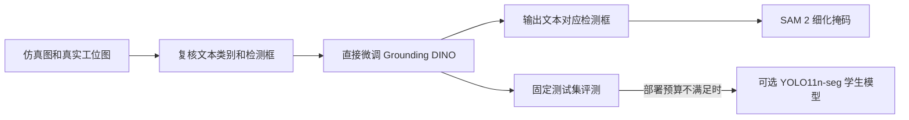

# 视觉模块阶段交接

更新时间：2026-07-30

这份文档是我对目前视觉模块的集中交接。代码怎么运行、接口收什么和返回什么、我已经
验证到哪一步、其他模块还需要给我什么，都统一写在这里。具体安装和命令细节仍以
[开放词汇视觉接入说明](../guides/vision_open_vocab_cn.md)为准，这里不重复维护另一套
操作手册。公开数据集的筛选、许可证和转换命令见[视觉公开数据集选择与使用](../guides/vision_public_datasets_cn.md)。

## 1. 先说结论

我已经把开放词汇检测、实例分割、可选 RGB-D 定位、批量评测和基础训练入口接进
SensorAgent。现在仓库里有一条能实际运行的 Grounding DINO + SAM 2 预训练开放词汇链路，
这次第一轮训练直接微调 Grounding DINO 本体。SAM 2 继续根据检测框生成掩码，
YOLO11n-seg 只保留为以后可能需要的轻量学生模型，不作为目前的主训练任务。

目前还不能说“比赛视觉模型已经训练完成”。现阶段跑通的是预训练模型推理和训练工程
链路，正式比赛模型还缺最终类别确认、足量仿真/真实图片、人工复核标注和冻结测试集。
仿真数据已经有人可以提供，我计划在 2026-07-31 开始第一轮训练，前提是第一批数据和
类别表按时到位。

## 2. 当前代码状态

我已经合入主线的视觉工作有三批：

| PR | 内容 | 状态 |
| --- | --- | --- |
| [#3](https://github.com/Yiannnn-202/SensorAgent/pull/3) | Grounding DINO + SAM 2 后端、RGB-D 定位和统一 Tool 接口 | 已合入 `main` |
| [#5](https://github.com/Yiannnn-202/SensorAgent/pull/5) | 检测框、掩码、中心点和置信度叠加图 | 已合入 `main` |
| [#8](https://github.com/Yiannnn-202/SensorAgent/pull/8) | 数据清单检查、批量评测、指标和验收阈值 | 已合入 `main` |
| [#14](https://github.com/Yiannnn-202/SensorAgent/pull/14) | YOLO11n-seg 可选学生模型训练入口、数据预检和测试 | 已合入 `main` |

这次 Grounding DINO 训练纠正工作在：

| 分支/PR | 内容 | 状态 |
| --- | --- | --- |
| [`#16`](https://github.com/Yiannnn-202/SensorAgent/pull/16) / `feat/grounding-dino-finetune` | Grounding DINO 直接微调、JSONL 训练数据预检、配置模板、结果追踪和文档纠正 | 等待审查合入 |

PR #14 已经合入，里面的 `scripts/vision_train.py` 仍可用于以后训练 YOLO11n-seg
学生模型，但不是 7 月 31 日第一轮训练的入口。当前主训练入口是
`scripts/vision_train_grounding_dino.py`。

## 3. 我现在采用的模型分工

我现在先直接微调开放词汇主模型，再根据部署结果决定是否需要学生模型：



具体分工如下：

- **Grounding DINO**：当前直接微调的主模型，学习比赛类别文本和检测框的对应关系。
- **SAM 2**：根据 Grounding DINO 检测框细化实例掩码；掩码不是 Grounding DINO 的
  训练损失，只作为分割输出、标注复核和后续消融数据保留。
- **YOLO11n-seg**：后续可选轻量学生模型。只有主模型确实不满足延迟、显存或模型大小
  预算时，再在同一测试集上训练和比较。
- **YOLOE**：仓库现有 Gazebo 配置仍保留这个后端，避免实验模型影响已有仿真流程；它的
  权重不随 Git 分发，需要使用者单独准备。

现在本机跑通的 Grounding DINO + SAM 2 仍是下载的预训练模型。它们能识别部分对象不
等于我已经用比赛数据训练过。只有第一批训练数据到位、完成直接微调并在冻结验证集上
评测后，才能称为比赛数据微调模型。

## 4. 我对外提供的接口

视觉模块统一通过下面这个 Tool 接入 Agent、ActionList 和 DecisionTree：

```text
vision.open_vocab_detect
```

最小调用只需要目标词和 RGB 图片：

```json
{
  "query": "roller",
  "image_path": "data/vision/latest/rgb.png"
}
```

需要指定多个同类物体中的某一个时，上层把空间要求单独传入，不要把“左侧的”混在类别
名称里：

```json
{
  "query": "roller",
  "image_path": "data/vision/latest/rgb.png",
  "spatial_constraint": {
    "relation": "left",
    "ordinal": 1
  }
}
```

目前支持 `left`、`right`、`front`、`back`、`largest`、`smallest`、`nearest` 和
`farthest`。`nearest`/`farthest` 需要相机内参和 `T_base_camera`，其他关系可以只按
图像平面排序。

典型成功输出如下：

```json
{
  "found": true,
  "label": "roller",
  "confidence": 0.83,
  "source": "grounding_dino_sam2",
  "object_id": "roller_001",
  "bbox_2d": [402.0, 210.0, 452.0, 262.0],
  "center_px": [427.0, 236.0],
  "mask_polygons": [[[405.0, 214.0], [449.0, 216.0], [447.0, 258.0]]],
  "mask_area_px": 1780.0,
  "timing_ms": {
    "grounding_dino": 755.4,
    "sam2": 1462.6
  }
}
```

只有输入同步深度、相机内参和相机到机械臂基座的变换后，我才会输出机械臂可消费的
三维位置：

```json
{
  "position_3d": {
    "x": 0.31,
    "y": -0.08,
    "z": 0.42,
    "frame_id": "base_link",
    "unit": "m"
  }
}
```

`pose_3d` 目前只为兼容已有 top-down pick 管线保留，后三个旋转值固定为 `0`。视觉侧
提供位置，抓取朝向和安全偏移由机械臂规划侧决定。

## 5. RGB-D 和坐标约定

如果只给 RGB，我能提供检测框、掩码、像素中心和置信度。要得到相机坐标，还需要同步
depth 和相机内参；要得到 `base_link` 坐标，还需要可靠的 `T_base_camera` 或 TF。

我目前接受的几何输入包括：

```text
image_path            RGB 图像
depth_path            二维 .npy 深度数组
camera_info_path      相机内参 JSON
depth_scale           深度换算到米的比例
T_base_camera         camera -> base_link 的 4x4 变换
camera_frame          相机坐标系名称
base_frame            机械臂基坐标系名称
```

深度单位是毫米时使用 `depth_scale=0.001`，已经是米时使用 `1.0`。有掩码时取掩码内
有效深度中位数，没有掩码时才退回检测框中心局部窗口。

没有 depth、内参和外参时，我不会把像素中心写成抓取坐标；只有相机坐标但没有
`T_base_camera` 时，也不会把它说成机械臂基坐标。

## 6. 已完成的真实模型验证

我已经在 RTX 4060 Laptop GPU 上完成 Grounding DINO Tiny + SAM 2 Tiny 的真实 RGB
单图测试：

| 对象 | 置信度 | DINO | SAM 2 | CLI 冷启动 |
| --- | ---: | ---: | ---: | ---: |
| bus | 0.9049 | 893.6 ms | 1682.8 ms | 25.86 s |
| wrench | 0.9311 | 810.3 ms | 1548.4 ms | 25.82 s |
| screwdriver | 0.8152 | 882.3 ms | 1472.5 ms | 23.07 s |
| conveyor roller | 0.6682 | 755.4 ms | 1462.6 ms | 22.38 s |
| spur gear | 0.8692 | 692.2 ms | 1395.5 ms | 22.85 s |

这五组都生成了真实 SAM 2 掩码，没有退回 box fallback。

我还用同一个模型实例跑过 4 张比赛相关正样本：

```text
检出：4/4
真实 SAM 2 掩码：4/4
box fallback：0/4
首次模型启动：约 8936 ms
热启动平均：约 394 ms
热启动 P95：约 462 ms
```

这只能证明真实模型链路和掩码输出可用。四张图全是正样本，没有完整人工框/掩码真值，
也不是最终相机和真实工位，所以我不会把它写成“准确率 100%”或“工业精度已达标”。

## 7. Grounding DINO 训练链路

本次新增的 `scripts/vision_train_grounding_dino.py` 会在训练前检查：

- 训练 YAML 中的文本类别是否非空、唯一并保持固定顺序；
- 每个 `class_name` 是否能映射到同一份候选文本列表；
- 检测框是否为有效的原图绝对坐标 `bbox_xyxy`；
- train/val/test 是否有图片重复或同一 `scene_id` 跨集合泄漏；
- train 和 val 是否覆盖所有已配置类别；
- 公开数据是否记录 URL 和许可证；
- 数据清单和图片内容是否能生成可追踪哈希。

训练时每张图片都输入同一个固定候选文本顺序，标注中的 `class_labels` 就是这个列表的
下标。脚本使用 Hugging Face 官方 Grounding DINO 处理器把绝对框转成模型需要的
归一化中心点框，直接计算 Grounding DINO 检测损失并更新本体参数。当前验证配置固定
`batch_size: 1`，通过梯度累积扩大有效批量，避免当前 Transformers 版本的大 batch
类别标签图偏移风险。

正式训练后，本地会保存最佳和最后 checkpoint、模型来源、类别提示顺序、训练参数、
数据清单哈希、图片内容哈希、checkpoint SHA-256、每轮损失和耗时。现在只完成了数据
预检和代码级测试，还没有拿比赛数据跑第一轮，所以不能写成“Grounding DINO 已完成
训练”。

当前分支测试结果：

```text
Grounding DINO 训练与 COCO 转换专项测试：13 passed
完整仓库测试：241 passed, 2 failed
```

完整测试中的两个失败与本次视觉改动无关：一个是本机缺少
`models/asr/vad/silero_vad.onnx`，另一个是 recovery 测试需要未启动的
`127.0.0.1:8765` robot bridge。

## 8. 第一轮训练数据

我暂时按下面 6 类准备类别表：

```text
roller
gear
hex_nut -> hex nut
short_bolt -> short bolt
stepped_shaft -> stepped shaft
flange
```

左侧是仿真/工程对象标识，右侧是有下划线对象对应的 Grounding DINO 英文提示。扳手和
螺丝刀目前只是模型冒烟对象。如果它们也是正式比赛类别，需要在第一轮标注前加进提示
列表，不能训练到一半再改类别顺序。

每类两张仿真图可以先验证模型是否能识别、数据能否读入，但不能支撑稳定微调。我把数据
分为两批：

- **V0 开训批次**：每类 20～30 张不同场景图片，加 20～30 张负样本；目标是尽快得到
  一个可以测的基础版。
- **内部稳定版批次**：每类累计至少 50 张，再补多实例、遮挡、旋转、小目标、反光、
  相似干扰物和独立负样本。

同一段仿真或视频的连续帧使用相同 `scene_id`。我会先按完整场景划分 train/val/test，
再做增强，避免相邻帧同时进入训练集和测试集导致结果虚高。

第一批至少需要原始 RGB、每张图的文本类别和检测框。如果仿真侧能直接导出准确框，就
优先使用仿真真值并人工抽检；如果只有 RGB，我会先用预训练 Grounding DINO 生成框草稿
再人工复核。实例掩码、depth、相机参数和真实位姿也请一起保留，这些信息后面做 SAM 2
分割和三维定位验收会直接用到。

仿真数据适合跑通格式、补充多角度和已知几何真值，但最终仍要用比赛相机、真实背景、
真实材质和实际光照采集一批数据。只在 Gazebo 上表现稳定，不能直接代表比赛现场稳定。

## 9. 其他模块需要给我的内容

### 仿真和数据侧

我需要：

- 最终类别表以及中英文标准名称；
- 原始 RGB 图片和 `scene_id`；
- 每张图包含的文本类别和 `bbox_xyxy` 检测框，或者能从真实位姿/实例 ID 生成框的信息；
- 能导出时提供实例掩码、depth、相机参数和物体真实位姿；
- 生成场景、相机位姿、光照和随机化方式的简要说明。

### 相机和机械臂侧

我需要：

- RGB、depth、camera_info 的话题或文件格式；
- RGB 与 depth 是否严格同步；
- depth 单位和无效值定义；
- `camera_frame`、`base_link` 和 TF 关系；
- 手眼标定结果或 `T_base_camera`；
- 下游允许的最大延迟、显存和模型文件大小；
- 抓取侧需要位置、完整姿态，还是候选区域。

### Agent 和任务理解侧

我需要上层稳定传入：

- `query`：只包含目标类别和必要属性；
- `spatial_constraint`：左右、前后、大小或距离要求单独传；
- 是否强制要求掩码；
- 找不到、结果歧义或模型未就绪时的重试/追问策略。

## 10. 2026-07-31 的计划

第一批数据到位后，我按这个顺序推进：

```text
核对类别和文件数量
  -> 检查损坏、重复和 scene_id
  -> 按完整场景划分 train/val/test
  -> 导出仿真真值框或生成框草稿
  -> 人工复核文本类别和检测框
  -> 生成 Grounding DINO JSONL 清单
  -> 运行 Grounding DINO 训练预检
  -> 直接微调 Grounding DINO V0
  -> 在冻结测试集输出每类指标、耗时、叠加图和失败样本
```

如果第一批数据在 7 月 31 日到位且格式可用，我当天开始预标注和训练，首轮结果预计当天
或第二天给出。内部稳定版要根据首轮漏检和误检再补一轮困难样本，时间从可用数据到位后
开始计算。

## 11. 我会交付什么

每一轮正式模型比较，我会统一给出：

- 初始模型 ID、微调 checkpoint SHA-256、文本提示顺序和训练参数；
- 数据版本、scene 级 train/val/test 划分和样本数量；
- 每类及总体 precision、recall、F1；
- Grounding DINO 的 box IoU 和中心误差；启用 SAM 2 且有掩码真值时另报 mask IoU；
- 热启动 P50/P95、显存、模型大小和运行设备；
- 检测框/掩码叠加图和典型失败样本；
- 是否启用 SAM 2、教师回退或 AMP；
- 当前模型能否进入仿真、真实相机或机械臂联调。

没有人工真值的测试我会明确标成冒烟测试，不把“能检出”当成正式准确率。

## 12. GitHub 提交边界

我会提交代码、配置模板、接口契约、测试、类别映射、训练参数模板和文档。下面这些内容
默认不进入 Git：

```text
模型权重和 Hugging Face/Ultralytics 缓存
.venv-vision
训练图片、标签和比赛数据
runs/ 与 logs/ 下的本机结果
训练后的 checkpoint、best.pt、ONNX 和 TensorRT engine
没有授权的公开图片或比赛现场原图
```

模型定版后，我会提交下载位置、SHA-256、许可证/来源和对应配置，不直接把大权重塞进
仓库。比赛现场数据能否上传要先由项目统一确认。

## 13. 当前没有完成的事项

截至这次交接，下面这些还没有完成：

- 最终比赛类别表还没有正式冻结；
- 正式 competition train/val/test 数据集还没有交付；
- Grounding DINO 还没有用比赛数据完成第一轮直接微调；
- 没有正式负样本和人工框/掩码真值，因此没有比赛 precision/recall/mAP；
- 没有最终相机的完整 RGB-D、内参和手眼标定验收；
- 没有真实工位遮挡、金属反光、多实例和干扰物测试；
- 本次 Grounding DINO 微调纠正 PR [#16](https://github.com/Yiannnn-202/SensorAgent/pull/16) 仍在等待审查合入；
- 正式训练显存占用、AMP 稳定性和完整 checkpoint 保存仍需要用第一批数据实测。

我接下来的重点不是继续换更多模型，而是先把第一批数据、固定测试集和 Grounding DINO
微调 V0 做出来。有统一指标后，再判断是否需要 YOLO11n-seg 学生模型、不同模型尺寸或
低置信度回退，后面的创新比较才有可复现基准。
